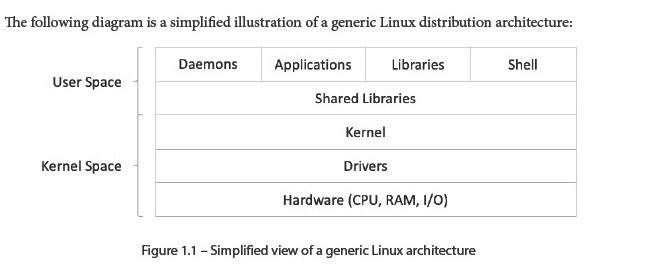
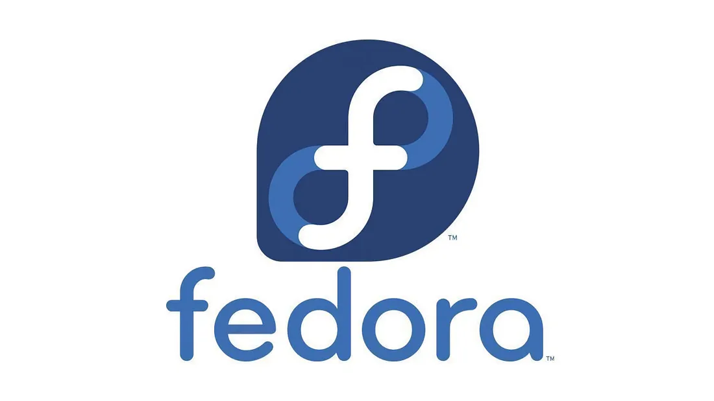
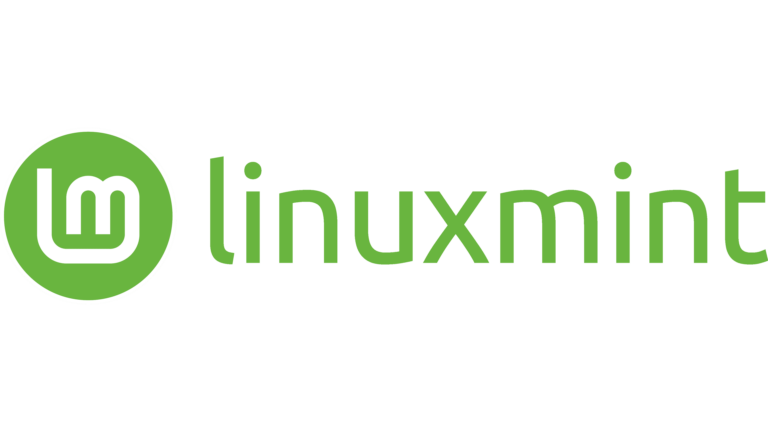
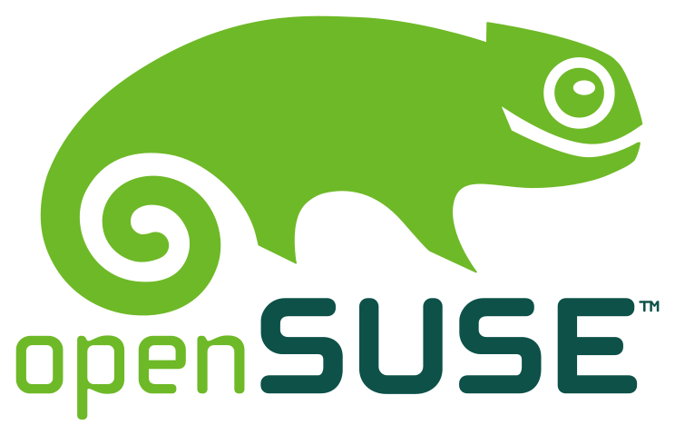

# **Exploring Linux Distributions** 🐧📦

## 📖 What Is a Linux Distribution?
A **Linux distribution** (or **distro**) is an installation bundle—usually an ISO image—that includes:

- **Linux Kernel**: The core that talks to your computer’s hardware (CPU, memory, storage).  
- **Bootloader**: Loads the kernel at startup (e.g., GRUB).  
- **Shell**: Command-line interface (e.g., `bash`, `zsh`).  
- **Package Manager**: Tool to install, update, and remove software (e.g., **APT**, **DNF**, **Pacman**).  
- **Libraries**: Shared code for programs to use (e.g., `glibc`).  
- **Graphical Interface**: Desktop environments like GNOME, KDE, or Xfce.  
- **Utilities & Applications**: Text editors, web browsers, servers, and more.

**Example:** When you download an Ubuntu ISO, you get the kernel plus all these parts in one bundle. 🍵

---

## 🛠️ Key Components Explained
- **Kernel**: Manages processes and hardware drivers. Without it, your CPU and peripherals cannot work.  
- **Bootloader**: Starts the kernel. Imagine turning on your computer—GRUB shows a menu to pick the OS.  
- **Shell**: Lets you type commands. For example, `ls` lists files, and `cd` changes folders.  
- **Package Manager**: Handles software. On Debian/Ubuntu:  
  ```bash
  sudo apt update       # Refresh software list
  sudo apt install git  # Install Git
  ```
  On Fedora/CentOS:  
  ```bash
  sudo dnf install vim  # Install Vim
  ```

---

## 📊 Distribution Architecture

<div align="center">
  
</div>

**Architecture Layers Explained:**
- **User Space:** The highest layer where user-facing programs run:
  - **Daemons:** Background services (e.g., web servers, schedulers).  
  - **Applications:** Graphical and command-line apps you interact with.  
  - **Libraries:** Shared code (like `glibc`) that applications reuse.  
  - **Shell:** Command interpreter (e.g., `bash`, `zsh`) for running commands.
  - **Shared Libraries:** Bridge between kernel interfaces and user programs, providing standard APIs.

- **Kernel Space:** The protected core of the OS:
  - **Kernel:** Manages CPU scheduling, memory allocation, and system calls.  
  - **Drivers:** Specialized modules that translate kernel calls into hardware actions (e.g., disk or network drivers).

- **Hardware:** Physical components:
  - **CPU:** Executes instructions.  
  - **RAM:** Temporary memory for running programs.  
  - **Storage:** Persistent data (HDD, SSD).  
  - **I/O Devices:** Keyboards, mice, network cards, and other peripherals.

---

## 🌍 Popular Linux Distributions

These are the most Popular Linux distributions


### 🍂 Fedora, CentOS Stream & RHEL
- **Format**: RPM packages (`dnf`, `yum`).  
- **Fedora**: Cutting-edge, community-driven.  
- **CentOS Stream**: Rolling preview of RHEL features.  
- **RHEL**: Commercial, stable platform with long-term support.  
- **Rocky Linux**: Community rebuild of RHEL binaries.

<div align="left">
  
</div>

---


### 📦 Debian
- **Format**: DEB packages (`dpkg`, `apt`).  
- **Highlights**: Very stable, slower releases, ideal for servers and projects requiring rock-solid reliability.

<div align="left">
  
</div>

---


### 🦄 Ubuntu
- **Format**: DEB + APT.  
- **Release Cycle**: Every 6 months, with **LTS** (Long Term Support) releases every 2 years (5 years of updates).  
- **Goal**: User-friendly desktop and server editions.

<div align="left">
  
</div>

---


### 🍃 Linux Mint
- **Based On**: Ubuntu (and Debian via LMDE).  
- **Desktop**: Cinnamon (lightweight, Windows-like).  
- **Focus**: Easy for newcomers with lower memory use.

<div align="left">
  
</div>

---


### 💎 openSUSE
- **Format**: RPM with **YaST** and **Zypper**.  
- **Tumbleweed**: Rolling release for the latest software.  
- **Leap**: Stable, regular release synced with SUSE Enterprise.

<div align="left">
  
</div>

---

## 🔑 Key Differences Between Distros
- **Package Manager**: DEB vs RPM vs others.  
- **Release Model**: Rolling (always updated) vs Fixed (periodic stable releases).  
- **Community vs Commercial**: Free community support vs paid enterprise support.

---

## 🎯 Choosing the Right Distro
- **For Servers**: Debian Stable, Ubuntu LTS, RHEL/CentOS Stream.  
- **For Desktops**: Ubuntu, Linux Mint, Fedora Workstation.  
- **For Power Users**: Arch Linux, openSUSE Tumbleweed.

*Tip:* Try a Live USB first—no installation needed—to see which one feels best. 🔍

