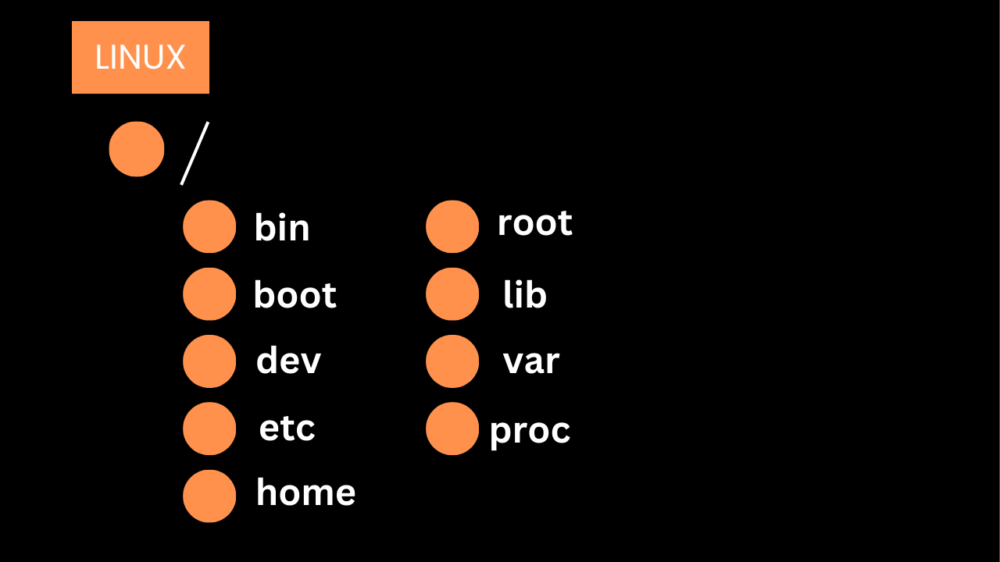

# **Understanding the Linux Filesystem** 📂

The Linux filesystem is a structured and logical way to organize and store files on a disk or partition. It’s the backbone of how Linux manages data, treating everything as a file—whether it’s a document, directory, or even a hardware device like a USB drive. This guide will break down the Linux filesystem, its hierarchical directory structure, and how to explore it using the command line, with examples and insights for beginners. Let’s dive in! 🚀

---

## What is the Linux Filesystem? 💾

The Linux filesystem is a logical collection of files stored on a partition or disk. Think of it as a highly organized filing cabinet where data is neatly categorized and easily accessible. Here’s a quick overview:

- **Partitions**: A hard drive can be divided into smaller sections called partitions. Each partition typically contains one filesystem. For example, one partition might hold the root (`/`) filesystem, while another holds the `/home` filesystem. 🗄️
- **Filesystem**: This is the structure that organizes files and directories within a partition. You can have a single filesystem spanning an entire disk or multiple filesystems across different partitions.
- **Why Use Multiple Filesystems?**: Keeping a separate filesystem per partition is considered best practice. It simplifies maintenance and management. For instance, if the root filesystem crashes, a separate `/home` filesystem can keep user data safe. 🔒
- **Everything is a File**: In Linux, *everything* is treated as a file. Hard drives, USB drives, DVDs, and even processes are represented as files in the filesystem. This unified approach makes Linux incredibly flexible. 🛠️

---

## Directory Structure: The Hierarchical Tree 🌳

Linux uses a **hierarchical filesystem structure**, resembling an upside-down tree. The **root directory (**`/`**)** is at the top, and all other directories and files branch out from it. This structure is defined by the **Filesystem Hierarchy Standard (FHS)**, which outlines the purpose of standard directories in Unix-like systems. However, some Linux-specific directories may not yet be part of the FHS.

### Key Directories and Their Purposes 📍

Here’s a rundown of some common directories in the Linux filesystem and what they’re used for:

- **/bin** 🛠️: Contains essential binary (executable) files, like `ls`, `cp`, and `mv`, used by all users.
- **/etc** ⚙️: Stores system configuration files, such as network settings or package manager configurations.
- **/home** 🏠: Holds user-specific files and directories, like documents, downloads, or personal settings.
- **/usr** 📦: Contains user-installed software, libraries, and documentation.
- **/var** 📈: Stores variable data, like system logs, temporary files, or databases.
- **/tmp** 🗑️: Temporary files created by the system or users are stored here.
- **/dev** 💽: Represents device files, such as `/dev/sda` (hard drive) or `/dev/tty` (terminal).
- **/proc** 📊: A virtual filesystem containing information about system processes and kernel settings.
- **/boot** 🚀: Stores bootloader files and kernel images needed to boot the system.
- **/sbin** 🔧: Contains system binaries, like `fsck` or `init`, used for system administration.

This tree-like structure ensures that files and directories are logically organized, making it easier to navigate and manage the system. 🌲

---

## Exploring the Linux Filesystem from the Command Line 🖥️

Now, let’s get hands-on and explore the Linux filesystem using the command line. The examples provided are based on an Ubuntu container running in Docker, but the concepts apply to any Linux system. We’ll walk through setting up the environment, installing tools, and navigating the filesystem with commands like `ls` and `tree`. Let’s go! ⚡

### 1. Setting Up a Docker Container 🐳

To explore the filesystem, we start by running an Ubuntu container in Docker using the following command:

```bash
docker run -it --name my-ubuntu ubuntu:latest bash
```

- **What Happens?**: This command launches an Ubuntu container and drops you into a bash shell. You’re now logged in as the `root` user, with the prompt showing the current directory as `/` (the root directory). The prompt looks like this:

  ```
  root@7e56c80bcd77:/#
  ```
- **Why Docker?**: Using a container is a safe way to experiment with Linux without affecting your main system. It’s like a sandbox for learning! 🏖️

### 2. Installing the `tree` Command 🌴

To visualize the directory structure, we install the `tree` tool, which displays directories and files in a tree-like format. Here’s how it’s done:

```bash
apt update
apt install tree
```

- **apt update**: Refreshes the package lists to ensure you’re downloading the latest versions of software.
- **apt install tree**: Installs the `tree` package, which is lightweight and super useful for exploring the filesystem.

**Sample Output**:

```
Get:1 http://archive.ubuntu.com/ubuntu noble/universe amd64 tree amd64 2.1.1-2ubuntu3 [47.1 kB]
Fetched 47.1 kB in 1s (45.8 kB/s)
...
Setting up tree (2.1.1-2ubuntu3) ...
```

This confirms that `tree` is installed and ready to use. 🎉

### 3. Exploring with `ls -la` 🔍

The `ls` command is a go-to tool for listing directory contents. Let’s run:

```bash
ls -la
```

- **What Does** `ls -la` **Do?**:
  - `ls`: Lists files and directories in the current directory.
  - `-l`: Displays detailed information in a long format (permissions, owner, size, etc.).
  - `-a`: Includes hidden files (those starting with a `.`, like `.dockerenv`).

**Sample Output**:

```
total 64
drwxr-xr-x   1 root root 4096 Apr 23 09:25 .
drwxr-xr-x   1 root root 4096 Apr 23 09:25 ..
-rwxr-xr-x   1 root root    0 Apr 23 09:25 .dockerenv
lrwxrwxrwx   1 root root    7 Apr 22  2024 bin -> usr/bin
drwxr-xr-x   2 root root 4096 Apr 22  2024 boot
drwxr-xr-x   5 root root  360 Apr 23 09:25 dev
drwxr-xr-x   1 root root 4096 Apr 23 09:25 etc
...
```

- **Breaking Down the Output**:
  - `.`: Represents the current directory (`/` in this case).
  - `..`: Represents the parent directory (also `/` since the root has no parent).
  - `.dockerenv`: A file used by Docker to indicate this is a container environment.
  - `bin -> usr/bin`: A symbolic link, meaning `/bin` points to `/usr/bin`. Symbolic links are like shortcuts that redirect to another location. 🔗
  - **Permissions (**`drwxr-xr-x`**)**: Indicates the file type and access rights:
    - `d`: Directory (or `l` for a link, `-` for a regular file).
    - `rwxr-xr-x`: Permissions for owner (`rwx`), group (`r-x`), and others (`r-x`). `r` = read, `w` = write, `x` = execute.
  - **root root**: The file’s owner and group (both `root` in this case).
  - **4096**: The size of the directory in bytes.
  - **Apr 23 09:25**: The last modified date and time.

This command gives you a detailed snapshot of what’s in the root directory. 🖼️

### 4. Exploring with `tree` 🌲

The `tree` command provides a graphical view of the directory structure. Let’s run:

```bash
tree -L 1 /
```

- **What Does** `tree -L 1` **Do?**:
  - `tree`: Displays directories and files in a tree-like format.
  - `-L 1`: Limits the output to one level deep (only the direct contents of the root directory).

**Sample Output**:

```
/ 
|-- bin -> usr/bin
|-- boot
|-- dev
|-- etc
|-- home
|-- lib -> usr/lib
|-- lib64 -> usr/lib64
|-- media
|-- mnt
|-- opt
|-- proc
|-- root
|-- run
|-- sbin -> usr/sbin
|-- srv
|-- sys
|-- tmp
|-- usr
|-- var
20 directories, 0 files
```

- **Breaking Down the Output**:
  - This lists all directories directly under `/`, along with symbolic links like `bin -> usr/bin`.
  - The output is clean and easy to read, showing the hierarchical structure at a glance.
  - **Symbolic Links**: Directories like `bin`, `lib`, `lib64`, and `sbin` are linked to their counterparts in `/usr`, a common setup in modern Linux distributions to streamline the filesystem. 🔄
  - **20 directories, 0 files**: Indicates that only directories (and links) are shown at this level, with no regular files.

### 5. Diving Deeper: Exploring `/etc` with `tree` 🗂️

Let’s take a closer look at the `/etc` directory, which holds system configuration files:

```bash
tree -a /etc/
```

- **What Does** `tree -a` **Do?**:
  - `-a`: Includes hidden files (those starting with a `.`).

**Sample Output**:

```
/etc/
|-- .pwd.lock
|-- alternatives
|   |-- README
|   |-- awk -> /usr/bin/mawk
|   |-- nawk -> /usr/bin/mawk
|   |-- pager -> /bin/more
|   |-- rmt -> /usr/sbin/rmt-tar
|   `-- which -> /usr/bin/which.debianutils
|-- apt
|   |-- apt.conf.d
|   |   |-- 01-vendor-ubuntu
|   |   |-- 01autoremove
|   |   |-- 70debconf
|   |   |-- docker-autoremove-suggests
|   |   |-- docker-clean
|   |   |-- docker-disable-periodic-update
|   |   |-- docker-gzip-indexes
|   |   `-- docker-no-languages
...
```

- **Breaking Down the Output**:
  - `.pwd.lock`: A lock file used during password-related operations to prevent conflicts.
  - `alternatives`: A directory managing symbolic links for alternative tools (e.g., `awk` points to `mawk`, a lightweight version of `awk`). This system allows flexibility in choosing default tools. 🔧
  - `apt`: Contains configuration files for the Advanced Package Tool (APT), Ubuntu’s package manager.
  - `apt.conf.d`: Holds configuration snippets for APT, such as:
    - `01-vendor-ubuntu`: Vendor-specific settings for Ubuntu.
    - `docker-gzip-indexes`: Docker-specific settings to optimize package index handling.
    - `docker-no-languages`: Disables language-specific package installations to save space.

This output shows how `/etc` is a critical directory for system configuration, with many files tailored to the Docker environment. 📋

---

## Important Note ⚠️

- **Clutter Alert**: Some directories, like `/etc` or `/usr`, contain hundreds of files and subdirectories. Running `ls` or `tree` without limiting the output (e.g., using `-L 1`) can flood your terminal with information. Use options like `tree -L 1` to keep things manageable. 🧹
- **Safe Exploration**: Simply looking around with commands like `ls` or `tree` won’t harm your system. Feel free to explore! However, be cautious when modifying or deleting files, especially as the `root` user. 🔐

---

## Tips for Beginners 🌟

1. **Essential Commands to Learn**:
   - `cd /directory`: Change to a specific directory.
   - `pwd`: Print the current working directory.
   - `ls`: List directory contents.
   - `tree`: Display directory structure graphically.
   - `cat /file`: View the contents of a file.
2. **Practice Safely**: Use a Docker container or virtual machine to experiment without risking your main system. It’s a great way to learn! 🧪
3. **Read the Manual**: Run `man ls` or `man tree` to access detailed documentation for any command. The `man` pages are your best friend! 📖
4. **Start Small**: Begin by exploring directories like `/etc` or `/home`, and gradually dive into more complex ones like `/proc` or `/dev`.

---

# **Linux Root Filesystem: Tree Structure** 🌳

<div align="center">
  
</div>

Below is the tree structure of the Linux root filesystem (`/`), showcasing the standard directories and their key subdirectories:

```
/ (Root Directory)
├── bin
├── boot
├── dev
├── etc
├── home
├── lib
├── media
├── mnt
├── opt
├── proc
├── sbin
├── srv
├── tmp
├── usr
│   ├── bin
│   ├── lib
│   ├── local
│   ├── sbin
│   ├── share
│   │   ├── doc
│   │   └── (icons, wallpapers, etc.)
│   └── (other subdirectories)
├── var
│   ├── log
│   └── (databases, mail, etc.)
```

This structure forms the backbone of the Linux filesystem, with each directory serving a specific purpose. Let’s break them down in detail. 📚

---

## Detailed Explanation of Each Directory 📋

### 1. / (Root Directory) 🌟

- **What Is It?**: The root directory is the topmost point of the Linux filesystem. All other directories and files branch out from here, forming a hierarchical, tree-like structure.
- **Purpose**: It serves as the foundation for the entire filesystem, acting as the starting point for all paths.
- **Example**: Directories like `/home`, `/etc`, and `/usr` are all located under `/`.
- **Important Note**: The root directory contains critical system files, so it should be modified with caution to avoid disrupting the system. 🔐

### 2. /bin (Essential Command Binaries) 🛠️

- **What Is It?**: Contains essential executable programs (binaries) used by all users, such as `ls`, `cp`, and `mv`.
- **Purpose**: These commands are vital for basic system operations, like listing files, copying data, or moving directories. They are available even during system boot in single-user mode.
- **Example**: Running `ls` executes `/bin/ls`.
- **Fun Fact**: The `/bin` directory ensures that core utilities are always accessible, making it a cornerstone of system functionality. 🚀

### 3. /boot (Static Files of the Boot Loader) 🥾

- **What Is It?**: Stores files required for booting the system, including the Linux kernel, bootloader (e.g., GRUB), and initial RAM filesystem (initramfs).
- **Purpose**: These files are used to initialize and start the operating system during the boot process.
- **Example**: `/boot/vmlinuz` is a common kernel image file.
- **Important Note**: Modifying `/boot` can prevent the system from booting, so changes should be made carefully. ⚠️

### 4. /dev (Device Files) 💾

- **What Is It?**: Contains device files that represent hardware devices, such as hard drives, USBs, and keyboards.
- **Purpose**: In Linux, hardware is treated as files, and `/dev` provides kernel device nodes to interact with these devices.
- **Examples**:
  - `/dev/sda`: Represents the first hard drive.
  - `/dev/tty`: Represents a terminal device.
- **Fun Fact**: These files are dynamically managed by the kernel and should not be manually created or altered. 🖥️

### 5. /etc (Host-Specific System Configuration) ⚙️

- **What Is It?**: Holds system-wide configuration files that control the behavior of the operating system and its services.
- **Purpose**: These files define settings for system startup, user accounts, and device management.
- **Examples**:
  - `/etc/passwd`: Stores user account information.
  - `/etc/fstab`: Lists storage device mount points.
  - `/etc/crontab`: Defines scheduled tasks.
- **Important Note**: System administrators frequently work with `/etc`, but changes should be made cautiously to avoid misconfigurations. 📝

### 6. /home (User Home Directory) 🏠

- **What Is It?**: Contains personal directories for each user, where they store files like documents, photos, and settings.
- **Purpose**: Provides a private space for users to organize and manage their data.
- **Example**: For a user named `ali`, the home directory would be `/home/ali`.
- **Fun Fact**: The `root` user’s home directory is typically `/root`, not under `/home`. 😎

### 7. /lib (Essential Shared Libraries and Kernel Modules) 📚

- **What Is It?**: Stores shared libraries (similar to Windows DLLs) and kernel modules required by programs and the system.
- **Purpose**: Libraries provide reusable code for binaries in `/bin` and `/sbin`, while kernel modules enable hardware support.
- **Example**: `/lib/libc.so` is a common library used by many programs.
- **Important Note**: This directory is critical for system stability, so avoid modifying it unless necessary. 🔧

### 8. /media (Mount Point for Removable Media) 📀

- **What Is It?**: Serves as a mount point for removable media, such as USB drives and DVDs.
- **Purpose**: When an external device is connected, it is automatically mounted under `/media`.
- **Example**: `/media/ali/USB` might represent a USB drive mounted for user `ali`.
- **Fun Fact**: Modern Linux systems prefer `/media` for removable devices, making it user-friendly. 🖱️

### 9. /mnt (Mount Point for Temporary Filesystems) 🗄️

- **What Is It?**: A mount point for temporarily mounting filesystems.
- **Purpose**: Historically used for mounting filesystems manually, though `/media` is now more common for removable media.
- **Example**: `/mnt/backup` could be a mount point for a temporary backup drive.
- **Important Note**: This directory is less frequently used in modern systems but remains available for legacy purposes. 📂

### 10. /opt (Add-on Application Software Packages) 📦

- **What Is It?**: Stores optional or third-party software not included in the default system distribution.
- **Purpose**: Provides a location for installing non-standard applications.
- **Example**: `/opt/google-chrome` might contain the Google Chrome browser.
- **Fun Fact**: Software vendors often use `/opt` for proprietary or custom applications, offering flexibility. 🛒

### 11. /proc (Virtual Filesystem Managed by the Kernel) 📈

- **What Is It?**: A virtual filesystem that provides runtime information about system processes and kernel settings.
- **Purpose**: Contains files that represent system and process data, managed dynamically by the kernel.
- **Examples**:
  - `/proc/cpuinfo`: Details about the CPU.
  - `/proc/meminfo`: Information about memory usage.
- **Important Note**: These files are read-only and exist only in memory, not on disk. They’re used for monitoring system status. 🔍

### 12. /sbin (Essential System Binaries) 🔧

- **What Is It?**: Contains system administration binaries, such as `fsck` and `init`, used for critical operations.
- **Purpose**: These programs are primarily for the `root` user or system processes, supporting tasks like system maintenance and recovery.
- **Example**: `/sbin/reboot` is used to restart the system.
- **Fun Fact**: Unlike `/bin`, `/sbin` focuses on system-level operations, not general user commands. ⚡

### 13. /srv (Data for Services Provided by This System) 🌐

- **What Is It?**: Stores data for services hosted by the system, such as web or FTP servers.
- **Purpose**: Organizes service-related files, like web server content or FTP directories.
- **Example**: `/srv/www` might contain files for a web server.
- **Important Note**: This directory is not always heavily used but is valuable for server environments. 🖥️

### 14. /tmp (Temporary Files) 🗑️

- **What Is It?**: Holds temporary files created by the system or users.
- **Purpose**: Provides a space for short-term storage, with files often deleted on system reboot.
- **Example**: `/tmp/tempfile.txt` could be a temporary file created by a program.
- **Fun Fact**: Any user can write to `/tmp`, but files should be managed carefully to avoid clutter. 🧹

### 15. /usr (Secondary Hierarchy) 📂

- **What Is It?**: A large directory containing user-related files, programs, and resources.
- **Purpose**: Supports regular users and system operations with executables, libraries, and shared data.
- **Subdirectories**:
  - **/usr/bin** 🛠️: Contains user-executable programs, like `gcc` or `python`.
  - **/usr/lib** 📚: Stores shared libraries for programs in `/usr/bin`.
  - **/usr/local** 🏬: Holds locally compiled or custom programs not part of the distribution.
  - **/usr/sbin** 🔧: Contains system administration programs, like `useradd`.
  - **/usr/share** 📜: Stores shared data, such as configuration files, icons, wallpapers, and sound files.
    - **/usr/share/doc** 📖: Contains documentation for system-wide files and programs.
- **Example**: `/usr/bin/firefox` is the executable for the Firefox browser.
- **Important Note**: `/usr` is one of the largest and most critical directories, so navigate and modify it with care. 🌟

### 16. /var (Variable Data) 📈

- **What Is It?**: Stores data that is modified during system operation, such as logs, databases, and user mail.
- **Purpose**: Manages dynamic, changeable data generated by the system or users.
- **Subdirectories**:
  - **/var/log** 📝: Contains system log files, like `/var/log/syslog` or `/var/log/auth.log`.
- **Example**: `/var/mail/ali` might store emails for user `ali`.
- **Fun Fact**: `/var` is essential for tracking system activity and debugging issues, making it a go-to for administrators. 🔎

---

## Important Notes ⚠️

- **Safe Exploration**: Exploring directories with commands like `ls` or `tree` is safe and won’t harm the system. However, be cautious when modifying or deleting files, especially in directories like `/etc`, `/boot`, or `/sbin`. 🔐
- **Clutter Warning**: Directories like `/usr` and `/var` can contain thousands of files. Use commands like `tree -L 1` or `ls -l` to limit output and avoid overwhelming your terminal. 🧹
- **Root Privileges**: As the `root` user, changes can have system-wide impacts. Always double-check commands when operating with elevated privileges. 😎

---

## Tips for Beginners 🌈

1. **Learn Key Commands**:
   - `cd /directory`: Navigate to a directory.
   - `ls -la`: List files and directories with details.
   - `tree -L 1`: View directory structure graphically.
   - `cat /file`: Display a file’s contents.
2. **Practice Safely**: Use a Docker container or virtual machine to experiment without risking your main system. 🧪
3. **Consult Man Pages**: Run `man ls` or `man tree` to access detailed documentation for any command. 📖
4. **Start Small**: Begin exploring user-friendly directories like `/home` or `/etc` before tackling complex ones like `/proc` or `/dev`.

---