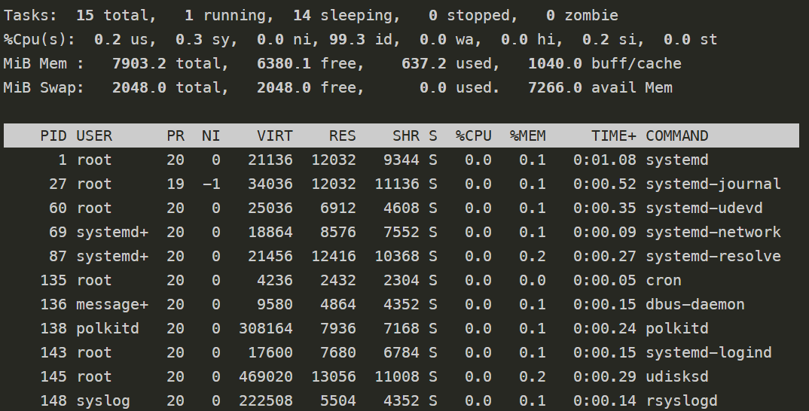
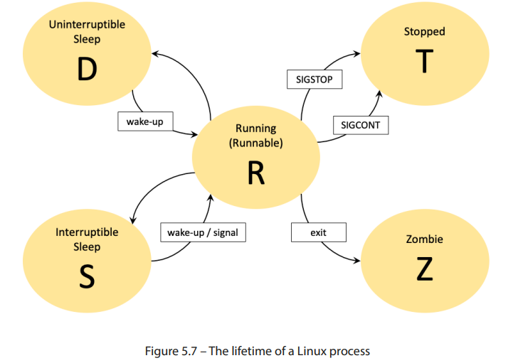

# 👨‍💻 **Introducing Processes** in Linux

A **process** represents a **running instance of a program**.

🔍 **Definition:**

> A process is a program in action — the actual execution of instructions from a compiled executable file.

🧠 In simple terms:

* A **program** is a passive collection of code and data.
* A **process** is that program actively running on the system.

📌 Every time you run a **command**, **script**, or **application**, a new **process** is created.

---

## 🛠️ How Are Processes Created?

In **Linux**, **every command you run** in the terminal starts a new process.

✅ These can be:

* 🧑‍💻 User-initiated commands (in terminal)
* 📜 Scripts (like Bash or Python)
* ⚙️ Executable programs (run manually or automatically)

The **method of creation** and **how it interacts** with the system or user determines the process **type**.

---

# 🔎 Understanding Process Types in Linux

At a high level, there are **two major categories**:

| Type              | Description                                 | Interaction |
| ----------------- | ------------------------------------------- | ----------- |
| 🟢 **Foreground** | Interactive processes (needs user input)    | Yes         |
| ⚫ **Background**  | Non-interactive or automated (run silently) | No          |

---

## 🧑‍💼 Foreground (Interactive) Processes

🔹 These processes **require user interaction** during their execution.

📌 Examples:

* Running `vim` in the terminal
* Executing `python` and typing commands live

---

## 🤖 Background (Non-Interactive) Processes

🔹 These processes run **without any user interaction**.

🔁 They are:

* **Automatically started** at boot time
* **Scheduled** to run at specific times (via `cron` or `at`)

---

# 🧩 Extended Classifications

While most process types can be grouped as **foreground** or **background**, there are some special kinds:

## 🧾 Batch Processes

* These are **automated tasks** scheduled by the system.
* Not manually initiated by users.
* Examples: Cron jobs, system backups, scheduled log rotations.

> 📌 **Batch = Background + Scheduled**

---

## 🧙‍♂️ Daemons

* Special background processes.
* Started **automatically at system boot**.
* Run **indefinitely** in the background (until system shutdown).

📌 Common examples:

* `sshd` (SSH server)
* `httpd` (Apache web server)
* `cron` (scheduler daemon)

---

## 👨‍👦 Parent and Child Processes

In Linux, processes can **create other processes**.

* The **creator** is called the **Parent Process**.
* The newly created one is the **Child Process**.

📌 Example:

```bash
bash -> python script.py
```

Here:

* `bash` is the parent
* `python` process is the child

---

# 🟢 **Foreground Processes** in Linux

A **Foreground Process** (also known as an **Interactive Process**) is a process that:

* 🧑‍💻 Starts **through a Terminal session**
* 📥 Accepts **user input**
* 📤 Sends **output to the screen** (stdout/stderr)
* 🔄 **Blocks** the terminal until the task finishes or is interrupted

---

## 🧠 Key Characteristics

| Feature               | Description                                           |
| --------------------- | ----------------------------------------------------- |
| 🎬 Started by         | User via Terminal                                     |
| 🧾 Output goes to     | Terminal (stdout or stderr)                           |
| 🧍 Needs user input   | Often yes                                             |
| 🔗 Linked to terminal | Tied to the current Terminal session (parent process) |
| 🔚 If terminal exits  | Process ends immediately (via `SIGHUP` signal)        |
| ✋ Interrupting        | `Ctrl + C` sends `SIGINT` to stop the process         |

---

## 🔍 Simple Foreground Example

```bash
man ps
```

📘 This opens the manual for the `ps` command (used to view current processes).

### ⚠️ Behavior:

* Terminal is captured by the `man` interface.
* You can’t type any other command until you **exit** the manual by pressing `q`.

---

## 🔁 Foreground Example – Infinite Loop

Here’s a **long-running task** that loops infinitely and prints "Wait..." every 5 seconds:

```bash
while true; do echo "Wait..."; sleep 5; done
```

### 📟 Sample Terminal Output:

```bash
root@abb64eb599dc:/# while true; do echo "Wait..."; sleep 5; done
Wait...
Wait...
Wait...
Wait...
^C
root@abb64eb599dc:/#
```

### ⚙️ Explanation of the Command:

| Part             | Meaning                                                                 |
| ---------------- | ----------------------------------------------------------------------- |
| `while true`     | Start an infinite loop                                                  |
| `do ... done`    | Commands inside the loop                                                |
| `echo "Wait..."` | Print the message “Wait...”                                             |
| `sleep 5`        | Pause execution for 5 seconds before repeating                          |
| `^C` (Ctrl + C)  | Sends `SIGINT` signal to stop the process and return to Terminal prompt |

---

## 📢 Important Signal: `SIGINT`

When you press **Ctrl + C**:

* 🧠 A **SIGINT (Signal Interrupt)** is sent to the **foreground process**.
* ✂️ The process is **interrupted** and **stopped immediately**.
* 🖥️ The Terminal becomes **interactive again**.

For deeper info, refer to the **Signals section** in the *Inter-process Communication* topic.

---

# ⚫ **Background Processes** in Linux

A **Background Process** (also known as a **non-interactive** or **automated process**) is a process that:

* 🏃 Runs **independently** of user input
* 💻 Is usually launched from the **Terminal** but **does not block it**
* 📂 Often writes output to **log files** instead of the terminal
* 🕰️ Is typically **long-running** and doesn’t require supervision

---

## 🧠 Key Characteristics

| Feature                | Description                                                            |
| ---------------------- | ---------------------------------------------------------------------- |
| 🧑‍💻 Started from     | Terminal, script, or auto-triggered                                    |
| 👤 Needs user input?   | ❌ No                                                                   |
| 🕐 Duration            | Often long-lived                                                       |
| 🖥️ Terminal blocked?  | ❌ No — you can keep using the terminal while it runs                   |
| 🗂️ Output Location    | Often written to files (e.g. log files) instead of displaying onscreen |
| 🔗 Linked to terminal? | Yes, but doesn’t stop terminal interaction                             |

---

## ✅ How to Start a Background Process

Append an `&` at the end of any command:

```bash
while true; do echo "Wait..."; sleep 10; done &
```

### 🧾 Breakdown of the Command:

| Part             | Meaning                                  |
| ---------------- | ---------------------------------------- |
| `while true`     | Infinite loop                            |
| `do ... done`    | Commands to repeat                       |
| `echo "Wait..."` | Print message                            |
| `sleep 10`       | Wait 10 seconds between messages         |
| `&`              | Run in background (don’t block terminal) |

---

## 👨‍💻 Example: Interactive Use While Background Process is Running

```bash
root@abb64eb599dc:/# while true; do echo "Wait..."; sleep 10; done &
[1] 2866   # <- Process ID (PID) shown after launch
root@abb64eb599dc:/# echo "Interactive prompt..."
Interactive prompt...
```

> ⚠️ Even though the process is running, you can **continue typing** and running other commands.

---

## 🔪 Terminating a Background Process

To stop a background process, use the `kill` command along with its PID:

```bash
kill -9 2866
```

### 💡 Explanation:

| Command | Description                                      |
| ------- | ------------------------------------------------ |
| `kill`  | Sends a termination signal to a process          |
| `-9`    | Stands for `SIGKILL`, a **forceful** termination |
| `2866`  | The PID (process ID) of the background process   |

✅ Once the process is killed, you’ll see:

```bash
[1]+  Killed                  while true; do echo "Wait..."; sleep 10; done
```

---

## 🧬 Background vs. Foreground Processes

| Feature                  | Foreground           | Background                    |
| ------------------------ | -------------------- | ----------------------------- |
| Terminal Blocked?        | ✅ Yes                | ❌ No                          |
| Needs User Input?        | ✅ Often              | ❌ Usually not                 |
| Ends if Terminal Exits?  | ✅ Yes (via `SIGHUP`) | ✅ Usually (unless daemonized) |
| Can Output to Log Files? | ❌ Not usually        | ✅ Common practice             |

---

## 🔁 Automated Background Tasks

There are two special types:

### 📅 **Batch Processes**

* Scheduled via tools like `cron` or `at`
* Not triggered manually by the user

### 🧙‍♂️ **Daemons**

* Start automatically during **system boot**
* Stop automatically at **shutdown**
* Examples: `sshd`, `cron`, `nginx`, etc.

> 💡 These are background processes too, but they **don't need terminal** interaction at all.

There’s also a select category of background processes that are automatically started during system
boot and terminated at shutdown without user supervision. These background processes are also
known as daemons.

---

# 🧿 **Introduction to Daemons** in Linux

## 🌀 What is a Daemon?

A **Daemon** is a special type of **background process** in Linux that:

* Starts automatically **during system boot**
* **Runs indefinitely** or until it's stopped (usually at shutdown)
* **Doesn’t interact directly** with the user or a terminal
* Is typically associated with a **system user account** (like `root`) and runs with **elevated privileges**

> ⚙️ Daemons are essential for handling various system services and tasks silently in the background.

---

## 📡 What Do Daemons Do?

Daemons usually:

* Serve **client requests** (e.g., HTTP, FTP)
* Communicate with other **foreground or background processes**

---

## 🔥 Common Examples of Daemons in Linux

| Daemon    | Description                                                   |
| --------- | ------------------------------------------------------------- |
| `systemd` | 🔁 The **parent of all processes** (replaces older `init`)    |
| `crond`   | ⏰ A **scheduler** that runs automated tasks in the background |
| `ftpd`    | 🌐 An **FTP server** that handles file transfer requests      |
| `httpd`   | 🌍 A **web server** (like Apache) for serving HTTP requests   |
| `sshd`    | 🔒 A **Secure Shell** server that handles remote SSH logins   |

📝 **Naming Convention:** Most daemons in Linux end with **`d`**, which stands for "daemon".

---

## 📂 Where Are Daemon Scripts Stored?

Depending on your **Linux distribution**, the location of daemon scripts varies:

| Distro | Daemon Script Directory |
| ------ | ----------------------- |
| Ubuntu | `/etc/init.d/`          |
| Fedora | `/lib/systemd/`         |

These scripts are used by the **init system** to start, stop, or manage services.

---

## ⚙️ How Are Daemons Controlled?

System daemons are typically controlled through **shell scripts**. These scripts:

* Are **executed during system boot** (automatically)
* Can also be **manually invoked** by administrators using service control commands

### 🧑‍💻 Example: Starting/Stopping Daemons

Commands like `systemctl start sshd` or `service sshd stop` allow privileged users to:

* Manage daemon lifecycle
* Perform actions in the **background** while keeping the **terminal free**

---

# 🧬 Understanding the init Process

## 🪜 What is init?

`init` (short for initialization) is:

* A **system process** and **service manager**
* The **first process** that starts when Linux boots
* The **root (parent)** of all other processes

🎯 All Linux processes are **direct or indirect children** of `init`.

---

## 🧠 Evolution of init Systems

Over time, various `init` implementations have evolved:

* **SysVinit**
* **Upstart**
* **OpenRC**
* **systemd** (most widely used today)
* **runit**

Each has pros and cons, but we treat all of them under the generic term "**init**" here.

---

## 🌳 Viewing the Process Tree with `pstree`

The `pstree` command gives a **tree-like view** of all processes, starting from `init` (often `systemd`):

### 🔍 Example Output:

```bash
root@5ca0168c9be1:/# pstree
systemd-+-cron
        |-dbus-daemon
        |-rsyslogd---3*[{rsyslogd}]
        |-2*[sleep]
        |-sshd
        |-systemd-journal
        |-systemd-logind
        |-systemd-network
        |-systemd-resolve
        |-systemd-udevd
        `-udisksd---5*[{udisksd}]
```

### 🧾 Explanation:

* `systemd` is at the **top** of the tree (parent process)
* `cron`, `sshd`, `rsyslogd`, etc., are **child processes**
* Threads (e.g., `[{rsyslogd}]`) are shown with asterisk (`*`) and count

This tree helps visualize the **hierarchical relationship** between processes and their **parent-child** structure.

> 💡 **Pro Tip:** Use `ps aux | grep daemon-name` or `systemctl status daemon-name` to check the status of any daemon.

---

# 👨‍👦 **Parent and Child Processes** in Linux

## 🧬 What is a Parent Process?

In Linux, a **Parent Process** is one that creates other processes using system calls like `fork()` or similar. The newly created processes are known as **Child Processes**.

### 🔁 Relationship:

* A **Parent Process** ➝ spawns ➝ **Child Processes**
* Each child is **linked** to its parent.
* If the parent process stops or exits, the child is usually affected—unless special instructions are given.

---

## 👶 What is a Child Process?

A **Child Process** is:

* Spawned by a **parent process**
* Usually **inherits** environment and permissions from the parent
* Normally **terminates** when the parent exits

However...

> 🛡️ If the child process is told to **ignore the SIGHUP signal** (using tools like `nohup`), it can continue to run even after the parent dies.

---

## 🧠 Key Concept: `SIGHUP` Signal

* **SIGHUP** (Signal Hang Up) is sent to child processes **when a parent process exits**
* If **not handled**, the child process will **terminate**
* You can **suppress** this behavior using the `nohup` command

```bash
nohup myscript.sh &
```

> 📌 This keeps the child process running **even after logout or parent termination**

---

## 🌲 Linux Process Tree Hierarchy

* **All Linux processes**, except the very first (`init` or `systemd`), are **child processes of some parent**.
* This creates a **process hierarchy tree** in the system.

> 🧮 You can view it with:

```bash
pstree
```

---

## 🔥 Important Behaviors

| Behavior                  | Description                                                                 |
| ------------------------- | --------------------------------------------------------------------------- |
| 🛑 Killing child process  | Will **not stop** the parent                                                |
| 🛑 Killing parent process | Will **usually stop** child unless `nohup` or similar is used               |
| ✅ Best Practice           | Let parent process **gracefully exit** after child completes                |
| 🧩 Signals                | Parent sends signals to child (like `SIGTERM`, `SIGHUP`) to manage behavior |

---


🧠 **Pro Tip**: Use `ps -ef` or `pstree -p` to inspect running processes and parent-child relationships.

Look:
```bash
root@5ca0168c9be1:/# ps -ef
UID          PID    PPID  C STIME TTY          TIME CMD
root           1       0  0 00:12 ?        00:00:06 /sbin/init
root          25       1  0 00:12 ?        00:00:00 /usr/lib/systemd/systemd-journald
root          66       1  0 00:12 ?        00:00:00 /usr/sbin/cron -f -P
root          70       1  0 00:12 ?        00:00:00 /usr/lib/systemd/systemd-logind
syslog        74       1  0 00:12 ?        00:00:00 /usr/sbin/rsyslogd -n -iNONE
root          77       1  0 00:12 ?        00:00:00 sshd: /usr/sbin/sshd -D [listener] 0 
message+      78       1  0 00:12 ?        00:00:01 @dbus-daemon --system --address=syste
root         105       0  0 00:12 pts/0    00:00:00 bash
systemd+    2601       1  0 00:24 ?        00:00:00 /usr/lib/systemd/systemd-networkd
systemd+    2627       1  0 00:24 ?        00:00:00 /usr/lib/systemd/systemd-resolved
root        3331       1  0 00:29 ?        00:00:00 /usr/libexec/udisks2/udisksd
root        3396       1  0 00:30 ?        00:00:00 /usr/lib/systemd/systemd-udevd
root        3447       0  0 00:30 pts/1    00:00:00 bash
root        3574       0  0 00:44 pts/2    00:00:00 bash
root        3600    3447  0 00:53 pts/1    00:00:00 bash -c set -o huponexit; sleep 1000 
root        3601    3600  0 00:53 pts/1    00:00:00 sleep 1000
root        3602    3600  0 00:53 pts/1    00:00:00 sleep 9999
root        3609    3574  0 01:00 pts/2    00:00:00 ps -ef
```

---
# 🔄 **Parent & Child Process Practical Example**

## 🧪 Case 1 — Parent killed → Child also dies

### ▶️ Step 1: Run a parent with a child in the foreground

```bash
bash -c "sleep 200" &
```

Output:

```
[1] 3615
```

* `3615` = PID of the parent (`bash -c`)
* It creates a child `sleep 200`

---

### ▶️ Step 2: Check processes

```bash
ps -o pid,ppid,cmd | grep '[s]leep'
```

Output:

```
3615  3574  sleep 200
```

Here:

* `PPID=3574` → Parent shell that spawned it
* `CMD=sleep 200`

---

### ▶️ Step 3: Kill the parent

```bash
kill -TERM 3615
```

---

### ▶️ Step 4: Verify

```bash
ps -o pid,ppid,cmd | grep '[s]leep'
```

Output:

```
[1]+  Terminated              bash -c "sleep 200"
```

✅ Proof: Parent is terminated → Child process (`sleep 200`) is also gone.

---

## 🧪 Case 2 — Child survives even if parent dies

### ▶️ Step 1: Run parent with `nohup` child

```bash
bash -c "nohup sleep 1000 >/tmp/nohup.out 2>&1 & sleep 9999" &
```

* Parent → `bash -c`
* Child1 → `sleep 1000` (background)
* Child2 → `sleep 9999`

---

### ▶️ Step 2: Check processes

```bash
ps -o pid,ppid,cmd | grep '[s]leep'
```

Sample Output:

```
3601  3600  sleep 1000
3602  3600  sleep 9999
```

---

### ▶️ Step 3: Kill the parent

```bash
kill -TERM 3600
```

---

### ▶️ Step 4: Verify

```bash
ps -o pid,ppid,cmd | grep '[s]leep'
```

Sample Output:

```
3601     1 sleep 1000
```

👉 Notice:

* Parent (`bash -c`) is gone
* Child (`sleep 1000`) survived
* **PPID = 1** → It was adopted by `systemd`

✅ Proof: Child continues even after parent termination.


## 🗂️ What is Batch Processing?

Sometimes, Linux processes are run:

* **Without user interaction**
* On a **predetermined schedule**
* For long-running or automated tasks

🎯 This is called **Batch Processing**

> Example: Running a backup script every night via `cron`
---

# 🧾 **Batch Processes**

Batch processing allows us to run **background jobs** automatically at a **specific time**, often on a **recurring schedule**. These are commonly used to automate repetitive or resource-heavy tasks during off-peak hours.

---

## 📌 What is a Batch Process?

> A **batch process** is a script or command that runs **automatically** without user interaction. It is typically launched by a **job scheduler** like `cron` or `at`.

These jobs can include:

* 📥 Backing up databases
* 📦 Compressing or uploading files
* 📊 Generating reports
* 🔄 Auto-updating system packages

---

## ⚙️ Tools for Scheduling Batch Jobs

### 🔁 `cron` – Recurring Jobs

* Designed for **recurring tasks** (e.g., every 2 minutes, every Monday).
* Uses a file called `crontab` to schedule jobs.

### ☑️ `at` – One-Time Jobs

* Used for **single-use**, scheduled tasks (e.g., "run this once at 4 PM").
* Not suitable for repeat schedules.

---

## 🔧 Step-by-Step: Install and Use `cron`

### ✅ Step 1: Install `cron` (If Not Already Installed)

```bash
sudo apt update
sudo apt install cron nano
```

### 🔁 Step 2: Start and Enable cron Service

```bash
sudo systemctl start cron
sudo systemctl enable cron
```

✅ This ensures `cron` starts at boot and runs in the background.

---

## ✍️ Step 3: Make nano as a default editor and Create the Batch Script

Let’s create a simple script at `/root/log_time.sh` that logs the current date and time every 2 minutes.

```bash
nano ~/.bashrc
export EDITOR=nano
source ~/.bashrc
nano /root/log_time.sh
```

Paste the following content into the file:

```bash
#!/bin/bash
echo "Job ran at: $(date)" >> /root/cron_job_log.txt
```

Make the script executable:

```bash
chmod +x /root/log_time.sh
```

---

## 🛠️ Step 4: Schedule the Job in Crontab

Edit the root user's crontab:

```bash
crontab -e
```

Then add the following line at the bottom:

```cron
*/2 * * * * /root/log_time.sh
```

📌 **This tells cron to run `/root/log_time.sh` every 2 minutes.**

---
Absolutely! Let's break down this line from the crontab:

```cron
*/2 * * * * /root/log_time.sh
```

This line tells `cron` **when** and **what** to run.

---

## 🧠 Crontab Format Breakdown

A typical crontab line has **5 time fields** followed by the **command/script**:

```cron
┌───────────── Minute (0 - 59)
│ ┌───────────── Hour (0 - 23)
│ │ ┌───────────── Day of month (1 - 31)
│ │ │ ┌───────────── Month (1 - 12)
│ │ │ │ ┌───────────── Day of week (0 - 7) (Sunday is 0 or 7)
│ │ │ │ │
│ │ │ │ │
* * * * *  command to run
```

---

## 📌 What Does `*/2 * * * *` Mean?

Let's break down **`*/2 * * * *`**:

| Field       | Value | Meaning               |
| ----------- | ----- | --------------------- |
| Minute      | `*/2` | Every **2 minutes**   |
| Hour        | `*`   | Every hour            |
| Day (Month) | `*`   | Every day             |
| Month       | `*`   | Every month           |
| Day (Week)  | `*`   | Every day of the week |

## ✅ Examples of Time Schedules

Here are some other examples of crontab time fields:

| Cron Expression   | Meaning                                   |
| ----------------- | ----------------------------------------- |
| `0 * * * *`       | Every hour at minute 0 (e.g., 1:00, 2:00) |
| `30 9 * * 1-5`    | 9:30 AM on weekdays (Mon–Fri)             |
| `0 0 * * 1`       | Every Monday at midnight                  |
| `*/15 8-17 * * *` | Every 15 minutes from 8 AM to 5 PM        |

---

## ✅ Step 5: Verify That cron Is Working

Wait a few minutes and check the log file:

```bash
cat /root/cron_job_log.txt
```

You should see something like:

```
Job ran at: Tue Aug 26 01:02:00 PKT 2025
Job ran at: Tue Aug 26 01:04:00 PKT 2025
```

🎉 Your batch job is successfully running every 2 minutes!

---

# 🧠 **Orphan, Zombie & Anatomy of a Process**

## ⚰️ Orphan and Zombie Processes

In Linux, understanding how processes behave — especially when they become **orphan** or **zombie** — is crucial for efficient system administration.

### 👶 What is an **Orphan Process**?

An **orphan process** occurs when:

* A child process is **still running**, but its **parent process terminates** before it finishes.
* In this case, the Linux kernel reassigns the orphan process to the **`init` process (PID 1)**, which becomes its new parent.
* This is a **normal behavior** and **handled gracefully** by Linux.

> 📌 **Remember:** Orphan processes are still **alive and running**.

---

### 🧟 What is a **Zombie Process**?

A **zombie process** (also known as a **defunct process**) occurs when:

* A child process **has completed execution** (terminated) **but still has an entry** in the **process table**.
* It stays there **until the parent process reads its exit status** using `wait()` system call.
* These entries can be seen using the `ps` command but the process **doesn't exist anymore**.

> 📌 **Remember:** Zombie processes are **terminated**, but **still linger** in memory tables.

---

### 🔍 Difference Between Orphan and Zombie

| Attribute       | Orphan Process 🍼  | Zombie Process 🧟                |
| --------------- | ------------------ | -------------------------------- |
| Alive?          | ✅ Yes              | ❌ No                             |
| Parent Exists?  | ❌ No (init adopts) | ✅ Yes (didn’t clean up)          |
| Cleanup Needed? | ❌ No (handled)     | ✅ Yes (manually if persistent)   |
| System Impact   | Minimal            | Can be dangerous if many pile up |

---

## 🧬 Anatomy of a Process in Linux

To inspect and analyze processes, Linux offers powerful tools like `ps` and `top`.

---

### 📌 `ps` Command Basics

```bash
ps [OPTIONS]
```

* The `ps` command shows a **snapshot of current system processes**.
* Most commonly used without any arguments to show processes in the current terminal.

```bash
ps
```

📸 **Sample Output:**

```bash
root@5ca0168c9be1:/# ps
  PID TTY          TIME CMD
  240 pts/0    00:00:00 bash
  262 pts/0    00:00:00 ps
```

---

### 📊 Breaking Down `ps` Output

| Header   | Meaning                                                                                                            |
| -------- | ------------------------------------------------------------------------------------------------------------------ |
| **PID**  | **Process ID** – A unique number assigned by the kernel when the process is created. Example: `240`                |
| **TTY**  | **Teletype Terminal** – Shows which terminal is controlling the process. Example: `pts/0` means a pseudo-terminal. |
| **TIME** | **CPU Time** – Total CPU time the process has used. Shows as `00:00:00` if commands run too quickly.               |
| **CMD**  | **Command Name** – The command that started the process (like `bash`, `ps`).                                       |

---

## 🔍 TTY: Understanding the Terminal Control

* **TTY** = Teletype terminal → represents where a process is interacting with.
* **pts/0** → Pseudo Terminal Session 0 (usually SSH or console session).
* More sessions (e.g., new SSH connections) will appear as `pts/1`, `pts/2`, etc.

---

## 🧠 CPU TIME Explanation

Even if you run multiple commands in your terminal session, the **`bash` process** might show **`00:00:00`** under **TIME** because:

* The **parent shell (bash)** doesn’t consume much CPU itself.
* **Each command** you run is a **separate child process**, and their CPU time is not added to bash’s TIME.

---

# 🔍 **Advanced Linux Process Attributes Using `ps -l`**

In many cases, the default `ps` command doesn’t provide enough detail. That’s where the `ps -l` (long format) option helps by offering **deeper insights** into each process running in the current terminal session.

---

## 🛠️ Command: `ps -l`

```bash
ps -l
```

📸 **Sample Output:**

```bash
F S   UID     PID    PPID  C PRI  NI ADDR SZ WCHAN  TTY          TIME CMD
4 S     0     240       0  0  80   0 -  1147 do_wai pts/0    00:00:00 bash
4 R     0     304     240  0  80   0 -  1980 -      pts/0    00:00:00 ps
```

Let's break it down, column by column. ⬇️

---

## 📊 Detailed Explanation of `ps -l` Output Fields

| Field     | Meaning                                                                                                                                                | Example                       |
| --------- | ------------------------------------------------------------------------------------------------------------------------------------------------------ | ----------------------------- |
| **F**     | **Flags**: Shows process flags<br> - `0`: No flags<br> - `1`: Forked but didn't exec<br> - `4`: Superuser privileges (root)                            | `4` (root user)               |
| **S**     | **Process State**:<br> - `R`: Running<br> - `S`: Sleeping (interruptible)<br> - `D`: Uninterruptible sleep<br> - `Z`: Zombie<br> - `T`: Traced/Stopped | `S` (sleeping), `R` (running) |
| **UID**   | **User ID**: The owner of the process (numeric ID of user)                                                                                             | `0` (root user)               |
| **PID**   | **Process ID**: Unique ID assigned to the process by kernel                                                                                            | `240`, `304`                  |
| **PPID**  | **Parent Process ID**: The PID of the parent process                                                                                                   | `0` (for init), `240` (bash)  |
| **C**     | **CPU Usage**: Percentage of CPU used by the process recently                                                                                          | `0` (no heavy CPU use)        |
| **PRI**   | **Priority**: Process priority (lower = higher priority)                                                                                               | `80`                          |
| **NI**    | **Nice value**:<br> - Ranges from `-20` (highest priority) to `19` (lowest priority)<br> - `0` is default                                              | `0`                           |
| **ADDR**  | **Memory address of the process** in kernel space (often `-` in userland ps)                                                                           | `-`                           |
| **SZ**    | **Size of virtual memory** used (in pages)                                                                                                             | `1147`, `1980`                |
| **WCHAN** | **Waiting Channel**: Kernel function the process is waiting on (if sleeping)                                                                           | `do_wai`, `-`                 |
| **TTY**   | **Terminal Type**: Terminal associated with the process                                                                                                | `pts/0`                       |
| **TIME**  | **Total CPU Time** used by the process                                                                                                                 | `00:00:00`                    |
| **CMD**   | **Command**: The name of the process or command run                                                                                                    | `bash`, `ps`                  |

---

# 📈 **Real-Time Process Monitoring in Linux using `top`**

The `ps` command provides a snapshot of current processes — but what if you want a **live, real-time view** of what’s happening in your system?

That’s where the **`top` command** comes in. It’s one of the most powerful tools for Linux administrators to monitor and manage running processes.

---

## 🧠 What is `top`?

* The `top` command gives a **live view** of system performance.
* It updates in **real time** and shows process activity, CPU/memory usage, and system load.
* It's **interactive**: you can sort, filter, and kill processes from the `top` screen.

---

## 🔧 Syntax

```bash
top [OPTIONS]
```

💡 Example (default usage):

```bash
top
```

<div align="center">
  
</div>

---

## 🖥️ Sample Output (Real-Time)

```bash
top - 13:23:31 up 34 min,  0 users,  load average: 0.30, 0.14, 0.04
Tasks:  15 total,   1 running,  14 sleeping,   0 stopped,   0 zombie
%Cpu(s):  0.2 us,  0.3 sy,  0.0 ni, 99.3 id,  0.0 wa,  0.0 hi,  0.2 si,  0.0 st
MiB Mem :   7903.2 total,   6380.1 free,    637.2 used,   1040.0 buff/cache
MiB Swap:   2048.0 total,   2048.0 free,      0.0 used.   7266.0 avail Mem
```

Let’s break this into sections 👇

---

## 🧾 1. **System Overview (Top Header)**

| Field                            | Meaning                                                                                               |
| -------------------------------- | ----------------------------------------------------------------------------------------------------- |
| `13:23:31`                       | Current system time                                                                                   |
| `up 34 min`                      | How long the system has been running                                                                  |
| `0 users`                        | Number of active (logged-in) users                                                                    |
| `load average: 0.30, 0.14, 0.04` | System load averages over **1, 5, and 15 minutes**. Lower is better (usually < 1 for single-core CPU) |

---

## 🧾 2. **Tasks Summary**

```bash
Tasks:  15 total,   1 running,  14 sleeping,   0 stopped,   0 zombie
```

| Field         | Description                                             |
| ------------- | ------------------------------------------------------- |
| `15 total`    | Total number of processes                               |
| `1 running`   | Processes currently using CPU                           |
| `14 sleeping` | Processes in idle or waiting state                      |
| `0 stopped`   | Suspended/stopped processes                             |
| `0 zombie`    | Defunct (zombie) processes not yet cleaned up by parent |

---

## 🧾 3. **CPU Usage Statistics**

```bash
%Cpu(s):  0.2 us,  0.3 sy,  0.0 ni, 99.3 id,  0.0 wa,  0.0 hi,  0.2 si,  0.0 st
```

| Code | Meaning                                            |
| ---- | -------------------------------------------------- |
| `us` | User space CPU usage (programs/apps)               |
| `sy` | System/kernel space usage                          |
| `ni` | Nice-value adjusted process usage                  |
| `id` | Idle time (higher is better!)                      |
| `wa` | Waiting for I/O                                    |
| `hi` | Hardware interrupts                                |
| `si` | Software interrupts                                |
| `st` | Stolen time (used by virtual machines/hypervisors) |

---

## 🧾 4. **Memory and Swap Summary**

```bash
MiB Mem :   7903.2 total,   6380.1 free,    637.2 used,   1040.0 buff/cache
MiB Swap:   2048.0 total,   2048.0 free,      0.0 used.   7266.0 avail Mem
```

| Field          | Explanation                         |
| -------------- | ----------------------------------- |
| **Total**      | Total physical RAM and swap         |
| **Free**       | Unused memory/swap                  |
| **Used**       | Currently active usage              |
| **buff/cache** | Memory used for buffers, file cache |
| **avail Mem**  | Memory available for new processes  |

---

## 🔍 5. **Per-Process Information Table**

```bash
PID USER      PR  NI    VIRT    RES    SHR S  %CPU  %MEM     TIME+ COMMAND
```

Let’s break down each column 🔍

| Column              | Description                                                                         |
| ------------------- | ----------------------------------------------------------------------------------- |
| **PID**             | Process ID — uniquely identifies each process                                       |
| **USER**            | User who owns the process                                                           |
| **PR (Priority)**   | Scheduling priority. Lower number = higher priority                                 |
| **NI (Nice Value)** | Adjusts priority from -20 (high) to 19 (low). 0 is default                          |
| **VIRT**            | Virtual memory used (includes code, data, and shared libs)                          |
| **RES**             | Resident memory (non-swapped physical RAM used)                                     |
| **SHR**             | Shared memory with other processes                                                  |
| **S (State)**       | Process state:<br>• `R`: Running<br>• `S`: Sleeping<br>• `I`: Idle<br>• `Z`: Zombie |
| **%CPU**            | CPU usage by this process                                                           |
| **%MEM**            | RAM usage by this process                                                           |
| **TIME+**           | Total CPU time used by the process                                                  |
| **COMMAND**         | Command used to launch the process                                                  |

---

## 🔁 Example Rows

```bash
    1 root      20   0   21136  12032   9344 S   0.0   0.1   0:01.08 systemd
   145 root      20   0  469020  13056  11008 S   0.0   0.2   0:00.29 udisksd
```

🧠 **Explanation**:

* **systemd** is sleeping (`S`) with minimal CPU/memory usage.
* **udisksd** is managing disk services and using slightly more memory.

---

Great, Hashim! 👨‍💻 Here's a **beautiful, full `README.md`** that explains the **lifecycle and states of a Linux process**, using the content and diagram you provided (Figure 5.7) — perfectly suitable for GitHub documentation, Linux study notes, or interviews.

---

# 🔁 **Lifecycle and States of a Linux Process**

Processes in Linux go through **various states** during their lifetime, depending on system conditions, resources, and signals. Understanding these states is vital for effective **system monitoring, debugging**, and **process management**.

---

## 🧠 Process State Codes (As Seen in `ps` and `top`)

| Code | State                         | Description                                                |
| ---- | ----------------------------- | ---------------------------------------------------------- |
| `R`  | **Running**                   | Actively executing on the CPU                              |
| `I`  | **Idle**                      | Special kernel task; runs when CPU is free                 |
| `S`  | **Sleeping (Interruptible)**  | Waiting for a signal/event that can wake it                |
| `D`  | **Uninterruptible Sleep**     | Waiting for hardware (e.g., I/O), cannot be interrupted    |
| `T`  | **Stopped (Job Control)**     | Stopped via `SIGSTOP` or similar signal                    |
| `t`  | **Stopped (Tracer/Debugger)** | Stopped under a debugger                                   |
| `Z`  | **Zombie**                    | Process has exited, but parent hasn’t read its exit status |

---

## 🧬 **High-Level Categories of Process States**

### 1️⃣ **Running**

* Includes:

  * `R` (Running)
  * `I` (Idle)
* `Idle`: A kernel task that keeps the CPU occupied when there's nothing to do.
* These show up in tools like `top` as part of **CPU idle time**.

---

### 2️⃣ **Waiting**

* Includes:

  * `S` (Interruptible Sleep)
  * `D` (Uninterruptible Sleep)
* **Interruptible Sleep**:

  * Can be awakened by signals (e.g., a keyboard interrupt or I/O completion).
* **Uninterruptible Sleep**:

  * Waiting for non-interruptible system calls, often related to disk or hardware access.

---

### 3️⃣ **Stopped**

* Includes:

  * `T` (Stopped by job control, e.g., via `Ctrl+Z`)
  * `t` (Stopped by debugger)
* The process is paused but can be resumed (`SIGCONT`).

---

### 4️⃣ **Zombie**

* Process has **completed** but the **parent hasn’t collected its exit status**.
* Remains in the process table to allow the parent to read the result (via `wait()`).
* Can be cleaned up once the parent does its job — or automatically if orphaned.

---

## 📉 **Process State Transitions (Lifecycle)**

Below is a simplified view of how a Linux process moves through different states:

<div align="center">
  
</div>

### 🔁 **Transitions**

| From         | To                                             | Trigger |
| ------------ | ---------------------------------------------- | ------- |
| `R` → `S`    | Process is waiting for a signal or event       |         |
| `S` → `R`    | A **wake-up signal** is received               |         |
| `R` → `D`    | Waiting on **uninterruptible I/O**, e.g., disk |         |
| `D` → `R`    | Woken up after device responds                 |         |
| `R` → `T`    | **SIGSTOP** signal received                    |         |
| `T` → `R`    | **SIGCONT** signal received                    |         |
| `R` → `Z`    | Process has exited                             |         |
| `Z` → (gone) | Parent collects status via `wait()`            |         |

---

# 🖥️ **Working with Processes** in Linux

Some of these tools (such as `ps` and `top`) were mentioned earlier when discussing process internals. Here, we’ll put that knowledge into practice with **real-world hands-on examples**.

## 📌 Process Exploration with `ps`

The `ps` command (short for **Process Status**) is a powerful utility for listing running processes on a Linux system.

---

### 🔍 Example 1: Listing all processes

```bash
ps -e | head
```

#### 📖 Explanation:

* **`ps -e`** → Displays **all running processes** in the system.

  * The `-e` flag is equivalent to `-A`.
* **`| head`** → Pipes the output into the `head` command, which shows only the **first 10 lines by default**.

#### 🖼️ Sample Output:

```
    PID TTY          TIME CMD
      1 ?        00:00:01 systemd
     27 ?        00:00:00 systemd-journal
     60 ?        00:00:00 systemd-udevd
     66 ?        00:00:00 systemd-resolve
     72 ?        00:00:00 systemd-network
    135 ?        00:00:00 cron
    136 ?        00:00:00 dbus-daemon
    138 ?        00:00:00 polkitd
    143 ?        00:00:00 systemd-logind
```

✅ This gives a **quick snapshot** of the processes, but it only shows minimal fields like **PID** and **CMD**.

---

### 🔍 Example 2: Detailed process listing for the current user

```bash
ps -fU $(whoami)
```

#### 📖 Explanation:

* **`-f`** → Enables **full-format listing**, displaying detailed process information.
* **`-U $(whoami)`** → Lists processes **owned by the current user**.

  * `$(whoami)` dynamically retrieves the **current logged-in username**.

#### 🖼️ Sample Output:

```
UID          PID    PPID  C STIME TTY          TIME CMD
root           1       0  0 03:57 ?        00:00:01 /sbin/init
root          27       1  0 03:57 ?        00:00:00 /usr/lib/systemd/systemd-journald
root          60       1  0 03:57 ?        00:00:00 /usr/lib/systemd/systemd-udevd
root         135       1  0 03:57 ?        00:00:00 /usr/sbin/cron -f -P
root         143       1  0 03:57 ?        00:00:00 /usr/lib/systemd/systemd-logind
root         145       1  0 03:57 ?        00:00:00 /usr/libexec/udisks2/udisksd
root         151       1  0 03:57 ?        00:00:00 sshd: /usr/sbin/sshd -D [listener] 0 
root         167       1  0 03:57 ?        00:00:00 /usr/bin/python3 /usr/share/unattende
root         242       0  0 03:57 pts/0    00:00:00 bash
root         274     242  0 03:59 pts/0    00:00:00 ps -fU root
```

---

# 🔎 **Searching and Monitoring Specific Processes** in Linux

In Linux system administration, we often need to **search for specific processes** — either for **monitoring** purposes or to take some **action** (like stopping them). This section demonstrates how to locate and analyze processes effectively.

---

## 🌀 Step 1: Creating a Long-Running Process

We can simulate a long-lived process using a simple **infinite loop**:

```bash
while true; do x=1; done
```

👉 This loop keeps assigning the value `1` to the variable `x` **forever**. It consumes CPU cycles and will continue running until stopped manually.

---

### 📝 Writing the Loop into a Script

Using an editor such as `nano`, we create a script file named **`test.sh`**:

```bash
nano test.sh
```

Then, add the following content:

```bash
#!/bin/bash
while true; do x=1; done
```

✔️ The first line `#!/bin/bash` is the **shebang line**, which tells Linux to run the script using the **bash shell**.
✔️ This line **must always be the first line** in a bash script.

Check the file contents:

```bash
cat test.sh
```

---

## 🔑 Step 2: Making the Script Executable

```bash
chmod +x test.sh
```

* **`chmod +x`** → Grants **execute permission** to the file.

Check permissions with:

```bash
ls -l test.sh
```

Sample Output:

```
-rwxr-xr-x 1 root root 38 Aug 27 04:20 test.sh
```

* `rwx` → Owner can read, write, and execute.
* `r-x` → Group and others can read and execute.

---

## 🚀 Step 3: Running the Script in the Background

```bash
./test.sh &
```

* **`&`** → Runs the script as a **background process**, freeing up the terminal.
* Linux assigns a **Process ID (PID)** to this background process.

Sample Output:

```
[1] 377
```

Here, `377` is the **PID** of our script.

---

## 🔍 Step 4: Finding the Process by Name

We can use `ps` and `grep` to locate our script:

```bash
ps -ef | grep test.sh
```

Sample Output:

```
root   377   343  99 04:21 pts/2  00:00:08 /bin/bash ./test.sh
root   379   343   0 04:21 pts/2  00:00:00 grep --color=auto test.sh
```

### 📖 Explanation:

* **First line** → Our actual process: `/bin/bash ./test.sh`.
* **Second line** → The `grep test.sh` command itself (not useful).

---

## 🧹 Step 5: Filtering Out Unwanted `grep` Results

We can refine the search to exclude the `grep` process itself:

```bash
ps -ef | grep test.sh | grep -v grep
```

Sample Output:

```
root   377   343  99 04:21 pts/2  00:01:34 /bin/bash ./test.sh
```

* **`grep -v grep`** → Removes the line that contains `grep` from the output.

---

## 🔢 Step 6: Finding a Process by PID

Sometimes, we already know the **PID** and want detailed info:

```bash
ps -fp 377
```

Sample Output:

```
UID   PID   PPID  C STIME TTY      TIME CMD
root  377   343  99 04:21 pts/2  00:02:32 /bin/bash ./test.sh
```

### 📖 Explanation:

* **PID** → 377 (our script).
* **PPID** → 343 (parent process ID).
* **CMD** → `/bin/bash ./test.sh`, meaning bash is executing our script.

---

# 🌳 **Visualizing Processes with `pstree`**

The **`pstree` command** displays running processes in a **hierarchical, tree-like structure**.
It acts as a **visualizer for the `ps` command**, helping administrators see **parent-child relationships** among processes.

---

## 📌 Syntax

```bash
pstree [OPTIONS] [PID] [USER]
```

* **OPTIONS** → Modify the display (e.g., show PIDs).
* **PID** → Show the tree starting from a specific process ID.
* **USER** → Show processes belonging to a specific user.

---

## 🌀 Example 1: Viewing Current Terminal’s Process Tree

```bash
pstree $(echo $$)
```

### 📖 Explanation:

* **`echo $$`** → Prints the **PID of the current shell**.
* **`pstree $(echo $$)`** → Builds a tree rooted at the current shell process.

### 🖼️ Sample Output:

```
bash-+-pstree
     `-test.sh
```

Here:

* **bash** is the parent process.
* **pstree** and **test.sh** are child processes of this bash session.

---

## 🌀 Example 2: Showing Process IDs with `-p`

```bash
pstree -p $(echo $$)
```

### 📖 Explanation:

* **`-p` / `--show-pids`** → Displays **process IDs** next to process names.

### 🖼️ Sample Output:

```
bash(343)-+-pstree(422)
          `-test.sh(377)
```

✔️ Now we can see both **process names** and their corresponding **PIDs**.

---

## 🌀 Example 3: Displaying Processes by User

```bash
pstree $(whoami)
```

### 📖 Explanation:

* **`whoami`** → Prints the **current logged-in user**.
* **`pstree $(whoami)`** → Displays a tree of all processes owned by this user.

### 🖼️ Sample Output:

```
systemd-+-bash
        |-cron
        |-dbus-daemon
        |-polkitd---3*[{polkitd}]
        |-rsyslogd---3*[{rsyslogd}]
        |-sshd
        |-systemd-journal
        |-systemd-logind
        |-systemd-network
        |-systemd-resolve
        |-systemd-udevd
        |-udisksd---5*[{udisksd}]
        `-unattended-upgr---{unattended-upgr}
```

✔️ This gives a **full view** of all processes started by the system and user.

---

## 📊 Why Use `pstree`?

* ✅ Provides a **visual representation** of process hierarchy.
* ✅ Makes it easier to identify **parent-child relationships**.
* ✅ Helps debug long-running background jobs or daemons.
* ✅ Complements `ps` by offering a **tree structure view**.

---
