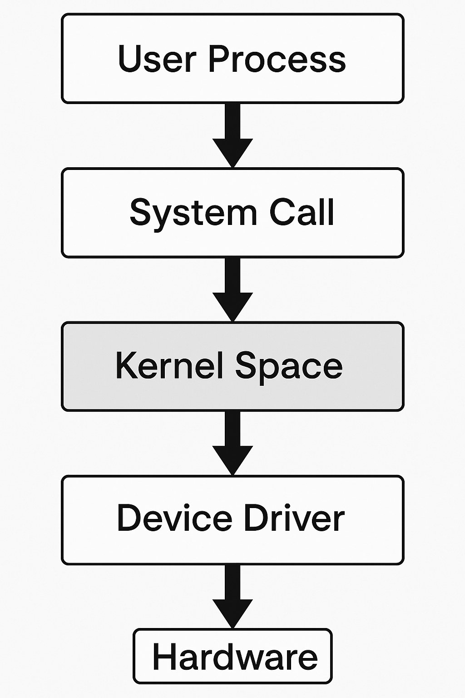
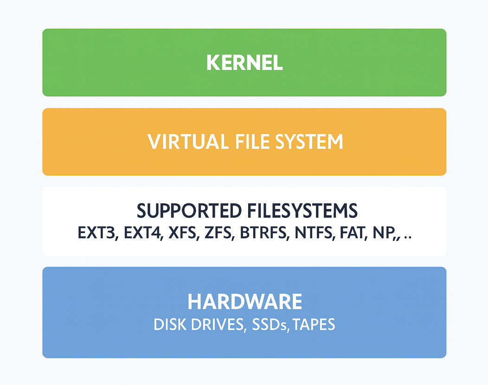

# ⚙️ **Understanding Devices** in Linux

In Linux, **everything is treated as a file** — even devices.
Device files are special files in Unix and Linux systems. These special files act as **interfaces to device drivers**, but appear in the filesystem just like regular files.

This section explains how **Linux abstraction layers** work, and how hardware and software are interconnected.

---

## 🧩 Linux Abstraction Layers

A computer system is generally divided into two main layers:

### 🔹 1. Hardware Level

This level contains all the **physical components** of your machine, such as:

* **CPU (Central Processing Unit)** 🖥️
* **RAM (Memory)** 💾
* **Devices** including disks, network interfaces, ports, and controllers

---

### 🔹 2. Software Level

For hardware to function, the **Operating System (Linux)** provides abstraction layers.
These layers exist in the **kernel**, which is the **core software component** of Linux.

When the computer boots:

* The **Linux kernel** is loaded from disk into system memory (RAM).
* Memory is then divided into two regions:

#### 🟢 Kernel Space

* The **heart of Linux** ❤️.
* Manages **hardware components**, **processes**, **system calls**, and **devices**.
* Handles **device drivers** (which act as bridges between hardware and software).
* Only the kernel has direct access here (for security and stability).

#### 🔵 User Space

* This is where **user processes** (programs, applications, daemons, etc.) run.
* Processes are **isolated** so they don’t interfere with each other.
* If user processes need something from the kernel (like accessing memory or devices), they use **system calls**.

---

## 🖥️ Devices in the Linux Model

* Devices are **managed by the kernel**.
* The **kernel controls device drivers**, which translate software requests into hardware actions.
* Devices are accessible **only in kernel mode** (not directly from user space) to maintain security and streamline operations.

---

## 📚 How It Works (Step by Step)

1. **RAM cells** temporarily store data and instructions.
2. **CPU** executes tasks by fetching from RAM.
3. **Processes** run inside **user space**.
4. When a process needs hardware access (like disk I/O, networking, etc.):

   * It makes a **system call** to the kernel.
   * The **kernel processes the request**.
   * Data moves between **CPU ↔ RAM ↔ Devices** via the kernel.

<div align="center">
  
</div>

✅ This ensures smooth execution and prevents processes from interfering with each other.

---

# 📂 **Device Files and Naming Conventions** in Linux

After learning about abstraction layers, the next question is:
👉 **How does Linux actually manage devices?**

Linux uses **userspace /dev (udev)** — a **device manager for the kernel**.
This system works with **device nodes** (also called *device files*), which are special files used as an **interface to drivers**.

---

## 🔧 udev: The Linux Device Manager

* **udev** runs as a **daemon** (`udevd`).
* It listens to kernel **userspace calls** (via **netlink sockets**) to detect and manage devices.
* Configurations for `udevd` are stored in:

```bash
/etc/udev/udev.conf
```

👉 To view this configuration, you can run:

```bash
cat /etc/udev/udev.conf
```

### 📝 Explanation of the command

* `cat` → Prints the contents of a file.
* `/etc/udev/udev.conf` → Path to the **udev configuration file**.
* This lets you see how device management is set up.

---

## 📜 Default udev Rules

Each Linux distribution comes with a **default set of rules** for `udevd`.
These rules are stored in:

```bash
/etc/udev/rules.d/
```

Example (from inside a container/VM):

```bash
root@5ca0168c9be1:/# ls /etc/udev/
hwdb.d  iocost.conf  rules.d  udev.conf

root@5ca0168c9be1:/# ls -l /etc/udev/rules.d/
total 0
```

👉 Here, the `rules.d` directory is empty, but normally it contains `.rules` files that define how devices should be named and managed.

---

## 🔗 Netlink Socket

* The **kernel communicates events** (like device add/remove) to userspace through a **netlink socket**.
* It allows **inter-process communication (IPC)** between kernel space and user space.

---

## 📂 The /dev Directory

The `/dev` directory is the **interface** between:

* **User processes** 👨‍💻
* **Devices managed by the kernel** ⚙️

To view its contents:

```bash
ls -la /dev | head -40
```

### 📝 Explanation of the command

* `ls -la` → Lists files with **long format** (`-l`) and shows **hidden files** (`-a`).
* `/dev` → Path where device files are located.
* `head -40` → Shows only the **first 40 lines** for readability.

---

### 🔤 Device File Types

Inside `/dev`, you’ll see files starting with certain letters:

* **b** → Block devices (e.g., disks)
* **c** → Character devices (e.g., serial ports, terminals)
* **p** → Named pipes (FIFOs)
* **s** → Sockets

Example output:

```bash
crw-rw-rw-  1 root root      1,   7 Aug 29 03:47 full
brw-rw----  1 root disk      7,   0 Aug 29 03:47 loop0
crw-r--r--  1 root root      1,  11 Aug 29 03:47 kmsg
```

* **`c`** → Character device (`crw-rw-rw-`)
* **`b`** → Block device (`brw-rw----`)

---

## 💽 Disk Devices in `/dev`

Disk devices also appear under `/dev` with specific names.
For example:

* `/dev/sdb ` → First SCSI/SATA disk
* `/dev/sdb` → Second disk, and so on
* `/dev/loop0`, `/dev/loop1` → Loop devices

These names can vary depending on whether you’re on:

* **Virtual machines**
* **Bare-metal servers**

---

# 📘 **Understanding Device Naming Conventions** in Linux

On a **Debian-based system**, the naming convention is designed for **predictability**. It is based on **hardware buses’ names**, which is similar across most modern Linux-based operating systems.

---

## 🔍 Checking Active `udev` Rules

You can check which **udev rules** are active on your system.

* On **Debian-based** and **Red Hat-based** distributions, the rules are stored in:

```
/lib/udev/rules.d/
```

These rules help the system **identify devices consistently** each time they are connected.

---

## 💽 Hard Drives and External Drives

Linux streamlines naming conventions for different types of drives. Below are the most common cases:

### 1️⃣ Classic **IDE Drivers** (used for ATA drives)

* `hda` → Master device on the first channel
* `hdb` → Slave device on the first channel
* `hdc` → Master device on the second channel
* `hdd` → Slave device on the second channel

---

### 2️⃣ **NVMe Drivers** (used for modern SSDs)

* `nvme0` → First device controller (**character device**)
* `nvme0n1` → First namespace (**block device**)
* `nvme0n1p1` → First namespace, first partition (**block device**)

💡 **Tip:** NVMe device names look longer, but the structure makes it easy to distinguish between controllers, namespaces, and partitions.

---

### 3️⃣ **MMC Drivers** (used for SD cards & eMMC chips)

* `mmcblk` → General identifier for SD/eMMC storage
* `mmcblk0` → First MMC device
* `mmcblk0p1` → First MMC device, first partition

---

### 4️⃣ **SCSI Drivers** (used for SATA & USB drives)

* `sd` → General identifier for mass storage devices
* `sdb ` → First registered SCSI/SATA/USB device
* `sdb` → Second device
* `sdc` → Third device
* `sg` → Refers to generic SCSI layers (**character device**)

💡 Today, most **SATA** and **USB** storage devices fall under this **SCSI-like naming scheme**.

---

## 📂 Why Device Naming Matters?

The devices we are most interested in are **mass storage devices**:

* **HDDs (Hard Disk Drives)**
* **SSDs (Solid-State Drives)**

These drives usually contain **partitions** with specific **filesystem structures**.

👉 Earlier (in **section 2: The Linux Shell and Filesystem**), we introduced the Linux directory structure.
👉 Now, it’s time to dive deeper into **filesystem types in Linux** to understand how data is organized inside these partitions.

---

# 📂 **Understanding Filesystem Types** in Linux

When we talk about **physical media** (like hard drives or external drives), we are not referring to the **directory structure**. Instead, we’re discussing the **structures created on the physical drive** during **formatting** or **partitioning**.

These structures are known as **filesystems**, and they determine **how files are stored, accessed, and managed** on the drive.

---

## 🔑 Key Idea: Filesystems

* A filesystem provides rules for organizing data into **files, directories, metadata, and permissions**.
* Different filesystems offer different **features, performance trade-offs, and reliability guarantees**.
* Some are **Linux-native** (e.g., `Ext4`, `XFS`, `ZFS`, `btrfs`) while others come from **Windows/macOS ecosystems** (e.g., `NTFS`, `APFS`).

---

## 🏆 Common Linux-Native Filesystems

### 🔹 **Ext Family (Ext, Ext2, Ext3, Ext4)**

* **Most widely used historically** in Linux.
* **Ext4** is the most advanced and stable version.
* ✅ Features:

  * Supports block sizes between `512` and `4096` bytes.
  * **Inode reservation** for performance when creating files.
  * Maximum filesystem size: **1 EB** (exabyte).
  * Supports **multi-block allocation** (better large file handling).
  * **Online defragmentation** support.
  * **Checksums** for journaling, improving reliability.
  * Extended timestamps (valid up to **year 2446 AD**).
* ❌ Limitations:

  * Weak in **data corruption detection**.
  * Not designed as a **next-gen enterprise filesystem**, but rather a robust workhorse.

---

### 🔹 **ZFS (Zettabyte File System)**

* Developed at **Sun Microsystems** (2001–2004).
* Combines **filesystem + volume manager** in one.
* Highly scalable **128-bit system**.
* ✅ Features:

  * **Copy-on-write mechanism** (never overwrites data in place).
  * Ensures **data integrity** and high performance.
  * Can handle **huge storage pools** with simple administration.
* Used in: **Solaris, FreeBSD, Ubuntu (via OpenZFS)**.
* 📖 More info: [OpenZFS Docs](https://openzfs.github.io/openzfs-docs/Getting%20Started/index.html)

---

### 🔹 **XFS**

* Origin: **Silicon Graphics, Inc. (IRIX OS)**.
* Focus: **High performance & parallel I/O**.
* ✅ Features:

  * Handles **large datasets** efficiently.
  * Maximum filesystem size: **16 EB**.
  * Single file support: up to **8 EB**.
  * Journals **quota information**.
  * Supports **online maintenance**: defrag, expansion, restore.
  * Backup & restore tools: `xfsdump`, `xfsrestore`.
* Default in **Red Hat Enterprise Linux (RHEL 7+)**.

---

### 🔹 **btrfs (B-tree Filesystem)**

* Designed as a **modern filesystem** for Linux.
* ✅ Features:

  * Supports **snapshots, pooling, checksums, and spanning across devices**.
  * Great for **enterprise environments** requiring robust data handling.
* ❌ Issues:

  * Still under development.
  * Performance concerns in **multi-disk volume managers**.
* Adoption:

  * Used in **SUSE Linux Enterprise** & **openSUSE**.
  * Dropped by **Red Hat**.
  * Chosen as the **future default filesystem in Fedora 33+**.

---

## 📦 Other Filesystems

* **ReiserFS, GlusterFS** → experimental/cluster filesystems.
* **NFS, SMB (Samba/CIFS)** → network filesystems.
* **ISO9660, Joliet** → CD/DVD media.
* **FAT, NTFS (Windows)**.
* **exFAT, APFS, HFS+ (macOS)**.

👉 To check supported filesystems on your Linux system:

```bash
cat /proc/filesystems
```

---

## 🏗️ Virtual File System (VFS)

Linux uses a **special abstraction layer** called the **Virtual File System (VFS)**.

* Acts as a **bridge between the kernel and various filesystem types/hardware**.
* Ensures applications can **open, read, write, and manage files** seamlessly, regardless of the underlying filesystem.

### 📊 Diagram: Linux VFS Abstraction Layer

<div align="center">
  
</div>

**Layers Explained:**

1. **Kernel** → Core part of Linux OS.
2. **Virtual File System (VFS)** → Middleware that unifies filesystem operations.
3. **Supported Filesystems** → Ext3, Ext4, XFS, ZFS, btrfs, NTFS, FAT, APFS, NFS, SMB…
4. **Hardware** → Physical storage like HDDs, SSDs, Tapes.

---

## ⚙️ Core Filesystem Functions

* **Namespace Provisioning** → Directory structures & hierarchy.
* **Metadata Management** → File size, timestamps, permissions.
* **Disk Block Allocation** → Organizing how files occupy storage blocks.
* **Access Control** → Defines rules for who can access files.
* **API Support** → System calls (open, read, write, delete, search).
* **Snapshots & Volume Management** (in advanced FS like ZFS/btrfs).

---

# 💽 **Understanding Disks and Partitions** in Linux

Understanding **disks and partitions** is a key skill for every **system administrator**. Formatting and partitioning are critical from the very beginning (system installation) and remain essential for storage management.

---

## 📀 Common Disk Types

A **disk** is a hardware component that stores data. It comes in different types and uses different interfaces:

* **HDD (Hard Disk Drive)** → Traditional spinning disks.
* **SSD (Solid-State Drive)** → Faster, uses flash memory.
* **NVMe (Non-Volatile Memory Express)** → Extremely fast, RAM-like storage with low latency.

### 🔌 Interfaces

* **IDE (Integrated Drive Electronics)** → Old, low transfer rate, now deprecated.
* **SATA (Serial ATA)** → Replaced IDE, supports up to **16 GB/s transfer rate**.
* **SCSI (Small Computer Systems Interface)** → Used in enterprise servers, often with RAID.
* **SAS (Serial Attached SCSI)** → High-reliability enterprise interface, similar speed to SATA.
* **USB (Universal Serial Bus)** → Used for external drives & flash drives.

---

## 📏 Disk Geometry

Each disk has:

* **Heads**
* **Cylinders**
* **Tracks**
* **Sectors**

In Linux, you can view this geometry using:

```bash
sudo fdisk -l
```

---

## 🔎 Command Example

We ran `fdisk -l` on a Debian 12 system with a **50 GB SSD** and a **USB device** inserted.

### 📜 Command Used

```bash
sudo fdisk -l
```

* `sudo` → Run with root privileges.
* `fdisk` → Tool to manage disk partitions.
* `-l` → List all disks and partitions.

---

## 📊 Output Explained

Here’s the actual output (abridged):

```text
Disk /dev/loop0: 4 KiB, 4096 bytes, 8 sectors
...
Disk /dev/sdb : 50 GiB, 53687091200 bytes, 104857600 sectors
Disk model: VBOX HARDDISK
Units: sectors of 1 * 512 = 512 bytes
Sector size (logical/physical): 512 bytes / 512 bytes
Disklabel type: gpt
Disk identifier: 4B260F40-3DAC-4B10-8131-933A12162613

Device     Start       End   Sectors Size Type
/dev/sdb 1   2048      4095      2048   1M BIOS boot
/dev/sdb 2   4096 104855551 104851456  50G Linux filesystem
```

---

### 🔹 Loop Devices (`/dev/loopX`)

Example:

```text
Disk /dev/loop0: 4 KiB, 4096 bytes, 8 sectors
```

* **Loop devices** are virtual devices.
* They are **files mounted as block devices**.
* Commonly used by **snap packages**, squashfs images, or mounting ISO files.
* Each `/dev/loopX` is a separate virtual device.

---

### 🔹 Main Disk (`/dev/sdb `)

```text
Disk /dev/sdb : 50 GiB, 53687091200 bytes, 104857600 sectors
Disk model: VBOX HARDDISK
Disklabel type: gpt
Disk identifier: 4B260F40-3DAC-4B10-8131-933A12162613
```

* **Device name:** `/dev/sdb ` → first detected hard drive.
* **Size:** 50 GiB (VirtualBox hard disk).
* **Sectors:** 512 bytes each.
* **Partition Table (Disklabel type):** GPT (GUID Partition Table).
* **Disk Identifier:** Unique UUID for this disk.

---

### 🔹 Partitions on `/dev/sdb `

| Device      | Start | End       | Sectors   | Size | Type             |
| ----------- | ----- | --------- | --------- | ---- | ---------------- |
| `/dev/sdb 1` | 2048  | 4095      | 2048      | 1M   | BIOS boot        |
| `/dev/sdb 2` | 4096  | 104855551 | 104851456 | 50G  | Linux filesystem |

* **`/dev/sdb 1` (1 MB)** → BIOS boot partition (used when booting in legacy BIOS mode with GPT).
* **`/dev/sdb 2` (50 GB)** → Main Linux filesystem partition.

---

### 🔹 Example of Loop Devices Sizes

* `/dev/loop1` → 73.91 MiB
* `/dev/loop3` → 245.13 MiB
* `/dev/loop5` → 516.01 MiB
* `/dev/loop11` → 246.43 MiB

👉 These correspond to **mounted squashfs images** (commonly from Snap packages in Ubuntu/Debian).

---

# 📀 **Partitioning Disks in Linux**

Disks are rarely used as a single block of storage — instead, they are divided into **partitions**. Partitioning allows better organization, multiple operating systems, and efficient disk usage.

---

## 🧩 Understanding Partitions

* **Partitions** are **contiguous sets of sectors and/or cylinders** on a disk.
* They help divide a single physical disk into multiple logical sections.
* Even with SSDs, this legacy concept remains relevant.

### 🔑 Partition Types

1. **Primary Partitions**

   * Maximum of **4 primary partitions**.
   * Can directly hold data or an OS.

2. **Extended Partitions**

   * Only **1 extended partition** is allowed per disk.
   * It acts like a container to hold **logical partitions**.

3. **Logical Partitions**

   * Created inside the extended partition.
   * Allow up to a **total of 15 partitions** per disk.

---

## 🗂️ MBR vs GPT Partitioning

### 🔹 Master Boot Record (MBR)

* Used until around **2010**.
* Limitations:

  * Only **4 primary partitions**.
  * Max partition size: **2 TB**.
* Stores partition table in the first **512 bytes** of disk.
* Uses **hexadecimal codes** for partition types:

  * `0x0c` → FAT
  * `0x07` → NTFS
  * `0x83` → Linux filesystem
  * `0x82` → Swap

### 🔹 GUID Partition Table (GPT)

* Part of **UEFI standard**.
* Solves MBR’s limitations:

  * Supports **128 partitions**.
  * Supports disks up to **75.6 Zettabytes (ZB)**.
  * Better redundancy (multiple copies of partition table).
* Modern systems use GPT.

---

## 📑 Partition Table Layout

The **MBR** (first 512 bytes of a disk) is structured as:

| Section              | Size      | Purpose                                       |
| -------------------- | --------- | --------------------------------------------- |
| Bootloader code      | 446 bytes | Loads the OS (e.g., **GRUB** in Linux).       |
| Partition table      | 64 bytes  | Stores details of up to 4 primary partitions. |
| End of sector marker | 2 bytes   | Identifies end of MBR.                        |

Each **partition entry** (16 bytes) includes:

* Start Cylinder/Head/Sector (CHS)
* Partition type code
* End CHS
* Starting sector (LBA)
* Number of sectors

---

## 🏷️ Naming Partitions in Linux

Linux uses **device nodes** in `/dev` to represent disks and partitions.

### Convention:

* First hard drive → `/dev/sdb `
* Second hard drive → `/dev/sdb`
* Third hard drive → `/dev/sdc`, and so on.
* Partitions are numbered:

  * First partition on first disk → `/dev/sdb 1`
  * Second partition on first disk → `/dev/sdb 2`
  * First partition on second disk → `/dev/sdb1`

```bash
Disk: /dev/sdb  (500GB)
 ├── /dev/sdb 1  → Linux OS (Primary)
 ├── /dev/sdb 2  → Windows OS (Primary)
 ├── /dev/sdb 3  → Data Storage (Primary)
 ├── /dev/sdb 4  → Extended Partition
        ├── /dev/sdb 5 → Movies (Logical)
        ├── /dev/sdb 6 → Backup (Logical)
        └── /dev/sdb 7 → Extra Files (Logical)
```

👉 Note: This applies to **SCSI and SATA devices**. Letters (`a`, `b`, `c`) are assigned based on device **ID**, not physical order.

---

## ⚙️ Checking Partition Attributes

To inspect partitions, use the **`lsblk` command**.

### 🔹 Command:

```bash
lsblk
```

### 📖 Explanation:

* `lsblk` → Lists information about all block devices (disks, partitions, loop devices, etc.).
* Columns:

  * **NAME** → Device name (`sdb `, `sdb 1`, etc.).
  * **MAJ\:MIN** → Major and minor device numbers (kernel identifiers).
  * **RM** → Removable device? (`1` for removable, `0` for fixed).
  * **SIZE** → Size of the disk or partition.
  * **RO** → Read-only status (`1` = read-only).
  * **TYPE** → Device type (`disk`, `part`, `loop`, `rom`).
  * **MOUNTPOINTS** → Where it is mounted in the filesystem.

---

## 📊 Sample Output Breakdown

```bash
hashim@hashim-VirtualBox:~$ lsblk
NAME   MAJ:MIN RM   SIZE RO TYPE MOUNTPOINTS
loop0    7:0    0  73.9M  1 loop /snap/core22/2111
loop1    7:1    0     4K  1 loop /snap/bare/5
loop2    7:2    0  73.9M  1 loop /snap/core22/2045
loop3    7:3    0 245.1M  1 loop /snap/firefox/6565
loop4    7:4    0 246.4M  1 loop /snap/firefox/6738
loop5    7:5    0   516M  1 loop /snap/gnome-42-2204/202
loop6    7:6    0  11.1M  1 loop /snap/firmware-updater/167
loop7    7:7    0  91.7M  1 loop /snap/gtk-common-themes/1535
loop8    7:8    0  10.8M  1 loop /snap/snap-store/1270
loop9    7:9    0  49.3M  1 loop /snap/snapd/24792
loop10   7:10   0  50.8M  1 loop /snap/snapd/25202
loop11   7:11   0   576K  1 loop /snap/snapd-desktop-integration/315
sdb       8:0    0    50G  0 disk 
├─sdb 1   8:1    0     1M  0 part 
└─sdb 2   8:2    0    50G  0 part /
sr0     11:0    1  50.7M  0 rom  /media/hashim/VBox_GAs_7.2.0
```

### 🔎 Analysis:

* **loop devices (`loop0` → `loop11`)**:
  Virtual devices created by the **snap package system** (read-only).

* **sdb  (50G, disk)**:
  Main virtual hard disk of the system.

  * **sdb 1 (1M)**: Tiny partition, often used for boot/grub or alignment.
  * **sdb 2 (50G, mounted at `/`)**: Root filesystem (Linux OS).

* **sr0 (ROM, 50.7M)**:
  Represents the **virtual CD-ROM drive**, currently mounted at `/media/hashim/VBox_GAs_7.2.0`.

---

# 🧰 **Partition Table Editors in Linux**

## 🗂️ What Are Partition Table Editors?

Linux provides multiple tools to **view, create, edit, and script** partition layouts:

* **`fdisk`** — Classic **interactive** CLI editor (widely used; great for MBR and basic GPT tasks).
* **`sfdisk`** — **Non-interactive**/script-friendly editor; perfect for **dumping and restoring** layouts.
* **`parted`** — GNU partition manipulator; good for larger disks and GPT; **CLI**.
* **`gparted`** — Graphical front-end to `parted` (GUI).

> In this guide we’ll **focus on `fdisk`** because it’s the most common CLI editor across Ubuntu/Debian, RHEL/Fedora, openSUSE, etc.

---

## 👀 First, See What Linux Already Knows: `/proc/partitions`

If you’re unsure what your last steps did, quickly **visualize kernel-known partitions**:

### 🔧 Command

```bash
cat /proc/partitions
```

### 🧠 What it shows

* A kernel view of block devices and partitions.
* Columns:

  * **major** / **minor**: Kernel device numbers.
  * **#blocks**: Size in **1 KiB blocks** (multiply by 1024 to get bytes).
  * **name**: Device node name (e.g., `sdb `, `sdb 1`, `sdb`, `loop0`).

### 📄 Your sample output (explained)

```
major minor  #blocks  name

   7        0          4 loop0
   7        1      75688 loop1
   7        2      75692 loop2
   7        3     251012 loop3
   7        4     252340 loop4
   7        5      11400 loop5
   7        6     528392 loop6
   7        7      93888 loop7
   8        0   52428800 sdb 
   8        1       1024 sdb 1
   8        2   52425728 sdb 2
  11        0      51898 sr0
   8       16   10563424 sdb
   7        8      11088 loop8
   7        9      50476 loop9
   7       10        576 loop10
   7       11      51988 loop11
```

* `loop*`: Read-only **loop devices** (often created by **Snap** packages).
* `sdb ` (≈ 50 GiB): Your main disk; `sdb 1` (1 MiB) and `sdb 2` (\~50 GiB).
* `sr0`: Optical (CD-ROM) device (VirtualBox Guest Additions ISO mounted).
* `sdb` (\~10.1 GiB): Another disk (in your case, a **VBOX HARDDISK**). We’ll edit this with `fdisk`.

---

## 🧨 Safety First with `fdisk`

> **Root required**: `sudo` is necessary.
> **Changes are NOT written** until you type **`w`** (write).
> You can **quit safely** with **`q`** at any time (no changes written).

### Start `fdisk` on a disk

```bash
sudo fdisk /dev/sdb
```

* Replace `/dev/sdb` with your target disk (⚠️ double-check with `lsblk` to avoid data loss).

### What you saw (and what it means)

```
Welcome to fdisk (util-linux 2.39.3).
Changes will remain in memory only, until you decide to write them.
Be careful before using the write command.

Device does not contain a recognized partition table.
Created a new DOS (MBR) disklabel with disk identifier 0x26eeecf9.
```

* `fdisk` warns that **nothing is saved** until `w`.
* It detected no valid table and created an **MBR (DOS) disklabel** in memory.

### Getting help inside `fdisk`

* Type **`m`** to show **all commands**.
* Useful ones:

  * `p` — print partition table
  * `n` — new partition
  * `d` — delete partition
  * `t` — change partition type
  * `a` — toggle bootable flag (MBR)
  * `o` — create new **empty MBR** table
  * `g` — create new **empty GPT** table
  * `i` — info about a partition (in modern `fdisk`, it’s **lowercase `i`**)
  * `v` — verify the partition table
  * `w` — **write** changes
  * `q` — **quit** (discard)

> 📝 Your text mentions **`I`** (capital i) for info; in current util-linux `fdisk`, the correct key is **lowercase `i`**.

---

## 🧱 Create a New **MBR** Partition Table (on a USB or Test Disk)

> Creating new  partition `sudo fdisk /dev/sdb` 

### Steps inside `fdisk`

```text
Command (m for help): o       ← create empty MBR (DOS) disklabel
Created a new DOS (MBR) disklabel with disk identifier 0x128d4ca3.

Command (m for help): w       ← write table to disk
The partition table has been altered.
Calling ioctl() to re-read partition table.
Syncing disks.
```

* `o` wipes the in-memory layout and prepares a fresh **MBR** table.
* `w` persists it to disk and asks the kernel to re-read the table.

> 💡 After creating a fresh table you can use:
>
> * `v` (verify) — should report no partitions yet.
> * `p` (print) — shows the empty table.

---

## ➕ Create a New Partition (Step-by-Step)

Your session on `/dev/sdb`:

```text
Command (m for help): n
Partition type
   p   primary (0 primary, 0 extended, 4 free)
   e   extended (container for logical partitions)
Select (default p): p
Partition number (1-4, default 1): 1
First sector (2048-21126847, default 2048): 2048
Last sector, +/-sectors or +/-size{K,M,G,T,P} (2048-21126847, default 21126847): +1G

Created a new partition 1 of type 'Linux' and of size 1 GiB.

Command (m for help): w
The partition table has been altered.
Calling ioctl() to re-read partition table.
Syncing disks.
```

### What each prompt means

* **`n`**: Start new partition creation.
* **`p`**: Choose **primary** (MBR supports up to 4 primary; or 3 primary + 1 extended).
* **Partition number**: `1` (first partition).
* **First sector**: `2048` is a good default (1 MiB alignment).
* **Last sector**: You used **`+1G`** to size the partition to **1 GiB**.
* **Signature removal**: If prompted, typing **`Y`** clears old filesystem signatures (safer).

> ✅ Result: **`/dev/sdb1`** created as a **1 GiB** primary partition (type **0x83 “Linux”** in MBR terms).

---

## 🔍 Verify with `fdisk -l` and `parted print`

### `fdisk -l /dev/sdb`

```bash
sudo fdisk -l /dev/sdb
```

```
Disk /dev/sdb: 10.07 GiB, 10816946176 bytes, 21126848 sectors
Disk model: VBOX HARDDISK
Units: sectors of 1 * 512 = 512 bytes
Sector size (logical/physical): 512 bytes / 512 bytes
I/O size (minimum/optimal): 512 bytes / 512 bytes
Disklabel type: dos
Disk identifier: 0x128d4ca3

Device     Boot Start     End Sectors Size Id Type
/dev/sdb1        2048 2099199 2097152   1G 83 Linux
```

* **Disk /dev/sdb**: Size in **GiB** + exact bytes + total sector count.
* **Units**: Sector size is 512 bytes.
* **Disklabel type**: `dos` = **MBR**.
* **Partition row**:

  * **Start/End**: Sector range.
  * **Sectors**: Count (here 2,097,152 sectors × 512 B = 1,073,741,824 B ≈ **1 GiB**).
  * **Id**: `83` = Linux (MBR type code).
  * **Type**: Human-friendly name.

### `parted /dev/sdb print`

```bash
sudo parted /dev/sdb print
```

```
Model: ATA VBOX HARDDISK (scsi)
Disk /dev/sdb: 10.8GB
Sector size (logical/physical): 512B/512B
Partition Table: msdos
Disk Flags:

Number  Start   End     Size    Type     File system  Flags
 1      1049kB  1075MB  1074MB  primary
```

* **Partition Table: msdos** = **MBR**.
* Column meanings:

  * **Number** — partition index (`1`).
  * **Start/End** — human-readable offsets.
  * **Size** — \~1.074 GB (decimal GB vs binary GiB explains small differences).
  * **Type** — `primary`.
  * **File system** — empty because it’s **not formatted yet** (that’s expected).

---

# 🛡️ **Backing Up and Restoring Partition Tables in Linux**

Partitioning can be risky ⚠️ — a small mistake may wipe important data.
That’s why it’s crucial to **back up your partition table (MBR or GPT headers)** before making changes.

In this section, we’ll see how to use the **`dd` utility** for this purpose.

---

## 📥 Backing Up the Partition Table

### 🔹 Command:

```bash
sudo dd if=/dev/sdb of=mbr-backup-sdb bs=512 count=1
```

### 📖 Explanation of Options:

* **`dd`** → A low-level copy tool that copies data from input to output in blocks.
* **`if=/dev/sdb`** → *Input file*: here it’s the raw disk (`/dev/sdb`).
* **`of=mbr-backup-sdb`** → *Output file*: the backup file stored in your home directory.
* **`bs=512`** → *Block size*: 512 bytes (size of one sector).
* **`count=1`** → Copy only **1 block** (first sector).

👉 The **first 512 bytes** of an MBR disk contain:

1. **Bootloader code** (446 bytes).
2. **Partition table** (64 bytes).
3. **Boot signature** (2 bytes).

So this backup captures the **MBR bootloader + partition table**.

### 🧾 Output:

```
1+0 records in
1+0 records out
512 bytes copied, 0.00112285 s, 456 kB/s
```

* Confirms that exactly **512 bytes** were copied.
* File **`mbr-backup-sdb`** is created in your current directory.

---

## 📂 Verifying the Backup File

After running the command, check with `ls`:

```bash
ls
```

Output:

```
Desktop  Documents  Downloads  mbr-backup-sdb  Music  Pictures  Public  snap  Templates  Videos
```

Here, `mbr-backup-sdb` is your backup file.

---

## 📤 Restoring the Partition Table

If something goes wrong, you can restore the MBR with:

```bash
sudo dd if=mbr-backup-sdb of=/dev/sdb bs=512 count=1
```

### 📖 Explanation:

* **`if=mbr-backup-sdb`** → Reads backup file.
* **`of=/dev/sdb`** → Writes back to the disk.
* **`bs=512 count=1`** → Writes only the first sector (MBR).

### 🧾 Output:

```
1+0 records in
1+0 records out
512 bytes copied, 0.000675828 s, 758 kB/s
```

✅ Successfully restored the MBR.

---

## ⚠️ Important Notes

* This backup only works for **MBR partition tables**.

  * GPT uses multiple headers and requires different tools (`sgdisk --backup`).
* Only the **first sector** is saved. If your disk had **extended partitions** (logical partitions), their tables live in Extended Boot Records (EBRs), which are **not included** in this 512-byte backup.
* Restoring overwrites the existing MBR — be careful.
* Always **double-check the target disk (`/dev/sdX`)** before running `dd`.

---

# 📂 **Mounting newly created partition in Linux**

---

## 1️⃣ Format the Partition

Since it’s brand new, first format it with **Ext4**:

```bash
sudo mkfs.ext4 /dev/sdb1
```

👉 This writes a filesystem so Linux can store files inside.

---

## 2️⃣ Create a Mount Point (Folder)

Choose a directory where you want this partition accessible.
Example: `/mnt/mydata`

```bash
sudo mkdir /mnt/mydata
```

👉 This will be the “link” between your filesystem and the partition.

---

## 3️⃣ Mount the Partition

Now mount `/dev/sdb1` to that folder:

```bash
sudo mount /dev/sdb1 /mnt/mydata
```

👉 Now anything you save inside `/mnt/mydata` will be written to the partition itself.

---

## 4️⃣ Create a Folder Inside the Partition

For example, create a folder `project` inside it:

```bash
sudo mkdir /mnt/mydata/project
```

---

## 5️⃣ Create a Text File Inside That Folder

Let’s make a text file named `hello.txt`:

```bash
echo "Hello from my new partition!" | sudo tee /mnt/mydata/project/hello.txt
```

Or open it with `nano`:

```bash
sudo nano /mnt/mydata/project/hello.txt
```

👉 Now your file is stored **inside the new partition**.

---

## 6️⃣ Verify the File

```bash
cat /mnt/mydata/project/hello.txt
```

Expected output:

```
Hello from my new partition!
```

---

## 🔁 Check Mounting

```bash
mount | grep /dev/sdb
/dev/sdb1 on /mnt/mydata type ext4 (rw,relatime)
```

## 7️⃣ Unmount When Done (Optional)

If you’re finished and want to safely detach the partition:

```bash
sudo umount /mnt/mydata
```

---

## 📌 **Mounting Persistence**

By default, mounting is **temporary**—it only lasts until the system is **shut down or rebooted**.
To make a mount **persistent**, you need to configure the `/etc/fstab` file.

---

## 📝 Editing `/etc/fstab`

Open the file in a text editor:

```bash
sudo nano /etc/fstab
```

Add a new line like this:

```bash
/dev/sdb  /mnt/sdb  ext4  defaults  0  0
```

---

## 📊 Structure of `/etc/fstab`

The file has **six columns**, each with a specific meaning:

1. **Device name** → e.g., `/dev/sdb` or a UUID.
2. **Mount point** → The directory where the filesystem will be mounted (e.g., `/mnt/sdb`).
3. **Filesystem type** → e.g., `ext4`, `xfs`, `ntfs`.
4. **Options** → Mount options, multiple options separated by commas (e.g., `defaults`, `ro`, `rw`).
5. **Backup operation** →

   * `0` → No backup
   * `1` → Backup enabled using `dump` utility
6. **Filesystem check order (fsck)** →

   * `0` → No check
   * `1` → Check root filesystem first
   * `2` → Check other partitions after root

---

## 💡 Key Notes

* Editing `/etc/fstab` makes mounting **permanent**, surviving **shutdowns and reboots**.
* Usually, `/etc/fstab` contains entries only for **internal hard drives**.
* **External drives** (USB, HDDs, etc.) are often mounted automatically under `/media` using the kernel’s **HAL (Hardware Abstraction Layer)**.

---

## ⚡ Example Workflow

1. Identify processes preventing unmount:

   ```bash
   sudo lsof | grep /dev/sdb 
   ```
2. Kill blocking processes if necessary.
3. Add the partition to `/etc/fstab` for persistence:

   ```bash
   /dev/sdb  /mnt/sdb  ext4  defaults  0  0
   ```
4. Mount all filesystems defined in `/etc/fstab`:

   ```bash
   sudo mount -a
   ```

# 🖥️ **Example: Permanent Mounting of `/dev/sdb1`**

Suppose you have a partition `/dev/sdb1` and you want it to be **always mounted at boot** under `/mnt/data`.

---

## 1️⃣ Create a Mount Point

```bash
sudo mkdir -p /mnt/data
```

📖 **Explanation**

* `mkdir -p` → Creates the directory `/mnt/data`.
* If the directory already exists, `-p` prevents errors.
* This will be the folder where `/dev/sdb1`’s contents appear.

---

## 2️⃣ Test Manual Mount

```bash
sudo mount /dev/sdb1 /mnt/data
```

📖 **Explanation**

* `mount` → Mounts the filesystem.
* `/dev/sdb1` → The device/partition you want to mount.
* `/mnt/data` → Target mount directory.

👉 At this point, the partition is mounted, but only **temporarily** (will disappear after reboot).

---

## 3️⃣ Get UUID of Partition (Recommended)

Instead of using `/dev/sdb1` (which may change across reboots), use the **UUID**.

```bash
sudo blkid -s UUID -o value /dev/sdb
```

Example output:

```
cc87e91a-f460-4768-a0a9-fb295fb0a942
```

Copy the `UUID` value.

---

## 4️⃣ Edit `/etc/fstab`

Open the file:

```bash
sudo nano /etc/fstab
```

Add this line at the end (replace UUID with your actual one):

```fstab
UUID=cc87e91a-f460-4768-a0a9-fb295fb0a942  /mnt/data   ext4   defaults   0   2
```

📖 **Column Meaning**

1. **UUID=…** → Unique ID of the partition
2. **/mnt/data** → Mount point
3. **ext4** → Filesystem type
4. **defaults** → Standard mount options
5. **0** → No backup with `dump`
6. **2** → Run `fsck` after root check (use `1` only for `/`)

---

## 5️⃣ Apply the Changes

```bash
sudo mount -a
```

📖 **Explanation**

* Reads `/etc/fstab` and mounts all listed filesystems.
* If there’s an error in `/etc/fstab`, this command will complain (good for testing before reboot).

---

## 6️⃣ Verify Mount

```bash
df -h | grep /mnt/data
```

Expected output (example):

```
/dev/sdb1       100G   20G   80G   20%   /mnt/data
```

---

✅ Now, `/dev/sdb1` will **auto-mount** at `/mnt/data` every time you boot your system.

---

⚡ Question: Do you want me to also show you an **example with multiple partitions** in `/etc/fstab` (like `/home`, `/data`, `/backup`), so you can see a real-world setup?
