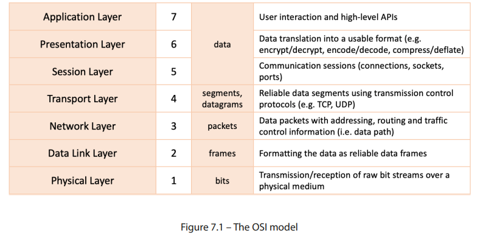
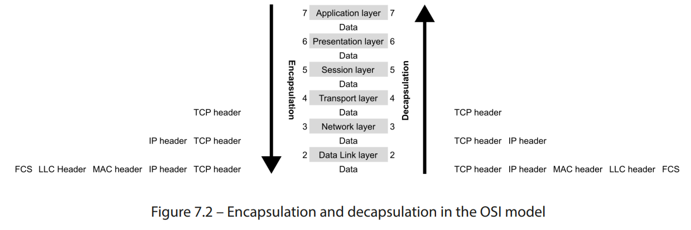
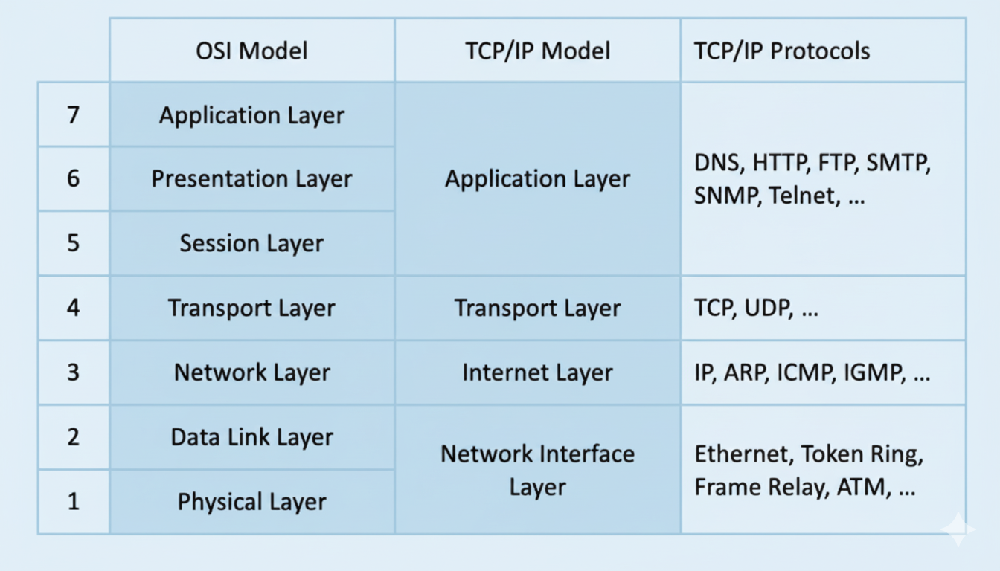
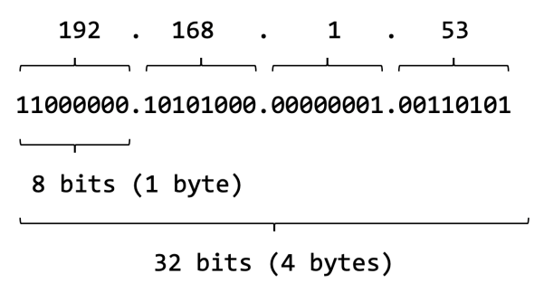
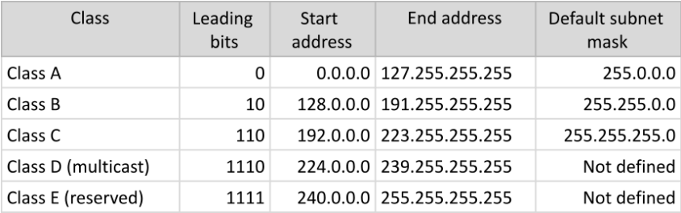
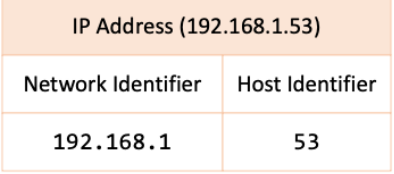

# 📖 What is a **Computer Network**?

A **computer network** is a group of **two or more computers (or nodes)** connected via a **physical medium** (cable, wireless, optical) and communicating with each other using a **standard set of communication protocols**.

---

## 🏗️ Network Infrastructure

At a high level, a network infrastructure includes:

* 💻 **Computers & Devices**
* 🔀 **Switches**
* 🌐 **Routers**
* 🧵 **Ethernet or Optical Cables**
* 📡 **Wireless Environments**
* ⚙️ **Network Equipment**

---

## 🔎 Logical Layout

Beyond physical connectivity, networks are also defined by their **logical structure**, such as:

* **Topologies**
* **Tiers**
* **Data Flow**

📌 **Example:**
A **three-tiered networking hierarchy**:

1. 🛡️ **DMZ (Demilitarized Zone)** – Outward-facing, adds a security layer against the internet.
2. 🚧 **Firewall** – Controls and filters traffic between DMZ & internal network.
3. 🏠 **Internal Network** – The secure organizational network.

---

## 🆔 Network Device Identification

Devices on a network are identified by:

* **Network Addresses** → Locate nodes (e.g., IP addresses).
* **Hostnames** → Easy-to-remember labels, friendlier than numeric addresses.

---

## 📏 Classification of Networks

### 🔹 Local Area Network (LAN)

* Devices connected in a **single, limited area** (residence, office, school).
* Size can range from **a few devices → thousands of computers**.
* Examples:

  * 🏠 Home Wi-Fi network
  * ☕ Coffee shop’s free Wi-Fi
* 🔗 [Cisco: What is a LAN?](https://www.cisco.com/c/en/us/products/switches/what-is-a-lan-local-area-network.html)

### 🔹 Wide Area Network (WAN)

* A **network of networks** connecting multiple LANs.
* Examples:

  * 🌍 **Internet** (largest WAN)
  * Multinational company networks across regions.
* **Built by service providers** & leased to businesses/institutions.
* Variations:

  * 👤 **PAN (Personal Area Network)**
  * 🏙️ **MAN (Metropolitan Area Network)**
  * ☁️ **IAN (Internet/Cloud Area Network)**
* 🔗 [Cisco: What is a WAN?](https://www.cisco.com/c/en/us/products/switches/what-is-a-wan-wide-area-network.html)

---

# 📚 OSI Model

The **Open Systems Interconnection (OSI) model** is a **theoretical representation of multilayer communication** between computer systems over a network.

* 📅 Introduced: **1983**
* 🏢 Organization: **ISO (International Organization for Standardization)**
* 🎯 Purpose: To provide a **standard framework** for different computer systems to communicate.

---

## 📊 OSI Layers

<div align="center">
  
</div>

| Layer           | Number | Data Unit           | Description                                                                        |
| --------------- | ------ | ------------------- | ---------------------------------------------------------------------------------- |
| 🖥️ Application | 7      | Data                | User interaction & high-level APIs                                                 |
| 🎨 Presentation | 6      | Data                | Translates data → usable format (encrypt/decrypt, encode/decode, compress/deflate) |
| 🔗 Session      | 5      | Data                | Manages sessions (connections, sockets, ports)                                     |
| 🚚 Transport    | 4      | Segments, Datagrams | Reliable delivery via **TCP/UDP**                                                  |
| 📦 Network      | 3      | Packets             | Adds addressing, routing, & traffic control                                        |
| 📑 Data Link    | 2      | Frames              | Formats reliable frames with MAC & LLC headers                                     |
| ⚡ Physical      | 1      | Bits                | Transmission/reception of raw bit streams                                          |

---

## 🔄 Data Encapsulation & Decapsulation

<div align="center">
  
</div>

### 🔹 Encapsulation (Sending Data)

Data moves **downward (Layer 7 → Layer 1)**:

1. **Layer 7 – Application**: User interacts with application.
2. **Layer 6 – Presentation**: Data converted → usable format.
3. **Layer 5 – Session**: Manages connection/session.
4. **Layer 4 – Transport**: Data split into **segments**; TCP/UDP header added.
5. **Layer 3 – Network**: Data becomes **packets**; IP header added.
6. **Layer 2 – Data Link**: Packets become **frames**;

   * Adds **MAC addresses (source & destination)**
   * Adds **LLC header**
   * Adds **FCS (Frame Check Sequence)** for error detection.
7. **Layer 1 – Physical**: Frames converted into **bits** for transmission.

---

### 🔹 Decapsulation (Receiving Data)

Data moves **upward (Layer 1 → Layer 7)**:

1. **Layer 1 – Physical**: Bits received & synchronized.
2. **Layer 2 – Data Link**:

   * Error checked via **FCS** using **CRC (Cyclic Redundancy Check)**.
   * Frame → Packet.
3. **Layer 3 – Network**: IP header processed.
4. **Layer 4 – Transport**: TCP/UDP validation.
5. **Layer 5 – Session**: Session re-established.
6. **Layer 6 – Presentation**: Data decrypted, decompressed, converted.
7. **Layer 7 – Application**: Data delivered to end-user application.

---

## 📡 Physical Layer (Layer 1)

The **physical layer** is the foundation of the OSI model. It deals with the **hardware infrastructure** that connects devices and enables communication.

### 🔑 Responsibilities

* Handles **conversion between raw bit streams** and the communication medium.
* Regulates **bit-rate control** (the speed of communication).
* Transfers data through **electrical, radio, or optical signals**.

### ⚙️ Components

* **Cables** (coaxial, fiber optics, twisted pair, etc.)
* **Wireless environments** (Wi-Fi, Bluetooth, etc.)
* **Optical mediums** (laser, infrared, fiber optics)
* **Connectors & switches**

### 📜 Protocols Operating at Layer 1

* **Ethernet**
* **Universal Serial Bus (USB)**
* **Digital Subscriber Line (DSL)**

---

## 🔗 Data Link Layer (Layer 2)

The **data link layer** ensures a **reliable data flow** between two directly connected devices (e.g., nodes in a **WAN** or devices in a **LAN**).

### 🔑 Responsibilities

* Ensures **flow control** (adapting to the physical layer’s speed).
* Detects and **corrects communication errors** from the physical layer.
* Handles **framing** (breaking data into manageable units).
* Prevents and recovers from **frame collisions** when multiple devices access the same channel.

### ⚙️ Subsystems

1. **Media Access Control (MAC)**

   * Uses **MAC addresses** to identify and connect devices.
   * Controls **permissions** for devices to transmit/receive data.

2. **Logical Link Control (LLC)**

   * Identifies and encapsulates **network layer protocols**.
   * Performs **error checking** and **frame synchronization**.

### 🗂️ Frames

* A **frame** = data transmission unit at the data link layer.
* It acts as a **container for a single network packet**.
* Packets inside frames move to the next OSI level (**network layer**).

### 📦 Types of Frames

* **Ethernet Frames**

  * IEEE 802.3 (original format)
  * **802.3 SNAP** (SubNetwork Access Protocol)
  * **Ethernet II (extended)**

### 📜 Example Protocol

* **Point-to-Point Protocol (PPP)**

  * Binary networking protocol.
  * Widely used in **high-speed broadband communication networks**.


## 🌍 Network Layer (Layer 3)

The **network layer** is responsible for **finding the optimal communication path** between devices across networks. It ensures data packets move from **source → destination** effectively.

### 🔑 Responsibilities

* **Routing:** Determines the best path for data using **IP addresses**.
* **Packetization:**

  * **Transmitting end:** Breaks **transport layer segments** into **network packets**.
  * **Receiving end:** Reassembles **frames (from Data Link Layer)** into **packets**.

### 🛠️ Key Protocols

* **Internet Control Message Protocol (ICMP):**

  * Used for **diagnosing network issues**.
  * Sends error/status messages such as:

    * `Destination network unreachable`
    * `Timer expired`
    * `Source route failed`

---

## 🚚 Transport Layer (Layer 4)

The **transport layer** ensures reliable **end-to-end delivery** of data, working with **segments (TCP)** or **datagrams (UDP)**.

### 🔑 Responsibilities

* **Data Segmentation:**

  * **Transmitting end:** Breaks data (from Session Layer) into **segments**.
  * **Receiving end:** Reassembles **packets (from Network Layer)** into **segments**.
* **Quality of Service (QoS):** Guarantees specific delivery quality.
* **Reliability:** Maintains integrity with error detection and retransmission.
* **Flow Control:** Matches transfer rate between sender & receiver to prevent overload.
* **Error Control:** Requests retransmission if data is corrupted or missing.

### 🛠️ Key Protocols

* **Transmission Control Protocol (TCP):**

  * Reliable, connection-oriented.
  * Ensures ordered delivery and retransmission if errors occur.
* **User Datagram Protocol (UDP):**

  * Faster, connectionless.
  * No error correction—used in streaming, gaming, VoIP.

## 💬 Session Layer (Layer 5)

The **session layer** manages the **lifetime of communication sessions** (channels) between devices. A session defines when communication starts, how long it lasts, and how it ends.

### 🔑 Responsibilities

* Establishes, manages, and terminates **sessions**.
* Uses **network addresses, sockets, and ports** to define sessions.
* Ensures **data integrity** within a session.
* Provides **checkpointing & recovery** → if a session is interrupted, it resumes from the last checkpoint.

### 🛠️ Protocols

* **Remote Procedure Call (RPC):** Used in interprocess communications.
* **NetBIOS (Network Basic Input/Output System):** Provides **file-sharing** and **name-resolution** services.

---

## 🎨 Presentation Layer (Layer 6)

The **presentation layer** acts as the **translator** of the OSI model. It ensures that data sent from one system can be understood by another, regardless of their internal formats.

### 🔑 Responsibilities

* Converts data into a **system-independent representation** before transmission.
* Transforms incoming data into **application-friendly formats**.
* Handles:

  * 🔒 **Encryption / Decryption** (e.g., SSL/TLS)
  * 📦 **Compression / Decompression** (e.g., ZIP)
  * 🔤 **Encoding / Decoding**
  * 🔄 **Serialization / Deserialization**

### 📂 Examples of Standard Data Formats

* **ASCII** (American Standard Code for Information Interchange)
* **XML** (Extensible Markup Language)
* **JSON** (JavaScript Object Notation)
* **JPEG** (Image format)
* **ZIP** (Compression format)

⚡ Note: In practice, the **presentation layer and application layer** are often tightly coupled.

---

## 🖥️ Application Layer (Layer 7)

The **application layer** is the **closest layer to the end user**. It does not run applications themselves, but rather provides **communication services** that applications use.

### 🔑 Responsibilities

* Provides **input/output handling** for application data.
* Acts as a **bridge** between user applications and the network.
* Supports end-user services like **web browsing, file transfers, and email**.

### 🛠️ Protocols

* **DNS** (Domain Name System)
* **HTTP** (HyperText Transfer Protocol)
* **FTP** (File Transfer Protocol)
* **Email Protocols:**

  * **POP** (Post Office Protocol)
  * **IMAP** (Internet Message Access Protocol)
  * **SMTP** (Simple Mail Transfer Protocol)

---

# 🏗️ OSI vs TCP/IP Model

* The **OSI Model** (7 layers) provides a **theoretical framework** for how network communication should work.
* The **TCP/IP Model** is a **practical implementation** with fewer layers (some OSI layers are collapsed).

### ✅ Why They Matter

* **OSI Model:** Great for **understanding networking concepts** and troubleshooting.
* **TCP/IP Model:** Widely used in real-world networking because of its **protocol-centric approach**.

---

# 🌐 **TCP/IP Network Stack Model**

The **TCP/IP model** is a **four-layer interpretation** of the OSI networking stack, where some of the OSI layers are consolidated.

📌 **Chronology:**

* The **TCP/IP model** was developed **before** the OSI model.
* Proposed by the **US Department of Defense (DoD)** as part of a DARPA (Defense Advanced Research Projects Agency) project.
* This project later evolved into the **modern internet**.

Both **OSI** and **TCP/IP** provide a layered approach to networking, but TCP/IP is more **protocol-centric** and practical, whereas OSI is more **theoretical**.

---

## 🗂️ Comparison: OSI vs TCP/IP Models

<div align="center">
  
  
**Figure 7.3 – The OSI and TCP/IP models**
</div>


---

## 📶 Layers of the TCP/IP Model

### 1️⃣ Network Interface Layer

* Responsible for **data delivery over a physical medium** (wire, wireless, optical).
* Combines **Physical Layer + Data Link Layer** of the OSI model.

🔑 **Protocols:**

* Ethernet
* Token Ring
* Frame Relay

---

### 2️⃣ Internet Layer

* Provides **connectionless data delivery** between nodes.
* Uses **routing functions** to determine the best path.
* Breaks data into **packets** at sender, reassembles at receiver.
* Maps to **Network Layer (L3)** in the OSI model.

🔑 **Protocols:**

* IP (Internet Protocol)
* ARP (Address Resolution Protocol)
* ICMP (Internet Control Message Protocol)
* IGMP (Internet Group Management Protocol)

---

### 3️⃣ Transport Layer

* Also called **Transmission Layer** or **Host-to-Host Layer**.
* Ensures **reliable communication** between endpoints.
* Implements **error detection & correction**.
* Maps directly to **Transport Layer (L4)** in the OSI model.

🔑 **Protocols:**

* TCP (Transmission Control Protocol)
* UDP (User Datagram Protocol)

---

### 4️⃣ Application Layer

* Provides **data communication services** to applications.
* Combines **Session, Presentation, and Application Layers** of the OSI model.

🔑 **Protocols:**

* DNS (Domain Name System)
* HTTP/HTTPS (Web communication)
* FTP (File Transfer Protocol)
* SMTP, POP, IMAP (Email protocols)
* SNMP (Simple Network Management Protocol)
* Telnet

---

## 🌍 Key Differences

| Feature      | OSI Model (7 Layers)                | TCP/IP Model (4 Layers)                 |
| ------------ | ----------------------------------- | --------------------------------------- |
| **Concept**  | Theoretical model for communication | Practical model for the internet        |
| **Layers**   | 7 (detailed separation)             | 4 (consolidated)                        |
| **Focus**    | Functionality of each layer         | Protocols and real-world implementation |
| **Examples** | Education, troubleshooting          | Internet, real-world networking         |

---


# 🌐 **TCP/IP Protocols**

The **TCP/IP protocol suite** is the backbone of the internet. These protocols define **how data is addressed, transmitted, routed, secured, and interpreted** across networks.

Each protocol is standardized in an **RFC (Request for Comments)**, published by the [IETF](https://www.ietf.org/standards/rfcs/).

---

## 🧩 Layer 3 – Network Layer Protocols

### 🌍 Internet Protocol (**IP**) – RFC 791

* **OSI Layer:** Network (L3)
* **Role:** The core protocol of TCP/IP, responsible for delivering data packets across networks.
* **Key Features:**

  * Provides **logical addressing** through IPv4 or IPv6.
  * Splits data into **datagrams** for transport.
  * Supports **fragmentation and reassembly** of large packets.
  * Handles **routing** between networks using routers.
* **Use Case:** Every device on the internet has an IP address (e.g., `192.168.1.1`, `2001:db8::1`).

---

### 🔗 Address Resolution Protocol (**ARP**) – RFC 826

* **OSI Layer:** Data Link (L2)
* **Role:** Maps **IPv4 addresses → MAC addresses** so data can be delivered over Ethernet.
* **Key Features:**

  * Operates within local networks.
  * Maintains an **ARP cache** to store IP-to-MAC mappings.
* **Use Case:** When you visit a website, your computer first asks, *“Who has this IP?”* ARP replies with the MAC address of the device.

---

### 🧭 Neighbor Discovery Protocol (**NDP**) – RFC 4861

* **OSI Layer:** Data Link (L2)
* **Role:** IPv6 replacement for ARP.
* **Key Features:**

  * Handles **address resolution, neighbor reachability, and router discovery**.
  * Uses **ICMPv6 messages**.
* **Use Case:** In IPv6-only networks, NDP enables devices to automatically discover neighbors and configure themselves.

---

### 🛠️ Internet Control Message Protocol (**ICMP**) – RFC 792

* **OSI Layer:** Network (L3)
* **Role:** Provides **diagnostic and error-reporting functions**.
* **Key Features:**

  * Reports unreachable destinations.
  * Alerts when packet TTL (Time To Live) expires.
  * Used in **ping** and **traceroute** commands.
* **Use Case:**

  * `ping google.com` uses ICMP Echo Request/Reply to test connectivity.
  * `traceroute` uses ICMP messages to trace the path packets take.

---

## 🚚 Layer 4 – Transport Layer Protocols

### 📦 Transmission Control Protocol (**TCP**) – RFC 793

* **OSI Layer:** Transport (L4)
* **Role:** Reliable, connection-oriented protocol.
* **Key Features:**

  * Uses **3-way handshake** (SYN, SYN-ACK, ACK) to establish connections.
  * Guarantees **delivery, order, and error correction**.
  * Implements **flow control** (sender doesn’t overwhelm receiver).
* **Use Case:**

  * Web browsing (HTTP/HTTPS)
  * Emails (SMTP, IMAP, POP)
  * File transfers (FTP)

---

### 🚀 User Datagram Protocol (**UDP**) – RFC 768

* **OSI Layer:** Transport (L4)
* **Role:** Lightweight, connectionless protocol.
* **Key Features:**

  * No handshake → faster but less reliable.
  * No retransmission or ordering guarantees.
* **Use Case:**

  * Online gaming 🎮
  * Video/voice streaming 🎥🎙️
  * DNS lookups

---

## 🖥️ Layer 7 – Application Layer Protocols

### 🖧 Dynamic Host Configuration Protocol (**DHCP**) – RFC 2131

* **Role:** Automatically assigns **IP addresses, subnet masks, gateways, and DNS servers**.
* **Process:**

  * DHCP Discover → DHCP Offer → DHCP Request → DHCP Acknowledge (DORA process).
* **Use Case:** When you connect your phone to Wi-Fi, DHCP gives it an IP automatically.

---

### 🌐 Domain Name System (**DNS**) – RFC 2929

* **Role:** Translates **domain names → IP addresses**.
* **Key Features:**

  * Hierarchical system (root → TLD → authoritative servers).
  * Caches results to improve speed.
* **Use Case:**

  * `www.google.com` → `142.250.190.14`.

---

### 🌍 HyperText Transfer Protocol (**HTTP**) – RFC 2616

* **Role:** Core protocol of the **World Wide Web**.
* **Key Features:**

  * Client/server model.
  * Stateless (each request is independent).
* **Use Case:** Loading web pages, APIs.

---

### 📂 File Transfer Protocol (**FTP**) – RFC 959

* **Role:** Transfers files between client ↔ server.
* **Modes:**

  * Active & Passive (different ways of handling connections).
* **Use Case:** Uploading/downloading files to a web server.

---

### 💻 Terminal Network Protocol (**TELNET**) – RFC 854

* **Role:** Provides **text-based remote login**.
* **Problem:** Insecure (sends data in plaintext).
* **Use Case:** Rarely used today, replaced by SSH.

---

### 🔒 Secure Shell (**SSH**) – RFC 4253

* **Role:** Secure remote login and administration.
* **Key Features:**

  * Encryption, authentication, tunneling.
* **Use Case:**

  * Managing Linux servers remotely.
  * Secure file transfer (SCP, SFTP).

---

### 📧 Simple Mail Transfer Protocol (**SMTP**) – RFC 5321

* **Role:** Email sending protocol.
* **Key Features:**

  * Supports authentication & encryption (STARTTLS, SMTPS).
* **Use Case:**

  * Outlook, Gmail sending emails to mail servers.

---

### 📡 Simple Network Management Protocol (**SNMP**) – RFC 1157

* **Role:** Used for **network monitoring and management**.
* **Key Features:**

  * Agents run on devices → report data to SNMP manager.
  * Supports monitoring CPU, memory, bandwidth, etc.
* **Use Case:** Enterprises monitor switches, routers, servers.

---

### ⏰ Network Time Protocol (**NTP**) – RFC 5905

* **Role:** Synchronizes clocks across devices.
* **Key Features:**

  * Uses time servers and hierarchical structure (Stratum levels).
  * Accuracy: within milliseconds over the internet.
* **Use Case:** Financial systems, databases, logging, authentication (Kerberos).

---

## 📊 OSI Mapping of TCP/IP Protocols

| Protocol (Full Name)                | Abbreviation | RFC  | OSI Layer        | Purpose                       |
| ----------------------------------- | ------------ | ---- | ---------------- | ----------------------------- |
| Internet Protocol                   | IP           | 791  | Network (L3)     | Addressing, routing           |
| Address Resolution Protocol         | ARP          | 826  | Data Link (L2)   | IPv4 → MAC mapping            |
| Neighbor Discovery Protocol         | NDP          | 4861 | Data Link (L2)   | IPv6 → MAC mapping            |
| Internet Control Message Protocol   | ICMP         | 792  | Network (L3)     | Diagnostics, error reporting  |
| Transmission Control Protocol       | TCP          | 793  | Transport (L4)   | Reliable delivery             |
| User Datagram Protocol              | UDP          | 768  | Transport (L4)   | Fast, connectionless delivery |
| Dynamic Host Configuration Protocol | DHCP         | 2131 | Application (L7) | Automatic IP allocation       |
| Domain Name System                  | DNS          | 2929 | Application (L7) | Domain → IP resolution        |
| HyperText Transfer Protocol         | HTTP         | 2616 | Application (L7) | Web communication             |
| File Transfer Protocol              | FTP          | 959  | Application (L7) | File transfers                |
| Terminal Network Protocol           | TELNET       | 854  | Application (L7) | Remote text login             |
| Secure Shell                        | SSH          | 4253 | Application (L7) | Secure remote access          |
| Simple Mail Transfer Protocol       | SMTP         | 5321 | Application (L7) | Email transmission            |
| Simple Network Management Protocol  | SNMP         | 1157 | Application (L7) | Device monitoring             |
| Network Time Protocol               | NTP          | 5905 | Application (L7) | Time synchronization          |

---


# 🌐 **IP Addressing, Subnets & Broadcast Addresses**

An **IP address** is a **unique identifier (UID)** for devices in a network. Devices locate and communicate with each other using IP addresses—similar to how postal mail is delivered using house addresses.

---

## 📮 IPv4 vs IPv6

* **IPv4 (Internet Protocol version 4):**

  * 32-bit address → 4,294,967,296 (\~4.3 billion) possible addresses.
  * Written as **4 groups of 8 bits (1 byte each)** separated by dots.
  * Example: `192.168.1.53`

* **IPv6 (Internet Protocol version 6):**

  * 128-bit address → virtually unlimited addresses.
  * Introduced due to IPv4 exhaustion.
  * Example: `2001:0db8:85a3:0000:0000:8a2e:0370:7334`

---

## 🧮 IPv4 Structure

Example: **192.168.1.53**

<div align="center">
  
</div>

* Each number = **8 bits (1 byte)**
* Total = **32 bits (4 bytes)**
* Binary form:

  ```
  11000000.10101000.00000001.00110101
  ```

---

## 🏷️ Network Classes (Classful Addressing)

Originally, IP addresses were divided into **classes** (introduced in 1981) to separate large, medium, and small networks.

<div align="center">
  
</div>

| Class       | Leading Bits | Start Address | End Address     | Default Subnet Mask | Usage               |
| ----------- | ------------ | ------------- | --------------- | ------------------- | ------------------- |
| **Class A** | 0            | 0.0.0.0       | 127.255.255.255 | 255.0.0.0           | Very large networks |
| **Class B** | 10           | 128.0.0.0     | 191.255.255.255 | 255.255.0.0         | Medium networks     |
| **Class C** | 110          | 192.0.0.0     | 223.255.255.255 | 255.255.255.0       | Small networks      |
| **Class D** | 1110         | 224.0.0.0     | 239.255.255.255 | Not defined         | Multicasting        |
| **Class E** | 1111         | 240.0.0.0     | 255.255.255.255 | Not defined         | Experimental        |

⚠️ Today, class-based addressing is mostly replaced by **CIDR (Classless Inter-Domain Routing)**.

---

## 🖧 Subnets

A **subnet (subnetwork)** is a logical division of a network.

Example:

* IP Address: `192.168.1.53`
* **Network ID:** `192.168.1`
* **Host ID:** `53`

<div align="center">
  
</div>

### 🔑 Subnet Mask

* Defines which part of the IP is **network** and which is **host**.
* Example: `192.168.1.0` with mask `255.255.255.0`

### 🔢 CIDR Notation

* Example: `192.168.1.0/24`
* `/24` = first 24 bits represent the **network ID**.

---

## 🧩 Subnetting Example

Suppose we want host addresses between **100 → 125** in network `192.168.1.x`.

1. Starting point: `192.168.1.100`

   ```
   11000000.10101000.00000001.01100100
   ```

   → Host identifier = `100`.

2. Closest reserved boundary = `96`.
   → Equivalent binary: `11100000`

3. Subnet mask:

   ```
   11111111.11111111.11111111.11100000
   = 255.255.255.224
   ```

4. CIDR notation:

   ```
   192.168.1.96/27
   ```

5. Host range:

   * Start: `192.168.1.97`
   * End: `192.168.1.126`
   * Broadcast: `192.168.1.127`

---

## 📢 Broadcast Addresses

A **broadcast address** is reserved for sending data to **all devices** in a subnet.

* Always the **last IP** in the subnet range.

### Examples:

* `192.168.1.0/24` → Broadcast = `192.168.1.255`
* `192.168.1.96/27` → Broadcast = `192.168.1.127`

---

## 📚 References

* [RFC 791 – Internet Protocol](https://tools.ietf.org/html/rfc791)
* [RFC 870 – Classful Networks](https://tools.ietf.org/html/rfc870)
* [RFC 1918 – Subnets & Private Addressing](https://tools.ietf.org/html/rfc1918)
* [RFC 6308 – Multicast Addressing](https://tools.ietf.org/html/rfc6308)

---
