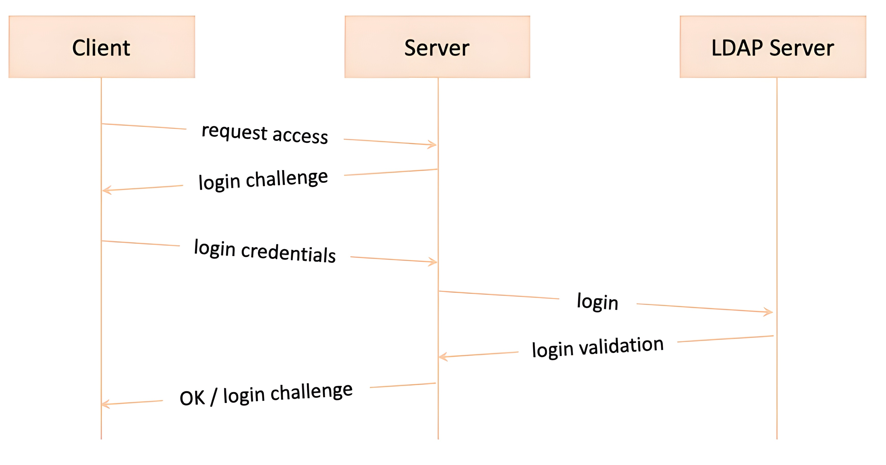
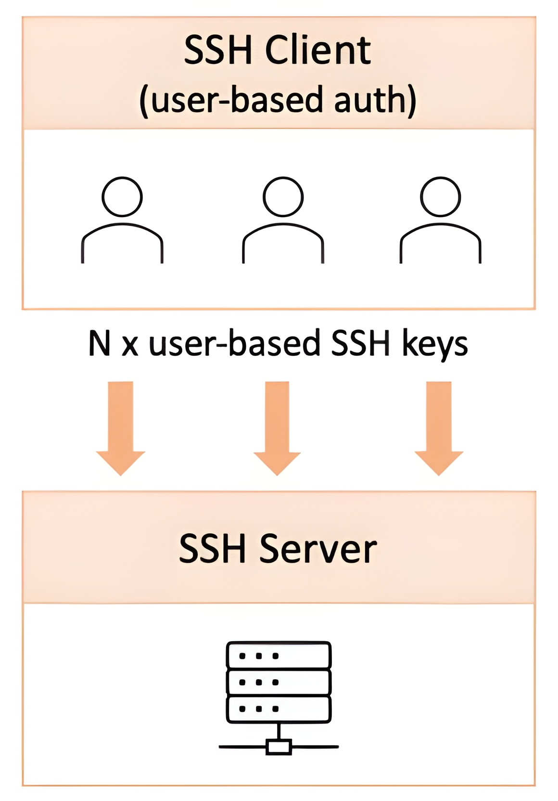
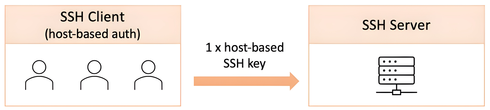

# 🌐 **Working with Network Services in Linux**

In this section, we’ll enumerate some of the most common **network services** running on Linux.

> ⚠️ **Note**: Not all services mentioned here are installed or enabled by default on your Linux distribution.

📖 For more in-depth details:

* **Section** → *Securing Linux*
* **Section** → *Disaster Recovery, Diagnostics, and Troubleshooting*

Those Sections will explain **installation** and **configuration** of these services.
Here, our focus is on:

✅ What these network services are
✅ How they work
✅ Which networking protocols they use for communication

---

## 🖥️ What is a Network Service?

A **network service** is typically a **system process** that implements **application layer (OSI Layer 7)** functionality for **data communication**.

* These services allow devices, applications, or users to interact across a network.
* They are usually designed as **peer-to-peer** or **client-server** architectures.

---

## 🔄 Peer-to-Peer Networking

In **peer-to-peer (P2P) networking**:

* Multiple network nodes each run their **own equally privileged instance** of a service.
* These nodes **share** and **exchange** a common set of data.

📌 **Example**:

* A network of **DNS servers** sharing and updating domain name records.

---

## 👨‍💻 Client-Server Networking

In **client-server networking**:

* One or more **server nodes** exist in a network.
* Multiple **clients** communicate with these servers.

📌 **Example**:

* **SSH (Secure Shell)**

  * An SSH client connects to a remote **SSH server** via a secure terminal session.
  * This is often used for **remote administration** purposes.

---

# 📡 **DHCP Servers in Linux**

## 📝 What is DHCP?

**DHCP (Dynamic Host Configuration Protocol)** is a network service that:

* Dynamically assigns **IP addresses** to devices (clients) on a network.
* Eliminates the need for **manual configuration** of IP addresses.
* Provides additional client configuration data like:

  * **MAC addresses**
  * **DNS server addresses**
  * **Default gateway**

---

## ⚙️ How DHCP Works

1. **Client Broadcast Request (Layer 2)**

   * A device sends a **broadcast message** on the local network to find a DHCP server.
   * Since this discovery happens at the **Data Link Layer (Layer 2)**, the request **cannot cross network boundaries** (it stays inside the local subnet).

2. **Server Reply (Layer 2 → Layer 4)**

   * The DHCP server responds with an **IP address** and additional configuration.
   * After the initial handshake, DHCP uses **UDP** at **Layer 4 (Transport Layer)**.

3. **Ports Used**

   * **UDP Port 67** → Used by DHCP server.
   * **UDP Port 68** → Used by DHCP client.

4. **IP Address Leasing**

   * DHCP assigns IP addresses for a specific **lease time** (finite or infinite).
   * The client must **renew the lease** before it expires.
   * If renewal fails → IP may be reassigned to another device.
   * Late renewal → Client may receive a **new IP address** if the old one is taken.

---

## 🔗 Communication Flow

* **Client → Broadcasts DHCP Discover**
* **Server → Offers IP + Config**
* **Client → Requests IP**
* **Server → Acknowledges & Assigns IP**

This entire workflow is often called **DORA** (Discover, Offer, Request, Acknowledge).

---

## 💻 Linux Example: Querying DHCP

You can verify your DHCP-assigned settings using:

```bash
ip route
```

### ✅ Example Output:

```bash
hashim@Hashim:~$ ip route
default via 10.0.2.2 dev enp0s3 proto dhcp src 10.0.2.15 metric 100 
10.0.2.0/24 dev enp0s3 proto kernel scope link src 10.0.2.15 metric 100
```

### 🔍 Explanation

* **default via 10.0.2.2**

  * Default **gateway/router** (assigned by DHCP).
  * All traffic going outside your local network is sent here first.

* **dev enp0s3**

  * Network interface card (NIC) being used.

* **proto dhcp**

  * Confirms that the route was assigned via **DHCP protocol**.

* **src 10.0.2.15**

  * The IP address **assigned to your machine**.

* **metric 100**

  * Route priority; lower metric = higher priority.

* **10.0.2.0/24 dev enp0s3**

  * Local subnet assigned (range: `10.0.2.0` to `10.0.2.255`).
  * `/24` = subnet mask `255.255.255.0`.

---

## 🌍 Testing Connectivity: `traceroute`

Another useful command is:

```bash
traceroute google.com
```

### ✅ Example Output:

```bash
hashim@Hashim:~$ traceroute google.com
traceroute to google.com (216.58.209.142), 30 hops max, 60 byte packets
 1  10.0.2.2 (10.0.2.2)  26.096 ms  1.129 ms  1.549 ms
```

### 🔍 Explanation

* **traceroute google.com** → Traces the path packets take from your system to Google.
* **30 hops max** → Maximum number of intermediate routers it will check.
* **First hop: 10.0.2.2** → This is your **default gateway** (router) provided by the DHCP server.
* The response times (`26.096 ms`, `1.129 ms`, `1.549 ms`) show the **latency** between your system and the gateway.

This proves that:

* Your system is connected via **DHCP**.
* The first step in your network path is your **local gateway/router**.

---

# 🌐 **DNS Servers in Linux**

## 📝 What is DNS?

**DNS (Domain Name System)**, also known as a **name server**, is a service that:

* Converts **hostnames** (like `wikipedia.org`) into **IP addresses** (like `208.80.154.224`).
* Makes it easier for users and applications to communicate without remembering complex numeric IPs.
* Uses the **DNS protocol** (Application Layer, OSI Layer 7).

📖 Analogy:
DNS is like an **address book** 📖 — you look up a name (hostname) and get the exact address (IP).

---

## 🏗️ DNS in TCP/IP Networks

* Devices can communicate with each other using **hostnames**, not just IPs.
* On the internet, DNS relies on a **globally distributed network of DNS servers**.
* Even in small local networks, DNS simplifies communication between machines.

---

## 🛠️ Types of DNS Servers

DNS servers are organized in a **hierarchical system**, working together to resolve queries.

1. **Recursive Servers**

   * Act as resolvers for user queries.
   * Contact multiple DNS servers on your behalf to find the final IP.
   * Use **caching** for faster future lookups.

2. **Root Servers**

   * The top-level servers in DNS hierarchy.
   * Direct queries to appropriate **TLD servers**.

3. **TLD Servers**

   * Manage top-level domains (`.com`, `.org`, `.net`, etc.).
   * Direct queries to **authoritative servers** for the requested domain.

4. **Authoritative Servers**

   * Contain the **actual DNS records** (zone files) of domains.
   * Provide the final IP address to complete the lookup.

---

## 🔄 Recursive vs Iterative Queries

* **Recursive Query**:

  * A DNS server (resolver) does all the work and gives you the final answer.
  * Faster because it uses **caching**.

* **Iterative Query**:

  * Each DNS server replies with a reference to another DNS server.
  * The client follows the chain until the answer is found.

---

## 📂 DNS Zone Files

* DNS servers store **hostname-to-IP mappings** in **zone files**.
* Zone files are usually simple **ASCII text files**.
* On Linux, a local resolver file is:

```bash
/etc/resolv.conf
```

---

## 💻 Querying DNS in Linux

### 🔎 1. Checking Local DNS Resolver

```bash
cat /etc/resolv.conf | grep nameserver
```

#### Example Output:

```bash
hashim@Hashim:~$ cat /etc/resolv.conf | grep nameserver
nameserver 127.0.0.53
```

✅ **Explanation**:

* `127.0.0.53` → Local loopback DNS resolver (systemd-resolved).

---

### 🔎 2. Using `nslookup`

Install **dnsutils** if not available:

```bash
sudo apt install dnsutils
```

#### Example 1: Lookup Local Host

```bash
nslookup neptune.local
```

Output:

```bash
Server:  127.0.0.53
Address: 127.0.0.53#53
```

✅ This shows the local DNS resolver is handling the request.

---

#### Example 2: Interactive `nslookup`

```bash
nslookup
> wikipedia.org
```

Output:

```bash
Server:   127.0.0.53
Address:  127.0.0.53#53

Non-authoritative answer:
Name:     wikipedia.org
Address:  103.102.166.224
Name:     wikipedia.org
Address:  2001:df2:e500:ed1a::1
```

✅ **Explanation**:

* **Server**: Local resolver (loopback).
* **Name**: Domain being queried (`wikipedia.org`).
* **Address**: IPv4 (`103.102.166.224`) and IPv6 (`2001:df2:e500:ed1a::1`) results.

To exit → Press **Ctrl + C**.

---

#### Example 3: Reverse Lookup

```bash
nslookup 8.8.8.8
```

Output:

```bash
8.8.8.8.in-addr.arpa  name = dns.google.
```

✅ This resolves the IP `8.8.8.8` (Google’s public DNS) back to its hostname `dns.google`.

---

### 🔎 3. Using `dig`

Install if missing:

```bash
sudo apt install dnsutils   # Ubuntu/Debian
sudo dnf install bind-utils # Fedora
```

#### Example: Forward Lookup

```bash
dig google.com
```

Output (shortened):

```bash
;; ANSWER SECTION:
google.com.   278 IN A  216.58.209.142
```

✅ Shows that `google.com` resolves to **216.58.209.142**.

---

#### Example: Reverse Lookup

```bash
dig -x 8.8.4.4
```

Output:

```bash
;; ANSWER SECTION:
4.4.8.8.in-addr.arpa. 8199 IN PTR dns.google.
```

✅ Confirms IP `8.8.4.4` belongs to `dns.google`.

---

## 📊 DNS in OSI Model

* Operates at **Application Layer (Layer 7)**.
* Uses **Port 53** (both TCP & UDP).
* Works closely with DHCP to provide:

  * **IP addressing** (DHCP)
  * **Name resolution** (DNS)

---

# 🔐 **Authentication Servers in Linux**

## 📝 Local vs Remote Authentication

* On **standalone Linux systems**, user credentials are stored **locally** in files like:

  * `/etc/passwd`
  * `/etc/shadow`

* However, as soon as authentication needs to extend **beyond a single machine** (e.g., logging into a file server, email server, or corporate portal), local storage becomes:

  * ❌ **Insecure** (credentials spread across multiple systems).
  * ❌ **Unscalable** (hard to manage centrally).

✅ The solution: **Centralized Authentication Servers**.

---

## 🌍 Centralized Authentication

* A **centralized authentication server** provides a **single point** of validating user credentials.
* Benefits:

  * **Security** → Robust encryption during login.
  * **Scalability** → One set of credentials works across the network.
  * **Management** → Easier to revoke, reset, or enforce policies.

---

## 📂 Example: Accessing a File Server with Active Directory (AD)

1. A user mounts a shared folder from a file server.
2. The file server **prompts for credentials**.
3. The file server passes the credentials to the **authentication server** (e.g., LDAP/AD).
4. If authentication succeeds → The **share is made available** to the client.

---

## 🔄 Authentication Workflow with LDAP

The following diagram shows the authentication flow:

<div align="center">
  
</div>

**Figure 7.33 – Authentication workflow with LDAP**

---

### 🧾 Step-by-Step Flow

1. **Client → Server**:

   * The client requests access to a service.

2. **Server → Client**:

   * The server issues a **login challenge** (asks for username/password).

3. **Client → Server**:

   * The client submits **login credentials**.

4. **Server → LDAP Server**:

   * The server forwards the credentials to the **LDAP authentication server**.

5. **LDAP Server → Server**:

   * The LDAP server validates the login against its **central user database**.

6. **Server → Client**:

   * If validation succeeds → The client is granted access (OK).
   * Otherwise → Another login challenge or denial.

---

# 📂 **File Sharing in Linux Networking**

## 📝 What is File Sharing?

In networking, **file sharing** means a **client machine** can:

* **Mount** and **access** a remote filesystem on a server.
* Use it **as if it were local storage**.

👉 Applications on the client (e.g., a text editor) can:

* Open files directly from the server.
* Modify them.
* Save them back seamlessly.

This transparency is achieved using **file-sharing services** and **protocols**.

---

## 🖥️ Client-Server File Sharing

* Each **file-sharing protocol** has a **corresponding client-server platform**.
* Many implementations are **cross-platform**.
* Choosing the right one depends on:

  * ⚙️ **Compatibility**
  * 🔐 **Security**
  * ⚡ **Performance**

---

## 🔑 Common File-Sharing Protocols

### 1. 📡 **Server Message Block (SMB)**

* Provides:

  * **Network discovery**
  * **File sharing**
  * **Printer sharing**
  * **Interprocess communication**
* Developed by **IBM in the 1980s**, later extended by **Microsoft**.
* Versions: `SMB 1.0, 2.0, 2.1, 3.0, 3.0.2, 3.1.1`.
* Still widely used (especially on **Windows networks**).

---

### 2. 🗂️ **Common Internet File System (CIFS)**

* A specific **implementation of SMB**.
* SMB ↔ CIFS interoperability is possible.
* Differences: **File locking, batch processing, performance**.
* ⚠️ Mostly obsolete today (replaced by **SMB 2/3**).
* ✅ Always prefer modern **SMB** over CIFS.

---

### 3. 🖨️ **Samba**

* **Open-source implementation of SMB**.
* Allows **Windows clients** to:

  * Access directories, files, and printers on **Linux Samba servers**.
* As of **version 4**:

  * Supports **Microsoft Active Directory (AD)**.
  * Can act as a **domain controller**.
  * Windows domain credentials can be used **transparently on Linux** without duplication.

---

### 4. 📡 **Network File System (NFS)**

* Developed by **Sun Microsystems**.
* Works on the **same principle as SMB**: access remote files like local ones.
* ❌ **Not compatible** with SMB/CIFS.
* ✅ Preferred in **Linux-only networks**.

---

### 5. 🍏 **Apple Filing Protocol (AFP)**

* Proprietary protocol by **Apple**.
* Exclusively used in **macOS environments**.
* macOS also supports **SMB** and **NFS**, making it compatible in mixed networks.

---

## 🧭 Which Protocol to Use?

* **Linux-only environments** → Use **NFS**.
* **Mixed networks (Windows + Linux + macOS)** → Use **SMB/Samba**.
* **macOS-specific networks** → Use **AFP**, though SMB/NFS are also available.
* Some protocols (like **SMB**) also support **printer sharing** for use in print servers.

---

# 🖨️ **Printer Servers in Linux Networking**

## 📝 What is a Printer Server?

A **printer server (print server)** is a network service that connects a **printer** to **client machines** (computers or mobile devices) using a **printing protocol**.

This allows multiple users to:

* Discover printers across the network
* Send print jobs
* Monitor printer status
* Manage (queue/cancel) print requests

---

## ⚙️ Tasks of Printing Protocols

Printing protocols handle the following responsibilities over a network:

* 🔍 **Discovering printers/print servers**
* 📊 **Querying printer status** (ready, busy, error, etc.)
* 📑 **Sending print jobs** to the printer
* 📥 **Receiving jobs** and managing them in a **queue**
* ❌ **Canceling print jobs** when needed
* 🔎 **Querying job status** (in-progress, completed, failed)

---

## 🔑 Common Printing Protocols

### 1. 📡 **Line Printer Daemon (LPD)**

* One of the oldest printing protocols.
* Works on a **client-server model**:

  * Client sends a job → Server manages the print queue → Printer executes the job.

---

### 2. 🖥️ **Generic Protocols**

* **SMB** (Server Message Block):

  * Already used for **file sharing**, also supports **printer sharing**.
* **TELNET**:

  * Originally a remote-access protocol.
  * Can also be adapted for basic printing tasks.

---

### 3. 📶 **Wireless Printing**

* **AirPrint (Apple)**:

  * Proprietary wireless printing protocol.
  * Allows iOS/macOS devices to print wirelessly without extra drivers.

---

### 4. 🌍 **Internet Printing Protocols**

* **Google Cloud Print** (now deprecated, but widely used in the past).
* Enabled printing documents via the **cloud**, from anywhere.

---

## 📚 Relationship with Other Services

Printer servers are closely tied to **file sharing**:

* Both involve **sharing documents** — either as **digital files** or as **printed copies**.
* Beyond printing, other network services (like **file transfer** and **email services**) often complement document sharing.

---

## 📌 Key Takeaways

* Printer servers connect printers to **multiple clients over a network**.
* Printing protocols handle **discovery, job submission, queueing, and monitoring**.
* Protocols include:

  * **LPD** (classic print protocol)
  * **SMB & TELNET** (generic)
  * **AirPrint** (wireless)
  * **Cloud Printing** (internet-based)
* Closely related to **file-sharing services** since both manage document exchange.

---

# 📂 **File Transfer in Linux Networking**

## 📝 What is FTP?

**FTP (File Transfer Protocol)** is a **standard network protocol** used to transfer files between computers over a network.

* Operates in a **Client-Server model**.
* An **FTP client** initiates a connection to an **FTP server**.
* Files can be transferred **both ways** (upload/download).

---

## ⚙️ FTP Connections

FTP maintains **two types of connections**:

1. **Control Connection**

   * Established on **Port 21 (default)**.
   * Used for sending **commands** between client and server.
   * Always open during the session.

2. **Data Connection**

   * Created only during actual **file transfers**.
   * Uses **dynamic (ephemeral) ports**.
   * Closed immediately after transfer completes.

---

## 🔄 FTP Modes of Operation

FTP negotiates data connections in two modes:

### 1. 📡 Active Mode

* Client sends **`PORT` command** to the server.
* The client provides a port number for the server to connect back for data transfer.

### 2. 📴 Passive Mode

* Client sends **`PASV` command** to the server.
* The server provides a port number where it listens, and the client connects to it.

✅ Passive mode is often preferred because it works better with **firewalls/NAT**.

---

## 🔐 FTP and Firewalls

* Control connection → Always on **Port 21 (insecure FTP)**.
* Data connection → Often on **Port 20**, but may vary.
* Inbound data sockets → Use **ephemeral port range (1024–65535)**.
* ❌ This dynamic port usage makes FTP **messy with firewall configurations**.

---

## 🔒 Secure FTP Implementations

Since plain FTP is **insecure** (credentials & data sent in cleartext), secure alternatives are used:

### 1. 🔑 **FTPS (FTP Secure / FTP over SSL/TLS)**

* Uses **SSL/TLS encryption** for FTP.
* Default control port: **990**.

### 2. 🛡️ **SFTP (SSH File Transfer Protocol)**

* Runs FTP operations over an **SSH connection**.
* Default control port: **22**.
* Much more secure and widely used.

---

# 📧 **Mail Servers in Linux Networking**

## 📝 What is a Mail Server?

A **mail server (email server)** is responsible for delivering and exchanging **emails over a network**.

Mail servers can:

* Handle **internal email exchanges** (within a company/organization/domain).
* Deliver emails to **external servers** (over the internet).

---

## 🧑‍🤝‍🧑 Key Actors in Email Exchange

1. **Email Client** → Outlook, Gmail app, Thunderbird.
2. **Mail Servers** → Exchange, Gmail server, Postfix, etc.
3. **Users** → Senders and recipients.
4. **Protocols** → Define how clients and servers communicate.

---

## 📡 Common Email Protocols

### 1. 📥 POP3 (Post Office Protocol v3)

* Used for **receiving & downloading** emails from a server to a local client.
* Typically, once downloaded → emails are **removed from the server**.
* Modern clients (Gmail, Outlook) allow keeping copies on the server.
* Suitable for **offline reading**.
* Not ideal for users accessing emails on **multiple devices**.

**Ports:**

* `110` → Insecure POP3
* `995` → Secure POP3 (POP3S using SSL/TLS)

---

### 2. 📥 IMAP (Internet Message Access Protocol)

* Emails are always **retained on the mail server**.
* Clients download **copies/sync** for local viewing.
* Allows access from **multiple devices**.
* Preferred over POP3 in modern email usage.

**Ports:**

* `143` → Insecure IMAP
* `993` → Secure IMAP (IMAPS using SSL/TLS)

---

### 3. 📤 SMTP (Simple Mail Transfer Protocol)

* Used for **sending emails** over a network or the internet.
* Supports **authentication** and **encryption** for secure delivery.

**Ports:**

* `25` → Insecure SMTP (legacy, often blocked by ISPs)
* `465` → Secure SMTP (SSL/TLS)
* `587` → Secure SMTP (STARTTLS, recommended for modern mail servers)

---

## 🔒 Secure Email Communication

* Always use **secure ports** (`995` POP3S, `993` IMAPS, `465/587` SMTPS).
* Ensure **TLS encryption** to protect credentials and data.
* Authentication via **username/password** adds an extra layer of security.

---

## 💻 Example: Secure SMTP with OpenSSL

We can simulate an SMTP client session to **Gmail’s SMTP server**:

```bash
openssl s_client -starttls smtp -connect smtp.gmail.com:587
```

### ✅ Breakdown

* `openssl s_client` → Launches OpenSSL in client simulation mode.
* `-starttls smtp` → Starts a **TLS handshake** for SMTP.
* `-connect smtp.gmail.com:587` → Connects to Gmail SMTP on **secure port 587**.

---

### Example Output (Shortened)

```bash
SSL handshake has read 4380 bytes and written 447 bytes
Verification: OK
---
New, TLSv1.3, Cipher is TLS_AES_256_GCM_SHA384
Protocol: TLSv1.3
Server public key is 256 bit
Verify return code: 0 (ok)
---
250 SMTPUTF8
```

✅ This confirms a successful **TLS-encrypted SMTP session**.

---

## 💬 SMTP Commands in Action

Once inside the **OpenSSL interactive prompt**:

1. **HELO Command** → Start SMTP communication.

```bash
HELO hellogoogle
```

Response:

```bash
250 smtp.gmail.com at your service
```

2. **EHLO Command** → Extended version (for ESMTP service extensions).

3. **AUTH LOGIN** → SMTP command for authentication (username/password).

⚠️ SMTP commands are **plaintext by default** → Always use TLS for encryption.

---

# ⏱️ **NTP Servers in Linux Networking**

## 📝 What is NTP?

**NTP (Network Time Protocol)** is a standard protocol for **clock synchronization** between computers on a network.

* Synchronizes system clocks within a few **milliseconds of UTC (Coordinated Universal Time)**.
* Ensures all devices share a **consistent and accurate time reference**.
* Critical for:

  * Logging and monitoring
  * Security certificates
  * Scheduling tasks
  * Distributed systems

---

## ⚙️ How NTP Works

* Follows a **Client-Server model**.
* **NTP Server**: Acts as a time source.

  * Sends timestamp datagrams to clients.
  * Broadcasts or unicasts updates.
* **Clients**: Adjust their system clocks based on received timestamps.
* **NTP Servers themselves** synchronize with highly accurate **global time servers**.
* Uses specialized **algorithms** to correct for network latency.

---

## 🛠️ Checking NTP Synchronization

### 1. Install `ntpstat`

On **Ubuntu/Debian**:

```bash
sudo apt install ntpstat
```

On **Fedora**:

```bash
sudo dnf install ntpstat
```

⚠️ `ntpstat` requires a **local NTP server** to be running.

---

## 📦 Setting Up a Local NTP Server (Ubuntu 22.04 Example)

1. **Install NTP**

   ```bash
   sudo apt install ntp
   ```

2. **Check Service Status**

   ```bash
   sudo systemctl status ntp
   ```

3. **Enable Service**

   ```bash
   sudo systemctl enable ntp
   ```

4. **Allow NTP in Firewall (Port 123/UDP)**

   ```bash
   sudo ufw allow from any to any port 123 proto udp
   ```

5. **Install `ntpdate` for manual updates**

   ```bash
   sudo apt install ntpdate
   ```

6. **Restart Service**

   ```bash
   sudo systemctl restart ntp
   ```

⚠️ Note: Ubuntu uses **`systemd-timesyncd`** by default. Installing `ntpd` will disable `timesyncd`.

---

## 🔎 Checking Synchronization

```bash
ntpstat
```

### Example Output:

```bash
hashim@Hashim:~$ ntpstat
synchronised to unspecified at stratum 3
   time correct to within 405 ms
   polling server every 64 s
```

✅ **Explanation**:

* **synchronised to unspecified at stratum 3** → System is synced with an NTP server (stratum 3 = relative accuracy).
* **time correct to within 405 ms** → Clock accuracy margin.
* **polling server every 64 s** → Interval between sync requests.

---

## 🌍 Digging More Info About the NTP Server

```bash
dig -x 31.209.85.242
```

### Example Output:

```bash
;; ANSWER SECTION:
242.85.209.31.in-addr.arpa. 505 IN PTR ntp1.lwlcom.net.
```

✅ Shows that the IP `31.209.85.242` maps to **ntp1.lwlcom.net**, a public NTP server.

---

# 🔐 **Remote Access in Linux (SSH)**

## 🧭 Why Remote Access?

Most Linux network services expose only limited **remote management**; their admin CLIs usually run **locally** on the same host. But direct console access isn’t always possible. That’s where **remote-access servers** step in to provide a **virtual Terminal login** to remote machines.

This section focuses on **SSH**, the most common secure remote-login protocol.
**Default SSH port:** `22`.

---

## 🛡️ What is SSH?

**SSH (Secure Shell)** provides encrypted, authenticated communication between a **client** and a **server** for secure remote access. SSH servers are easy to install and configure (see in SSH section later).

SSH supports these **authentication types**:

* **Public-key authentication**
* **Password authentication**
* **Keyboard-interactive authentication**

Below we explain each, without skipping any detail.

---

## 🔑 Public-Key Authentication (a.k.a. SSH-key / passwordless auth)

### How key-based auth works (common flow)

1. The SSH **client generates** a certificate/key pair (typically via `ssh-keygen`) using algorithms such as **RSA** or **DSA**.
2. The **public key** is shared with the SSH **server** (one-time step) and recorded among the server’s allowed keys.
3. During connection, the **server requests** the client’s public key and **verifies** it against its allowed list.

   * If it matches, the handshake succeeds, the **server shares its public key** with the client, and the SSH session is established.
4. Subsequent traffic uses standard crypto workflows:

   * **Client → Server:** encrypted with the **client’s private key**, decrypted with the **client’s public key**.
   * **Server → Client:** encrypted with the **server’s private key**, decrypted with the **server’s public key**.

Because no password prompts are required, this is often called **passwordless authentication** and is widely used in **automation scripts** that execute commands across many hosts.

> ℹ️ The key-ownership model can be **user-based** or **host-based**.

---

### 👤 User-Based Public-Key Authentication

Each **user** gets their **own SSH key pair**. Multiple accounts—even on the same machine/domain—use **different keys**, each granting its own access to the remote server.

<div align="center">
  
</div>
**When it’s great**

* Fine-grained per-user access control
* Easy to revoke a single user’s access without affecting others

---

### 🖥️ Host-Based Public-Key Authentication

A **single key pair per client host** is used to connect to the SSH server.

<div align="center">
  
</div>

**Important characteristics**

* The host-based key can **authenticate sessions only from that specific client host**.
* **Multiple users** from the **same host** can connect using the **same host key**.
* If a user tries the host-based key **from a different machine** than the one authorized by the server, **access is denied**.

**Security note:** Some environments **combine user-based and host-based** models to raise the security bar (both must be trusted).

---

## 🔒 Password Authentication

With password auth, the client supplies simple credentials (username + password). The server validates them against:

* **Local accounts** (e.g., `/etc/passwd`), or
* **Selected accounts** configured in the SSH server config (e.g., `/etc/ssh/sshd_config`).

SSH can also **delegate authentication** to **remote identity systems** such as **Kerberos, LDAP, RADIUS**, etc. (as discussed in your Authentication Servers section).
Because passwords require user entry (or automation that supplies them), they are simpler but typically **less secure** than keys.

---

## ⌨️ Keyboard-Interactive Authentication

This mechanism runs a **multi-step challenge–response dialogue** between the SSH server and the user (or client program):

* The **server asks** one or more questions (challenges).
* The **client answers** them in plaintext (responses).
* In a sense, **password authentication** is just a **single-challenge** variant of keyboard-interactive.

Despite the name, **it does not require a human**—it can also back custom or proprietary authentication protocols that your client automates.

---

## 🧩 Choosing an SSH Auth Method (Quick Ref)

| Need                                                      | Recommended Method                                    |
| --------------------------------------------------------- | ----------------------------------------------------- |
| Strong non-interactive automation across many hosts       | **Public-key (user-based)** or **combined user+host** |
| Per-user access control & easy revocation                 | **User-based keys**                                   |
| Same machine used by many users, trust tied to the box    | **Host-based keys**                                   |
| Simple, human-entered login for ad-hoc access             | **Password** (or keyboard-interactive)                |
| Integrate with central identity (AD/LDAP/Kerberos/RADIUS) | **Password/keyboard-interactive with remote auth**    |

---

