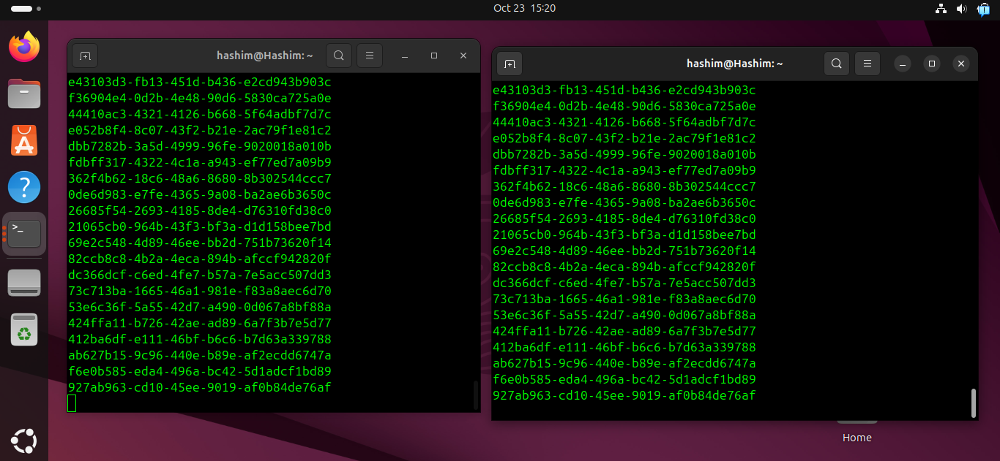

# 🚀 **Using Scripts to Showcase Interprocess Communication**

<details>
<summary><strong>📑 Table of Contents</strong></summary>

- [🚀 **Using Scripts to Showcase Interprocess Communication**](#-using-scripts-to-showcase-interprocess-communication)
  - [🏭 The Producer-Consumer Model](#-the-producer-consumer-model)
  - [💻 Implementation Using Bash Scripts](#-implementation-using-bash-scripts)
  - [Topics to be Covered](#topics-to-be-covered)
- [🗄️ **Shared Storage**](#️-shared-storage)
  - [⚠️ The Challenge: Race Conditions](#️-the-challenge-race-conditions)
  - [💻 Example: Producer and Consumer Scripts](#-example-producer-and-consumer-scripts)
    - [Producer Script (`producer.sh`)](#producer-script-producersh)
      - [Script Content](#script-content)
      - [📜 Code Explanation](#-code-explanation)
    - [Consumer Script (`consumer.sh`)](#consumer-script-consumersh)
      - [Script Content](#script-content-1)
      - [📜 Code Explanation](#-code-explanation-1)
    - [Visual Output](#visual-output)
- [➡️ **Unnamed Pipes**](#️-unnamed-pipes)
    - [🏭 Producer Script (`producer2.sh`)](#-producer-script-producer2sh)
      - [Script Content](#script-content-2)
      - [📜 Code Explanation](#-code-explanation-2)
    - [📥 Consumer Script (`consumer2.sh`)](#-consumer-script-consumer2sh)
      - [Script Content](#script-content-3)
      - [📜 Code Explanation](#-code-explanation-3)
    - [🚀 Execution and Output](#-execution-and-output)
      - [Result](#result)
- [📁 **Named Pipes** (FIFOs)](#-named-pipes-fifos)
  - [🏭 Producer Script (`producer3.sh`)](#-producer-script-producer3sh)
      - [Script Content](#script-content-4)
      - [📜 Code Explanation](#-code-explanation-4)
  - [📥 Consumer Script (`consumer3.sh`)](#-consumer-script-consumer3sh)
      - [Script Content](#script-content-5)
      - [📜 Code Explanation](#-code-explanation-5)
  - [🚀 Execution Output](#-execution-output)
      - [Producer Terminal Output](#producer-terminal-output)
      - [Consumer Terminal Output](#consumer-terminal-output)
  - [🛡️ Resilience and Persistence Workflow](#️-resilience-and-persistence-workflow)
  - [⚠️ A Note on Queuing](#️-a-note-on-queuing)
- [🔌 **Sockets**](#-sockets)
  - [Socket-Based Communication](#socket-based-communication)
  - [Example: IPC Sockets with `netcat`](#example-ipc-sockets-with-netcat)
    - [🔧 Installing `netcat`](#-installing-netcat)
    - [🏭 Producer Script (`producer4.sh`)](#-producer-script-producer4sh)
      - [Script Content](#script-content-6)
      - [📜 Code Explanation](#-code-explanation-6)
    - [📥 Consumer Script (`consumer4.sh`)](#-consumer-script-consumer4sh)
      - [Script Content](#script-content-7)
  - [⚙️ Socket Communication Behavior](#️-socket-communication-behavior)
    - [📊 Data Flow](#-data-flow)
    - [🏃 Execution Workflow](#-execution-workflow)
  - [💡 Alternative Tool](#-alternative-tool)

</details>

---

Interprocess communication (IPC) was initially introduced in previous section. In this chapter, we will revisit these mechanisms, focusing specifically on how they can be demonstrated using scripts.

## 🏭 The Producer-Consumer Model

To illustrate most of these communication mechanisms, our examples will be structured around a **producer-consumer model**. This model involves two distinct processes:

* **Producer:** This process is responsible for *writing* or generating data.
* **Consumer:** This process *reads* the data written by the producer.

Both processes interact through a shared common interface.

## 💻 Implementation Using Bash Scripts

While IPC mechanisms are typically implemented in distributed systems and are built around applications of varying complexity, our examples will use simple Bash scripts to mimic the producer and consumer processes.

* `producer.sh`: This script will represent the producer process.
* `consumer.sh`: This script will represent the consumer process.

We hope that using these simple models provides a reasonable and understandable analogy for how these concepts apply in more complex, real-world applications.

## Topics to be Covered

We will now explore the following IPC mechanisms, which were introduced in Chapter 5 but will now be covered in greater detail:

* 🗄️ **Shared Storage**
* ➡️ **Named and Unnamed Pipes**
* 🔌 **Sockets**

---

# 🗄️ **Shared Storage**

In its simplest form, the shared storage for an Interprocess Communication (IPC) mechanism can be a basic file saved to the disk.

In this model, the **producer** writes data to this file, while the **consumer** reads from the exact same file. At any given moment, the data feeds for both the producer and consumer are identical. The two processes communicate entirely via this shared storage file.

## ⚠️ The Challenge: Race Conditions

A significant challenge with this simple use case is maintaining the **integrity of read/write operations**. This is due to the risk of **race conditions** occurring between the underlying operations.

To prevent race conditions, the file must be **locked** during write operations. This lock prevents any other read or write actions from overlapping with the current I/O.

To keep our examples straightforward, we will not be resolving this problem. However, we felt it was important to call it out.

## 💻 Example: Producer and Consumer Scripts

In our example, the producer will write a new set of data (specifically, 10 random UUID strings) to the storage file every 5 seconds.

### Producer Script (`producer.sh`)

Here are the commands to create the script, make it executable, and view its contents:

```bash
hashim@Hashim:~$ nano producer.sh
hashim@Hashim:~$ chmod u+x producer.sh
hashim@Hashim:~$ cat producer.sh
```

#### Script Content

```bash
#!/bin/bash
# producer.sh
STORAGE_FILE="./storage"

rm -f "${STORAGE_FILE}"

while true
do
    for (( i=1; i<=10; i++ ))
    do
        uid="$(uuidgen)"
        echo "${uid}"
        echo "${uid}" >> "${STORAGE_FILE}"
    done
    sleep 5s
done
```

#### 📜 Code Explanation

  * `#!/bin/bash`: This "shebang" line tells the system to execute this script using the Bash shell.
  * `# producer.sh`: This is a comment identifying the script's name.
  * `STORAGE_FILE="./storage"`: This line declares a variable named `STORAGE_FILE` and assigns it the value `./storage`, which is the path to the shared file in the current directory.
  * `rm -f "${STORAGE_FILE}"`: This command forcibly removes (`-f`) the file specified by `${STORAGE_FILE}`. This ensures the script starts with a clean, empty file each time it runs.
  * `while true`: This starts an infinite loop, causing the code within it to run repeatedly.
  * `for (( i=1; i<=10; i++ ))`: This is a C-style `for` loop that will run 10 times (from `i=1` up to `i=10`).
  * `uid="$(uuidgen)"`: This line executes the `uuidgen` command (which generates a unique random ID) and stores its output in a new variable called `uid`.
  * `echo "${uid}"`: This command prints the value of the `uid` variable to the terminal (standard output). This allows you to see the UUIDs as they are generated.
  * `echo "${uid}" >> "${STORAGE_FILE}"`: This command appends (`>>`) the value of the `uid` variable as a new line inside the shared file specified by `${STORAGE_FILE}`.
  * `done`: This marks the end of the `for` loop.
  * `sleep 5s`: After the `for` loop finishes (10 UUIDs are generated), this command pauses the script for 5 seconds.
  * `done`: This marks the end of the `while true` loop, which then repeats, starting the `for` loop again.

### Consumer Script (`consumer.sh`)

Here are the commands to create the script, make it executable, and view its contents:

```bash
hashim@Hashim:~$ nano consumer.sh
hashim@Hashim:~$ chmod u+x consumer.sh
hashim@Hashim:~$ cat consumer.sh
```

#### Script Content

```bash
#!/bin/bash
# consumer.sh
STORAGE_FILE="./storage"

while true
do
    while IFS= read -r line
    do
        echo "${line}"
    done < "${STORAGE_FILE}"
    sleep 1s
done
```

#### 📜 Code Explanation

  * `#!/bin/bash`: Specifies that the script should be run using the Bash shell.
  * `# consumer.sh`: A comment identifying this as the consumer script.
  * `STORAGE_FILE="./storage"`: This declares a variable for the shared file, matching the one used in the producer script.
  * `while true`: This starts an infinite outer loop to ensure the consumer runs continuously.
  * `while IFS= read -r line`: This starts an inner loop designed to read a file line by line.
      * `IFS=`: Sets the Internal Field Separator to empty, preventing it from trimming leading or trailing whitespace from the lines.
      * `read -r`: Reads a line of input. The `-r` (raw) option prevents backslashes from being interpreted as escape characters.
      * `line`: The content of each line read from the file is stored in this variable.
  * `done < "${STORAGE_FILE}"`: This signifies the end of the inner `while` loop and, most importantly, redirects (`<`) the content of the file specified by `${STORAGE_FILE}` to be the input for the `while read` loop. **Note:** This loop will read the *entire file* from the beginning.
  * `echo "${line}"`: Inside the inner loop, this prints the content of the `line` variable (which holds one line from the file) to the terminal.
  * `sleep 1s`: After the inner loop has finished reading and printing the entire file, this command pauses the outer loop for 1 second.
  * `done`: This marks the end of the outer `while true` loop. The script then repeats, re-reading the entire `storage` file from the beginning.


<div align="center">
  
</div>

### Visual Output

The following screenshot shows the producer and consumer scripts running simultaneously in two separate terminal windows.

As seen in the image, the producer script (left terminal) generates and prints UUIDs. The consumer script (right terminal) reads from the shared file and prints the exact same UUIDs, demonstrating that communication is successful.


---

# ➡️ **Unnamed Pipes**

Unnamed (or anonymous) pipes, which are also known as regular pipes, function by feeding the standard output of one process directly into the standard input of another.

Using our producer-consumer model, the simplest way to illustrate an unnamed pipe as an IPC mechanism is by using the following command structure:

```bash
producer.sh | consumer.sh
```

The key element here is the **pipe (`|`) symbol**. The process on the left-hand side (`producer.sh`) produces an output that is "piped" directly to the process on the right-hand side (`consumer.sh`) for consumption.

To demonstrate this, we will create two new scripts, `producer2.sh` and `consumer2.sh`.

### 🏭 Producer Script (`producer2.sh`)

These commands create the script, make it executable, and display its contents.

```bash
hashim@Hashim:~$ nano producer2.sh
hashim@Hashim:~$ chmod u+x producer2.sh
hashim@Hashim:~$ cat producer2.sh
```

#### Script Content

```bash
#!/bin/bash
# producer 2
for (( i=1; i<=10; i++ ))
do
    uid="$(uuidgen)"
    echo "${uid}"
done
```

#### 📜 Code Explanation

  * `#!/bin/bash`: This shebang line specifies that the script should be executed using the Bash interpreter.
  * `# producer 2`: This is a comment identifying the script.
  * `for (( i=1; i<=10; i++ ))`: This line initiates a C-style `for` loop that will iterate 10 times.
  * `uid="$(uuidgen)"`: Inside the loop, this command executes `uuidgen` to generate a random UUID and stores it in the `uid` variable.
  * `echo "${uid}"`: This command prints the value of the `uid` variable to **standard output** (the console). This output is what will be captured by the pipe.
  * `done`: This marks the end of the `for` loop.

### 📥 Consumer Script (`consumer2.sh`)

These commands create the second script, make it executable, and display its contents.

```bash
hashim@Hashim:~$ nano consumer2.sh
hashim@Hashim:~$ chmod u+x consumer2.sh
hashim@Hashim:~$ cat consumer2.sh
```

#### Script Content

```bash
#!/bin/bash
# consumer 2
echo "Consumer data:"
echo "--------------"
if [ -t 0 ]
then
    data="$*"
else
    data=$(cat)
fi
echo "${data}"
```

#### 📜 Code Explanation

  * `#!/bin/bash`: Specifies the Bash interpreter.
  * `# consumer 2`: A comment identifying this script.
  * `echo "Consumer data:"` and `echo "--------------"`: These lines print a static header to the console. This helps confirm that the consumer script is the one printing the final output.
  * `if [ -t 0 ]`: This is the script's core logic. It performs a test (`[ -t 0 ]`).
      * `-t`: This flag checks if a file descriptor is open and associated with a terminal.
      * `0`: This is the file descriptor for **standard input** (`stdin`), which is also represented as `/dev/stdin`.
      * In simple terms, this line asks: "Is the standard input for this script coming from a user typing at a terminal?"
  * `then data="$*"`: This block executes if the `if` test is **true** (meaning the input *is* from a terminal, and not a pipe). It captures all command-line arguments (e.g., `./consumer2.sh arg1 arg2`) and stores them in the `data` variable.
  * `else data=$(cat)`: This block executes if the `if` test is **false** (meaning the input is *not* from a terminal, indicating it's coming from a pipe).
      * `$(cat)`: The `cat` command, when run without arguments, reads all data from standard input. In this case, it reads all the data being piped from `producer2.sh` and stores it in the `data` variable.
  * `fi`: Marks the end of the `if` block.
  * `echo "${data}"`: This line prints the final contents of the `data` variable, which will either be the piped data or the command-line arguments.

### 🚀 Execution and Output

We now run the producer script and pipe its output directly to the consumer script.

```bash
hashim@Hashim:~$ ./producer2.sh | ./consumer2.sh
```

#### Result

```
Consumer data:
--------------
6c9ab353-64bb-4438-8496-627c0f1692d1
31556077-b42b-4e01-8b7b-b21594dff2a7
048f27e1-2942-4a7a-b7f2-0909edd55bd7
9e3361d9-2327-4660-a167-39ebe1700608
4fc0cd37-e7ab-40ad-98a5-9101f44fb7ba
fe0becf4-b09f-4adc-8da4-7348e563fec4
4436837f-014e-414f-9b4c-958f4632c6e4
411af292-81ac-4a6c-ace2-caefca28ed0a
d193bbef-72e9-4a96-b0b5-a55734529ffc
1cd11de2-9899-43ee-ae89-36ae12355a08
```

The output clearly shows the data being printed by the consumer process. The "Consumer data:" header confirms that `consumer2.sh` successfully received the 10 UUID strings that were generated and sent by `producer2.sh` through the anonymous pipe.


---

# 📁 **Named Pipes** (FIFOs)

Named pipes, also known as **First In, First Outs (FIFOs)**, are similar to traditional (unnamed) pipes but are substantially different in their semantics.

  * **Unnamed Pipe ⏳:** An unnamed pipe only persists for as long as the related process is running.
  * **Named Pipe 💾:** A named pipe has backing storage. It will last as long as the system is up, regardless of the running status of the processes attached to the related IPC channel.

Typically, a named pipe acts as a special file and can be deleted when it is no longer being used. Let’s modify our producer and consumer scripts to use a named pipe as their IPC channel.

## 🏭 Producer Script (`producer3.sh`)

Here are the commands to create the script, make it executable, and view its contents:

```bash
hashim@Hashim:~$ nano producer3.sh
hashim@Hashim:~$ chmod u+x producer3.sh 
hashim@Hashim:~$ cat producer3.sh
```

#### Script Content

```bash
#!/bin/bash
# producer 3
PIPE="pipe.fifo"

if [[ ! -p ${PIPE} ]]
then
    mkfifo ${PIPE}
fi

while true
do
    for (( i=1; i<=10; i++ ))
    do
        uid="$(uuidgen)"
        echo "${uid}"
        echo "${uid}" > "${PIPE}"
    done
    sleep 1s
done
```

#### 📜 Code Explanation

  * `#!/bin/bash`: This shebang line specifies that the script should be run using the Bash shell.
  * `# producer 3`: A comment identifying the script.
  * `PIPE="pipe.fifo"`: This line declares a variable named `PIPE` and assigns it the file name `pipe.fifo`. This will be our named pipe.
  * `if [[ ! -p ${PIPE} ]]`: This is a conditional check.
      * `!`: The "not" operator.
      * `-p ${PIPE}`: Checks if a file named `pipe.fifo` exists *and* is a named pipe (FIFO).
      * The full line means: "If a named pipe called `pipe.fifo` does not already exist..."
  * `then mkfifo ${PIPE}`: If the condition is true (the pipe doesn't exist), this command creates it. `mkfifo` stands for "make FIFO."
  * `fi`: Marks the end of the `if` block.
  * `while true`: This starts an infinite outer loop, ensuring the producer runs continuously.
  * `for (( i=1; i<=10; i++ ))`: This starts an inner `for` loop that will run 10 times.
  * `uid="$(uuidgen)"`: Generates a random UUID and stores it in the `uid` variable.
  * `echo "${uid}"`: This prints the generated UUID to the producer's own terminal (standard output).
  * `echo "${uid}" > "${PIPE}"`: This is the core IPC command. It **writes** (redirects with `>`) the contents of the `uid` variable *into* the named pipe. This operation will **block** (pause) if no other process is currently reading from the pipe.
  * `done`: Marks the end of the `for` loop.
  * `sleep 1s`: After the inner loop finishes writing 10 UUIDs, the script pauses for 1 second.
  * `done`: Marks the end of the `while true` loop, which then repeats, starting the `for` loop again.

## 📥 Consumer Script (`consumer3.sh`)

Here are the commands to create the corresponding consumer script:

```bash
hashim@Hashim:~$ nano consumer3.sh
hashim@Hashim:~$ chmod u+x consumer3.sh 
hashim@Hashim:~$ cat consumer3.sh
```

#### Script Content

```bash
#!/bin/bash
# consumer 3
PIPE="pipe.fifo"

if [[ ! -p ${PIPE} ]]
then
    mkfifo ${PIPE}
fi

while true
do
    if read line <"${PIPE}"
    then
        echo "${line}"
    fi
done
```

#### 📜 Code Explanation

  * `#!/bin/bash`: Specifies the Bash interpreter.
  * `# consumer 3`: A comment.
  * `PIPE="pipe.fifo"`: Declares the variable for the named pipe, which must match the one used by the producer.
  * `if [[ ! -p ${PIPE} ]] ... fi`: This is the same check as in the producer. It ensures the pipe file is created, regardless of which script starts first.
  * `while true`: This starts an infinite loop to keep the consumer continuously listening for data.
  * `if read line <"${PIPE}"`: This is the core logic for the consumer.
      * `<"${PIPE}"`: This redirects the named pipe `pipe.fifo` to be the **standard input** for the `read` command.
      * `read line`: This command waits for data to appear in its standard input (the pipe). When a line of data arrives, it reads it and stores it in the variable `line`. This operation will **block** (pause) indefinitely until data is available to be read.
      * `if ... then`: The `read` command returns a successful (true) status as long as it successfully reads a line.
  * `echo "${line}"`: If the `read` command was successful, this line prints the data (which is stored in the `line` variable) to the consumer's terminal.
  * `fi`: Marks the end of the `if` block.
  * `done`: Marks the end of the `while true` loop. The script immediately loops back and waits to read the next line from the pipe.

## 🚀 Execution Output

The named pipe is `pipe.fifo` (line 3 in both scripts). The pipe file is created (if it’s not already present) by either the producer or consumer when they start (line 6), using the `mkfifo` command.

The producer writes data to the pipe, and the consumer reads it. This results in both terminals showing the same data.

#### Producer Terminal Output

```bash
hashim@Hashim:~$ ./producer3.sh 
5a05164f-0941-41f8-a30a-748f8f39c43a
dcbdb83e-1d4c-4a20-9b2c-88df5e9a9a74
4d2bfd69-2aea-44f9-966d-ed81dfa0986c
13171e3f-1491-4181-8d58-9c02dc3eebcb
1a6fa150-737b-4389-9139-d3341991dea7
767d9475-cf4e-4a81-9f1e-863405d13065
7b08518d-a20e-4bf1-a0af-a93e75f7c09b
d38e00ac-ac2b-4df7-a3e5-c20de5841b9a
e4302865-e108-4c4c-b31e-bd5c514408e6
```

#### Consumer Terminal Output

```bash
hashim@Hashim:~$ ./consumer3.sh 
5a05164f-0941-41f8-a30a-748f8f39c43a
dcbdb83e-1d4c-4a20-9b2c-88df5e9a9a74
4d2bfd69-2aea-44f9-966d-ed81dfa0986c
13171e3f-1491-4181-8d58-9c02dc3eebcb
1a6fa150-737b-4389-9139-d3341991dea7
767d9475-cf4e-4a81-9f1e-863405d13065
7b08518d-a20e-4bf1-a0af-a93e75f7c09b
d38e00ac-ac2b-4df7-a3e5-c20de5841b9a
e4302865-e108-4c4c-b31e-bd5c514408e6
```

## 🛡️ Resilience and Persistence Workflow

We started both the producer and the consumer scripts, in an arbitrary order. We can then test the pipe's resilience:

1.  After a while, we **stopped (interrupted) the consumer (Step 1)**.
2.  The producer continued to run but automatically **stopped sending data** to the pipe (because the write operation blocks until there is a reader).
3.  Then, we **started the consumer again**.
4.  The producer **immediately resumed** sending data to the pipe, and the flow of data continued.
5.  After a while, we **stopped the producer (Step 2)**.
6.  This time, the consumer became **idle** (it blocked, waiting for data that was no longer being sent).
7.  After **starting the producer again**, both processes resumed normal operation, and data began flowing through the named pipe.

This workflow has shown the **persistence and resilience** of the named pipe, which operates regardless of the running status of the producer or consumer processes.


## ⚠️ A Note on Queuing

Named pipes are essentially **queues**, where data is queued and dequeued on a **first-come-first-served (FIFO)** basis.

When more than two processes communicate on the IPC named pipe channel, the FIFO approach may not fit the bill. This is especially true when specific processes demand a higher priority for data processing.

---

# 🔌 **Sockets**

There are two primary types of IPC (Interprocess Communication) socket-based facilities:

  * **IPC Sockets:** Also known as **Unix domain sockets**.
  * **Network Sockets:** These include **Transport Control Protocol (TCP)** and **User Datagram Protocol (UDP)** sockets.

## Socket-Based Communication

**IPC sockets** use a local file as a socket address. They enable bidirectional communication between processes that are running on the **same host**.

On the other hand, **network sockets** extend the IPC data connectivity layer **beyond the local machine** by using TCP/UDP networking.

Apart from the obvious implementation differences, the data communication channels for both IPC and network sockets behave the same:

  * Both sockets are configured as streams.
  * They support bidirectional communication.
  * They emulate a **client/server** pattern.
  * The socket's communication channel remains active until it is closed on either end, which breaks the IPC connection.

## Example: IPC Sockets with `netcat`

Let’s adapt our producer-consumer model to simulate an IPC socket (Unix domain socket) data connectivity layer.

We will use **netcat** to handle the underlying client/server IPC socket connectivity. `netcat` is a powerful networking tool for reading and writing data using TCP, UDP, and IPC socket connections.

### 🔧 Installing `netcat`

If `netcat` is not installed by default on your Linux distribution of choice, you may look to install it as follows.

**On Ubuntu/Debian:**

```bash
sudo apt install netcat
```

**On Fedora/RHEL:**

```bash
sudo dnf install nmap
```

### 🏭 Producer Script (`producer4.sh`)

These are the commands to create the script, make it executable, and view its content:

```bash
hashim@Hashim:~$ nano producer4.sh
hashim@Hashim:~$ chmod u+x producer4.sh 
hashim@Hashim:~$ cat producer4.sh
```

#### Script Content

```bash
#!/bin/bash
# producer 4
SOCKET="/var/tmp/ipc.sock"

rm -rf "${SOCKET}"

while true
do
    uuidgen;
    sleep 1s;
done | tee /dev/tty | nc -lU "${SOCKET}"
```

#### 📜 Code Explanation

  * `#!/bin/bash`: This "shebang" line specifies that the script should be executed by the Bash shell.
  * `# producer 4`: A comment identifying the script.
  * `SOCKET="/var/tmp/ipc.sock"`: This line defines a variable named `SOCKET` and sets its value to the file path `/var/tmp/ipc.sock`. This file will be used as the Unix domain socket.
  * `rm -rf "${SOCKET}"`: This command forcibly (`-f`) and recursively (`-r`) removes the socket file if it already exists. This ensures the producer starts with a clean socket file.
  * `while true`: This initiates an infinite loop, causing the code within it to run repeatedly.
  * `do ... done | tee ... | nc ...`: This structure indicates that the entire output of the `while` loop is being "piped" through two other commands.
  * `uuidgen;`: This command generates a random UUID and prints it to standard output.
  * `sleep 1s;`: The script then pauses for 1 second before the loop repeats.
  * `| tee /dev/tty`: The output of the `while` loop (a new UUID every second) is piped to the `tee` command. `tee` duplicates the data stream.
      * It sends one copy to `/dev/tty` (the current terminal), which allows you to see the UUIDs as they are generated on the producer's screen.
      * It passes the second copy along to the next command in the pipe.
  * `| nc -lU "${SOCKET}"`: The data stream from `tee` is piped to `netcat` (`nc`).
      * `-l`: This option puts `netcat` in **listener (server)** mode, waiting for a client to connect.
      * `-U`: This option specifies that it should use a **Unix domain socket** (an IPC socket).
      * `"${SOCKET}"`: This tells `netcat` to listen on the file path stored in the `SOCKET` variable (i.e., `/var/tmp/ipc.sock`).

### 📥 Consumer Script (`consumer4.sh`)

These are the commands to create the consumer script:

```bash
hashim@Hashim:~$ nano consumer4.sh
hashim@Hashim:~$ chmod u+x consumer4.sh 
hashim@Hashim:~$ cat producer4.sh
```

*(Note: The text provided for the consumer script's content was identical to the producer script's.)*

#### Script Content

```bash
#!/bin/bash
# producer 4
SOCKET="/var/tmp/ipc.sock"

rm -rf "${SOCKET}"

while true
do
    uuidgen;
    sleep 1s;
done | tee /dev/tty | nc -lU "${SOCKET}"
```

## ⚙️ Socket Communication Behavior

The **producer** acts as the **server** by initiating a `netcat` listener endpoint using an IPC socket. This is specified in the last line of `producer4.sh`:

```bash
nc -lU "${SOCKET}"
```

  * The `-l` option indicates the **listener (server)** mode.
  * The `-U "${SOCKET}"` option parameter specifies the **IPC socket type** (Unix domain socket) and its file path.

The **consumer** connects to the `netcat` server endpoint as a **client** with a similar command (as described in the last line of `consumer4.sh`).

Both the producer and consumer use the same (shared) IPC socket file descriptor for communication: `/var/tmp/ipc.sock`.

### 📊 Data Flow

The producer sends random UUID strings every second to the consumer (using the `while-do-done` structure in `producer4.sh`).

The related output is captured in `stdout` (standard output) with the `tee` command (which displays it on the producer's terminal) before being piped to `netcat` (which sends it through the socket).

### 🏃 Execution Workflow

The consumer gets all the messages (UUIDs) that have been generated by the producer. To show you that the consumer listens, we first started the consumer script, which generated two errors. These errors occurred as long as the producer was not sending data through the socket (i.e., the server was not yet running).

  * Once we started the producer script, the consumer started to receive data.
  * When we interrupted the producer, the consumer stopped immediately.

## 💡 Alternative Tool

In our producer-consumer model, we used `netcat` for the IPC socket communication layer. Alternatively, we could use **socat**, a similar networking tool.


---