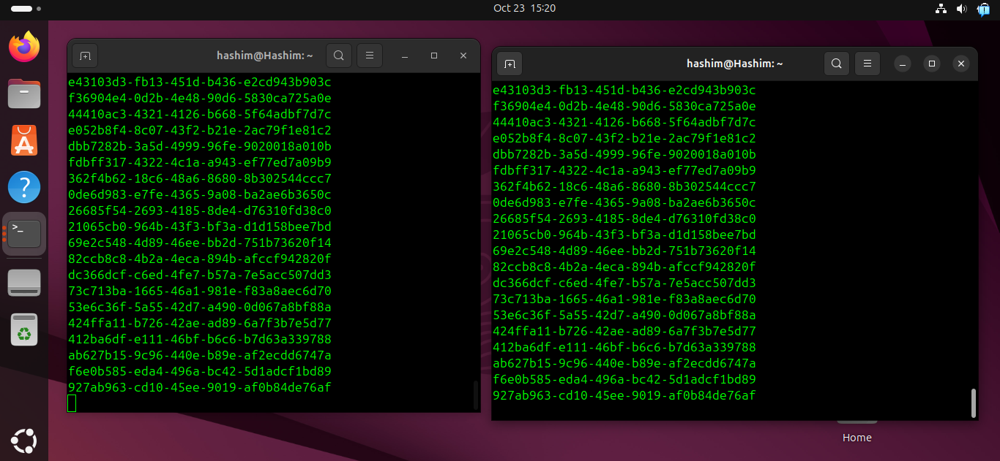

# 🚀 **Using Scripts to Showcase Interprocess Communication**

Interprocess communication (IPC) was initially introduced in previous section. In this chapter, we will revisit these mechanisms, focusing specifically on how they can be demonstrated using scripts.

## 🏭 The Producer-Consumer Model

To illustrate most of these communication mechanisms, our examples will be structured around a **producer-consumer model**. This model involves two distinct processes:

* **Producer:** This process is responsible for *writing* or generating data.
* **Consumer:** This process *reads* the data written by the producer.

Both processes interact through a shared common interface.

## 💻 Implementation Using Bash Scripts

While IPC mechanisms are typically implemented in distributed systems and are built around applications of varying complexity, our examples will use simple Bash scripts to mimic the producer and consumer processes.

* `producer.sh`: This script will represent the producer process.
* `consumer.sh`: This script will represent the consumer process.

We hope that using these simple models provides a reasonable and understandable analogy for how these concepts apply in more complex, real-world applications.

## Topics to be Covered

We will now explore the following IPC mechanisms, which were introduced in Chapter 5 but will now be covered in greater detail:

* 🗄️ **Shared Storage**
* ➡️ **Named and Unnamed Pipes**
* 🔌 **Sockets**

---

# 🗄️ **Shared Storage**

In its simplest form, the shared storage for an Interprocess Communication (IPC) mechanism can be a basic file saved to the disk.

In this model, the **producer** writes data to this file, while the **consumer** reads from the exact same file. At any given moment, the data feeds for both the producer and consumer are identical. The two processes communicate entirely via this shared storage file.

## ⚠️ The Challenge: Race Conditions

A significant challenge with this simple use case is maintaining the **integrity of read/write operations**. This is due to the risk of **race conditions** occurring between the underlying operations.

To prevent race conditions, the file must be **locked** during write operations. This lock prevents any other read or write actions from overlapping with the current I/O.

To keep our examples straightforward, we will not be resolving this problem. However, we felt it was important to call it out.

## 💻 Example: Producer and Consumer Scripts

In our example, the producer will write a new set of data (specifically, 10 random UUID strings) to the storage file every 5 seconds.

### Producer Script (`producer.sh`)

Here are the commands to create the script, make it executable, and view its contents:

```bash
hashim@Hashim:~$ nano producer.sh
hashim@Hashim:~$ chmod u+x producer.sh
hashim@Hashim:~$ cat producer.sh
```

#### Script Content

```bash
#!/bin/bash
# producer.sh
STORAGE_FILE="./storage"

rm -f "${STORAGE_FILE}"

while true
do
    for (( i=1; i<=10; i++ ))
    do
        uid="$(uuidgen)"
        echo "${uid}"
        echo "${uid}" >> "${STORAGE_FILE}"
    done
    sleep 5s
done
```

#### 📜 Code Explanation

  * `#!/bin/bash`: This "shebang" line tells the system to execute this script using the Bash shell.
  * `# producer.sh`: This is a comment identifying the script's name.
  * `STORAGE_FILE="./storage"`: This line declares a variable named `STORAGE_FILE` and assigns it the value `./storage`, which is the path to the shared file in the current directory.
  * `rm -f "${STORAGE_FILE}"`: This command forcibly removes (`-f`) the file specified by `${STORAGE_FILE}`. This ensures the script starts with a clean, empty file each time it runs.
  * `while true`: This starts an infinite loop, causing the code within it to run repeatedly.
  * `for (( i=1; i<=10; i++ ))`: This is a C-style `for` loop that will run 10 times (from `i=1` up to `i=10`).
  * `uid="$(uuidgen)"`: This line executes the `uuidgen` command (which generates a unique random ID) and stores its output in a new variable called `uid`.
  * `echo "${uid}"`: This command prints the value of the `uid` variable to the terminal (standard output). This allows you to see the UUIDs as they are generated.
  * `echo "${uid}" >> "${STORAGE_FILE}"`: This command appends (`>>`) the value of the `uid` variable as a new line inside the shared file specified by `${STORAGE_FILE}`.
  * `done`: This marks the end of the `for` loop.
  * `sleep 5s`: After the `for` loop finishes (10 UUIDs are generated), this command pauses the script for 5 seconds.
  * `done`: This marks the end of the `while true` loop, which then repeats, starting the `for` loop again.

### Consumer Script (`consumer.sh`)

Here are the commands to create the script, make it executable, and view its contents:

```bash
hashim@Hashim:~$ nano consumer.sh
hashim@Hashim:~$ chmod u+x consumer.sh
hashim@Hashim:~$ cat consumer.sh
```

#### Script Content

```bash
#!/bin/bash
# consumer.sh
STORAGE_FILE="./storage"

while true
do
    while IFS= read -r line
    do
        echo "${line}"
    done < "${STORAGE_FILE}"
    sleep 1s
done
```

#### 📜 Code Explanation

  * `#!/bin/bash`: Specifies that the script should be run using the Bash shell.
  * `# consumer.sh`: A comment identifying this as the consumer script.
  * `STORAGE_FILE="./storage"`: This declares a variable for the shared file, matching the one used in the producer script.
  * `while true`: This starts an infinite outer loop to ensure the consumer runs continuously.
  * `while IFS= read -r line`: This starts an inner loop designed to read a file line by line.
      * `IFS=`: Sets the Internal Field Separator to empty, preventing it from trimming leading or trailing whitespace from the lines.
      * `read -r`: Reads a line of input. The `-r` (raw) option prevents backslashes from being interpreted as escape characters.
      * `line`: The content of each line read from the file is stored in this variable.
  * `done < "${STORAGE_FILE}"`: This signifies the end of the inner `while` loop and, most importantly, redirects (`<`) the content of the file specified by `${STORAGE_FILE}` to be the input for the `while read` loop. **Note:** This loop will read the *entire file* from the beginning.
  * `echo "${line}"`: Inside the inner loop, this prints the content of the `line` variable (which holds one line from the file) to the terminal.
  * `sleep 1s`: After the inner loop has finished reading and printing the entire file, this command pauses the outer loop for 1 second.
  * `done`: This marks the end of the outer `while true` loop. The script then repeats, re-reading the entire `storage` file from the beginning.


<div align="center">
  
</div>

### Visual Output

The following screenshot shows the producer and consumer scripts running simultaneously in two separate terminal windows.

As seen in the image, the producer script (left terminal) generates and prints UUIDs. The consumer script (right terminal) reads from the shared file and prints the exact same UUIDs, demonstrating that communication is successful.


---

# ➡️ **Unnamed Pipes**

Unnamed (or anonymous) pipes, which are also known as regular pipes, function by feeding the standard output of one process directly into the standard input of another.

Using our producer-consumer model, the simplest way to illustrate an unnamed pipe as an IPC mechanism is by using the following command structure:

```bash
producer.sh | consumer.sh
```

The key element here is the **pipe (`|`) symbol**. The process on the left-hand side (`producer.sh`) produces an output that is "piped" directly to the process on the right-hand side (`consumer.sh`) for consumption.

To demonstrate this, we will create two new scripts, `producer2.sh` and `consumer2.sh`.

### 🏭 Producer Script (`producer2.sh`)

These commands create the script, make it executable, and display its contents.

```bash
hashim@Hashim:~$ nano producer2.sh
hashim@Hashim:~$ chmod u+x producer2.sh
hashim@Hashim:~$ cat producer2.sh
```

#### Script Content

```bash
#!/bin/bash
# producer 2
for (( i=1; i<=10; i++ ))
do
    uid="$(uuidgen)"
    echo "${uid}"
done
```

#### 📜 Code Explanation

  * `#!/bin/bash`: This shebang line specifies that the script should be executed using the Bash interpreter.
  * `# producer 2`: This is a comment identifying the script.
  * `for (( i=1; i<=10; i++ ))`: This line initiates a C-style `for` loop that will iterate 10 times.
  * `uid="$(uuidgen)"`: Inside the loop, this command executes `uuidgen` to generate a random UUID and stores it in the `uid` variable.
  * `echo "${uid}"`: This command prints the value of the `uid` variable to **standard output** (the console). This output is what will be captured by the pipe.
  * `done`: This marks the end of the `for` loop.

### 📥 Consumer Script (`consumer2.sh`)

These commands create the second script, make it executable, and display its contents.

```bash
hashim@Hashim:~$ nano consumer2.sh
hashim@Hashim:~$ chmod u+x consumer2.sh
hashim@Hashim:~$ cat consumer2.sh
```

#### Script Content

```bash
#!/bin/bash
# consumer 2
echo "Consumer data:"
echo "--------------"
if [ -t 0 ]
then
    data="$*"
else
    data=$(cat)
fi
echo "${data}"
```

#### 📜 Code Explanation

  * `#!/bin/bash`: Specifies the Bash interpreter.
  * `# consumer 2`: A comment identifying this script.
  * `echo "Consumer data:"` and `echo "--------------"`: These lines print a static header to the console. This helps confirm that the consumer script is the one printing the final output.
  * `if [ -t 0 ]`: This is the script's core logic. It performs a test (`[ -t 0 ]`).
      * `-t`: This flag checks if a file descriptor is open and associated with a terminal.
      * `0`: This is the file descriptor for **standard input** (`stdin`), which is also represented as `/dev/stdin`.
      * In simple terms, this line asks: "Is the standard input for this script coming from a user typing at a terminal?"
  * `then data="$*"`: This block executes if the `if` test is **true** (meaning the input *is* from a terminal, and not a pipe). It captures all command-line arguments (e.g., `./consumer2.sh arg1 arg2`) and stores them in the `data` variable.
  * `else data=$(cat)`: This block executes if the `if` test is **false** (meaning the input is *not* from a terminal, indicating it's coming from a pipe).
      * `$(cat)`: The `cat` command, when run without arguments, reads all data from standard input. In this case, it reads all the data being piped from `producer2.sh` and stores it in the `data` variable.
  * `fi`: Marks the end of the `if` block.
  * `echo "${data}"`: This line prints the final contents of the `data` variable, which will either be the piped data or the command-line arguments.

### 🚀 Execution and Output

We now run the producer script and pipe its output directly to the consumer script.

```bash
hashim@Hashim:~$ ./producer2.sh | ./consumer2.sh
```

#### Result

```
Consumer data:
--------------
6c9ab353-64bb-4438-8496-627c0f1692d1
31556077-b42b-4e01-8b7b-b21594dff2a7
048f27e1-2942-4a7a-b7f2-0909edd55bd7
9e3361d9-2327-4660-a167-39ebe1700608
4fc0cd37-e7ab-40ad-98a5-9101f44fb7ba
fe0becf4-b09f-4adc-8da4-7348e563fec4
4436837f-014e-414f-9b4c-958f4632c6e4
411af292-81ac-4a6c-ace2-caefca28ed0a
d193bbef-72e9-4a96-b0b5-a55734529ffc
1cd11de2-9899-43ee-ae89-36ae12355a08
```

The output clearly shows the data being printed by the consumer process. The "Consumer data:" header confirms that `consumer2.sh` successfully received the 10 UUID strings that were generated and sent by `producer2.sh` through the anonymous pipe.


---