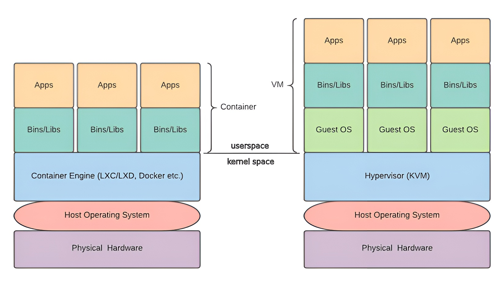

# 🐳 Containers vs. Virtual Machines (VMs)

Virtual Machines (VMs) emulate an entire machine's hardware, acting as if they are distinct computers with their own dedicated hardware. In contrast, containers do not emulate hardware at all.

A container shares the host operating system's kernel, along with the necessary shared libraries and binaries to run specific applications. Applications run inside these isolated containers, separate from the rest of the system. Containers also share the host's network interface to provide connectivity similar to VMs.

### 📊 Figure 12.1: The Architecture Comparison

The diagram below visually compares the software stacks of Containers versus Virtual Machines.

  

**Explanation of Figure 12.1:**

#### Left Side: Containers (The Lightweight Approach)
* **Top Layer (User Space):** You have multiple isolated applications (`Apps`) running with their specific dependencies (`Bins/Libs`).
* **Middle Layer:** Instead of a full OS for each app, they all sit on top of a **Container Engine** (like Docker, LXC, or LXD).
* **Bottom Layer:** The Container Engine shares the single **Host Operating System** kernel across all containers. This sits directly on the **Physical Hardware**.
* **Key Takeaway:** There is no "Guest OS" layer. This removes massive overhead, making containers start in milliseconds.

#### Right Side: Virtual Machines (The Heavyweight Approach)
* **Top Layer:** Like containers, you have your `Apps` and `Bins/Libs`.
* **Guest OS Layer:** Crucially, *every* VM requires its own full **Guest Operating System** (e.g., a full install of Ubuntu or Windows). This duplicates the kernel, system processes, and memory usage for every single VM.
* **Hypervisor Layer:** The **Hypervisor** (like KVM) manages these Guest OSs.
* **Bottom Layer:** The Hypervisor sits on the **Host Operating System** (or bare metal), which sits on the **Physical Hardware**.

---

## 🏗️ Understanding Container Technology

Container engines provide **OS-level virtualization**, allowing developers to deploy and test applications bundled with only the libraries and dependencies they need. This ensures that an application behaves exactly the same way on any machine, solving the "it works on my machine" problem.

### A Brief History
Containerization isn't new. On Unix, the `chroot` tool has provided basic isolation since 1982. On Linux, modern containerization began with **LXC (Linux Containers)** in 2008, which was later extended by **LXD**. However, **Docker**, introduced in 2013, revolutionized the landscape and fueled the DevOps movement.

### How It Works Under the Hood
Containers use specific userspace interfaces that leverage Linux kernel features to isolate resources. They replicate a standard Linux environment without needing a separate kernel.

The backbone of any container system (like LXC or Docker) relies on these key kernel technologies:
1.  **Kernel Namespaces:** Provide isolation for processes, networking, and user IDs.
2.  **Cgroups (Control Groups):** Manage and limit resource usage (CPU, RAM) for groups of processes.
3.  **Chroots:** Isolate the file system view.
4.  **Security Profiles:** Use AppArmor and SELinux to enforce security boundaries.

### LXC vs. Docker
* **LXC/LXD:** One of the earliest modern container forms. It was popular for its API support across languages like Python, Go, and Ruby. While less dominant now, it is still supported (LXC 4.0 until 2025, LXC 5.0 until 2027).
* **Docker:** The current industry standard. It took the crown by making containers easier to use and portable, becoming the center of modern container engine usage.

We will focus on Docker for our examples, as it is the most relevant tool today.

# 🧠 Understanding Linux Namespaces

**Namespaces** are a critical Linux kernel feature. They are the primary mechanism that provides the "isolation" in containers.

In a nutshell, namespaces wrap a global system resource in an abstraction layer. This tricks a process inside the namespace into believing that it has its own independent copy of that resource.

### Why do we need them?
Normally, a user or process on Linux can see almost everything: other users, all running processes, network interfaces, and mounted disks. This transparency is bad for containers, which need to be isolated environments. Since containers don't have a hypervisor to enforce this separation, they rely on namespaces to create "virtual" views of the system.

### Types of Namespaces
There are several types of namespaces, each isolating a specific aspect of the system:

1.  **Mount (`mnt`):** Isolates filesystem mount points. A process inside this namespace sees a completely different set of mounted filesystems than the host. This allows containers to have their own private root filesystem (`/`).
2.  **UTS (Unix Time Sharing):** Isolates the hostname and domain name. This allows each container to have its own hostname (e.g., `webserver-01`) independent of the host machine.
3.  **IPC (Interprocess Communication):** Isolates communication resources like shared memory, message queues, and semaphores. Processes in different IPC namespaces cannot communicate via these standard methods.
4.  **PID (Process ID):** Isolates the process ID number space. Inside a new PID namespace, the first process created gets **PID 1** (just like the init system on a real server). It cannot see processes outside its namespace.
5.  **Network (`net`):** Isolates the network stack. Each namespace gets its own private network interfaces (e.g., `eth0`), IP addresses, routing tables, and firewall rules (`iptables`).
6.  **User (`user`):** Isolates User and Group IDs. This is powerful security: a process can be `root` (UID 0) *inside* the container but map to a powerless, unprivileged user (e.g., UID 1000) *outside* on the host.
7.  **Cgroup (`cgroup`):** Isolates the view of control groups (resource limits). It hides the host's full hierarchy, showing the container only its own resource limits.

### 👀 Viewing Namespaces
You can see the namespaces currently active on your system using the `lsns` command.

Figure 12.2 shows the output of `lsns`. Each row represents a namespace.
* **NS:** The unique ID of the namespace.
* **TYPE:** The type (mnt, net, pid, etc.).
* **NPROCS:** Number of processes running in that namespace.
* **COMMAND:** The command that created or is running in that namespace.

This command is a great way to "peek under the hood" and see the isolation boundaries the kernel is enforcing.

# 🧠 Linux cgroups (Control Groups)

**Cgroups** (short for Control Groups) are a Linux kernel feature that allows you to allocate resources—such as CPU time, system memory, network bandwidth, or combinations of these resources—among hierarchically ordered groups of processes.

While **namespaces** isolate *what* a process can see (like files or network interfaces), **cgroups** restrict *how much* of the system's resources a process can use.

### ⚙️ What do Cgroups Control?
Cgroups provide a mechanism to limit, account for, and isolate the resource usage (CPU, memory, disk I/O, network, etc.) of a collection of processes.

Key resources managed by cgroups include:
* **🧠 Memory:** Limits how much RAM a group of processes can use. If they exceed the limit, the Out of Memory (OOM) killer might terminate them.
* **💻 CPU:** Limits the amount of CPU time a group can consume (e.g., "Container A gets 20% of the CPU").
* **💾 I/O (Input/Output):** Limits read/write speeds to block devices (hard drives), preventing one container from hogging all disk performance.
* **🌐 Network:** (Often managed via `net_cls` or `net_prio`) Tags network packets to control bandwidth priority.

### 🌳 The Hierarchy Concept
Cgroups are organized hierarchically, similar to a file system tree.
* **Inheritance:** Every child group inherits the attributes and limits of its parent group.
* **Multiple Hierarchies:** You can have different hierarchies for different resources. For example, you might group processes one way for CPU usage and a completely different way for Memory usage, though modern implementations (cgroups v2) tend to unify this into a single hierarchy for simplicity.

### 🤝 The Power Couple: Cgroups + Namespaces
This is the secret sauce behind modern containers like Docker:

1.  **Namespaces:** Provide **Isolation**. (The container thinks it's the only thing running on the system).
2.  **Cgroups:** Provide **Resource Management**. (The container is stopped from using 100% of the host's RAM or CPU).

By combining these two technologies, resources are allocated and managed for each container separately. This architecture allows containers to be lightweight and run as isolated entities compared to the heavier hardware emulation required by Virtual Machines.

# 🐳 Understanding Docker

**Docker** is a platform designed for developing, shipping, and running applications. Like LXC/LXD, it is built on fundamental Linux kernel technologies, specifically **namespaces** and **cgroups**.

The Docker platform provides the infrastructure that allows containers to operate securely. Docker containers are lightweight, standalone units that run directly on the host's kernel. The platform offers a suite of tools to create and manage these isolated, containerized applications.

The **container** is the base unit for modern application development, testing, and distribution. When an app is ready for production, it can be shipped as a container or as part of an orchestrated service (often managed by tools like Kubernetes).

---

## 🏗️ Docker Architecture

To understand how Docker works, we must look at its layered architecture.

  

As shown in **Figure 12.3**, the architecture is built on the Host Operating System (Linux) and relies on core kernel features like **Namespaces** and **cgroups**. Above these kernel features sit the **Container Runtime** and the **Docker Engine**, topped by the **REST API** which allows for automation.

Let's break down these two major components in detail.

### 1. Container Runtime
The **Container Runtime** is the low-level component responsible for actually running containers. It adheres to the standards set by the **Open Container Initiative (OCI)**, which defines the open industry standards for container formats and runtimes.

The runtime is split into two key pieces:
* **`containerd`**: A high-level daemon that manages the complete container lifecycle of its host system: image transfer and storage, container execution and supervision, and networking. It is responsible for downloading Docker images and then running them.
* **`runc`**: A low-level CLI tool for spawning and running containers according to the OCI specification. It is directly responsible for interacting with the kernel to set up namespaces and cgroups for each container.

> **Note:** Docker donated `runc` and `containerd` to the **Cloud Native Computing Foundation (CNCF)**. This move was crucial as it allowed broader industry collaboration and standardization, ensuring these core components weren't controlled by a single company.

  

**Figure 12.4** provides a more detailed view of this hierarchy. You can see how the API Interface communicates with `dockerd`, which talks to `containerd`, which finally uses `runc` to spawn the actual container processes.

### 2. The Docker Engine
The **Docker Engine** is the higher-level component that users interact with. It is split into:
* **The `dockerd` daemon:** A long-running process that listens for Docker API requests and manages Docker objects such as images, containers, networks, and volumes.
* **The API Interface:** A REST API that specifies interfaces that programs can use to talk to the daemon and instruct it what to do.
* **The Command-Line Interface (CLI):** The `docker` command you type in your terminal. It uses the Docker API to control or interact with the Docker daemon.

---

## 🔄 Docker Workflow

Docker uses a **client-server architecture**. The workflow involves three main players: the Client, the Host (Server Daemon), and the Registry.

  

**Figure 12.5** illustrates this workflow clearly:

1.  **The Client:** This is how users interact with Docker (e.g., running `docker build`, `docker pull`, `docker run`). The client sends these commands to the Docker daemon via the API.
2.  **The Docker Host (Server):** This is the machine running the `dockerd` daemon. The daemon listens for API requests and manages the heavy lifting of building, running, and distributing your containers. It manages **Images** and **Containers**.
3.  **The Registry:** This is where Docker images are stored.
    * **Docker Hub** is the default public registry that anyone can use.
    * You can also host your own **Private Registries**.

**Typical Workflow:**
* When you run `docker pull ubuntu`, the daemon checks if it has the image locally. If not, it downloads it from the configured **Registry** (like Docker Hub).
* When you run `docker run ubuntu`, the daemon takes that **Image** and creates a runnable **Container** from it.

# 🐳 Working with Docker

This section introduces the practical side of working with Docker. Before running commands, it is essential to understand the environment we are working in, the licensing model of Docker, and the best strategy for installation to ensure stability and security.

## 💻 The Lab Environment

For the exercises in this section, the text specifies a specific setup to ensure consistency.

* **Operating System:** Debian GNU/Linux 12 (Bookworm).
* **Hardware Resources:**
    * **vCPUs:** 2
    * **RAM:** 2 GB
* **Role:** This machine acts as the **Docker Host**.

---

## 🏷️ Choosing the Right Docker Version

Docker, Inc. has evolved its business model over time. Understanding this evolution helps clarify which version you should install.

### 1. The History: CE vs. EE
In the past, Docker offered two distinct products:
* **Docker CE (Community Edition):** The free, open-source version.
* **Docker EE (Enterprise Edition):** The paid version with support and advanced features, which generated the company's revenue.

### 2. The Current Model: Subscription Tiers
Recently, Docker restructured its portfolio into four main tiers. This change affects how users access tools like Docker Desktop.

| Product Tier | Cost | Target Audience |
| :--- | :--- | :--- |
| **Docker Personal** | **Free** | Individual developers, education, open-source communities, and small businesses. |
| **Docker Pro** | Paid | Individual professional developers requiring advanced tools. |
| **Docker Team** | Paid | Development teams requiring collaboration features. |
| **Docker Business** | Paid | Large organizations requiring centralized management and security. |

### 3. Our Choice: Docker Personal
For the purpose of learning and general server administration in this guide, we will use **Docker Personal**.
* **Cost:** Free.
* **Includes:** Docker Engine (for servers) and Docker Desktop (for Linux/Mac/Windows).
* **Requirement:** It usually implies the existence of a Docker user account (Docker ID).

> **Note on Architecture:** Docker Engine is highly versatile. It supports both **x86** (Intel/AMD) and **ARM** architectures and provides native packages (`.deb` for Debian/Ubuntu and `.rpm` for Fedora/CentOS/RHEL).

---

## 📥 Installation Strategy: Repo vs. Repo

When installing software on Linux, you generally have two choices. The text advises on the best path for Docker.

### Option A: The OS Repository (Not Recommended)
You can install Docker directly from Debian's default repositories (e.g., `sudo apt install docker.io`).
* **Pros:** Easy, no setup required.
* **Cons:** The version is often **out of date**. Linux distributions freeze package versions for stability, meaning you might miss out on the latest Docker features and security patches.

### Option B: The Official Docker Repository (Recommended)
This method involves adding Docker's official package repository to your system's package manager (`apt`).
* **Pros:** You always get the **latest stable version** directly from the source.
* **Cons:** Requires a few extra setup steps.

### 🏆 The Decision
Since we are using a fresh Debian system with no prior Docker installation, we do not need to worry about conflicts with older versions.

We will proceed using **Option B (Docker's official `apt` repository)**. This ensures our environment is current, secure, and compatible with modern container standards.
