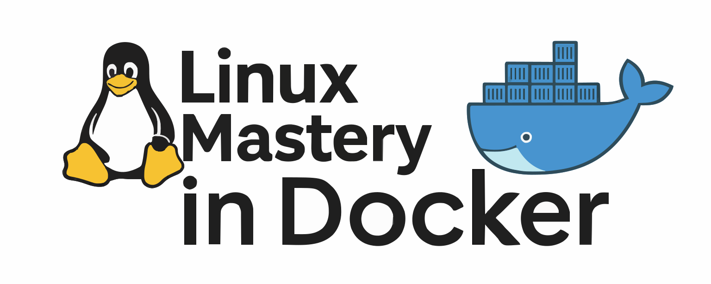

<h1 align="center">
  
</h1>

<p align="center"><i>Your complete guide to mastering Linux using Docker containers</i></p>

<p align="center">
  
  
  
  
</p>

##  About the Project 📘

> 🐧 **Linux Mastery for Everyone** provides a practical, containerized environment to learn Linux administration — right from your local machine.  
No need to dual-boot or run heavy VMs — just Docker, and you're good to go!


##  Table of Contents 📚

- [About the Project 📘](#about-the-project-)
- [Table of Contents 📚](#table-of-contents-)
- [What You Will Learn 🔁](#what-you-will-learn-)
- [Prerequisites ✔️](#prerequisites-️)
- [Contributing  🤝](#contributing--)
- [License 📄](#license-)


##  What You Will Learn 🔁
| 📌  | Topic                         | Description |
|----|-------------------------------|-------------|
| 🐧 1  | Installing Linux              | Set up Linux directly inside Docker |
| 🗂️ 2 | Shell & Filesystem           | Shell navigation, file hierarchy, and VIM usage |
| 📦 3 | Software Management          | Use `apt`, `yum`, `zypper`, and build your own packages |
| 👥 4 | User & Group Management      | Manage `/etc/passwd`, `/etc/group`, file permissions, sticky bits |
| 🔁 5 | Process Management           | Daemons, signals, and service managers |
| 💽 6 | Disk Management              | Mounting, partitioning, and LVM basics |
| 🌐 7 | Networking                   | IP configuration, interfaces, and CLI tools |
| ⚙️ 8 | Shell Scripting              | Automate with Bash scripting |
| 🔐 9 | System Security              | Basics of SELinux and AppArmor |
| 🛠️ 10 | Troubleshooting              | Journaling, backup/restore, and system recovery |
| 🧱 11 | Virtualization (Theory)      | KVM and Linux-based VM concepts |
| 🐳 12 | Docker Mastery               | Containers, volumes, networking, images |
| 🖥️ 13 | Server Setup                 | DNS, DHCP, SSH, Samba, NFS configuration |
| ☁️ 14 | Cloud Fundamentals           | DevOps, IaaS, PaaS, and CaaS concepts |
| 🚀 15 | Deploying on AWS & Azure     | Launch and manage Linux VMs in the cloud |
| 🧩 16 | Kubernetes Essentials        | Pods, services, security, and deployments |
| 🔧 17 | Ansible Automation           | Write and run playbooks for real infrastructure |


## Prerequisites ✔️

- 🐳 **Docker installed**  
  ▶ [Install Docker (YouTube Guide)](https://www.youtube.com/watch?si=DglDYuvf-zvFY9bS&v=R4uy6Oqiy5I&feature=youtu.be)

- 🧠 **Basic Git knowledge**  
  ▶ [Git Mastery Repo](https://github.com/HashimThePassionate/learn-git-mastery)


## Contributing  🤝

We love contributions! 🙌  
Whether you're fixing typos, updating scripts, or adding new modules — you're welcome!

1. **Fork** this repository  
2. Create your feature branch:  

```bash
   git checkout -b feature/my-topic
```

3. Commit and push your changes
4. Open a Pull Request (PR)

Please follow good commit hygiene and keep PRs clean. For major features, open an issue first to discuss.


##  License 📄

This repository is licensed under the **MIT License**.
See [`LICENSE`](./LICENSE) for more details.

